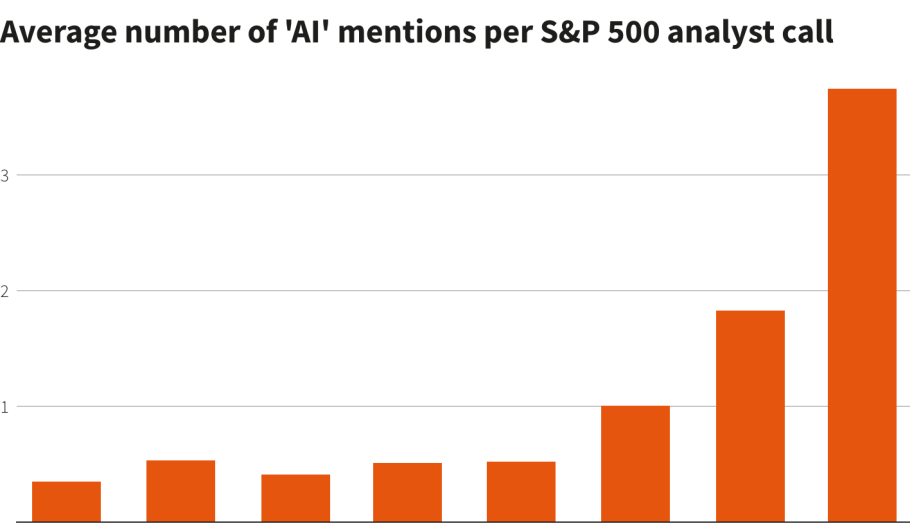
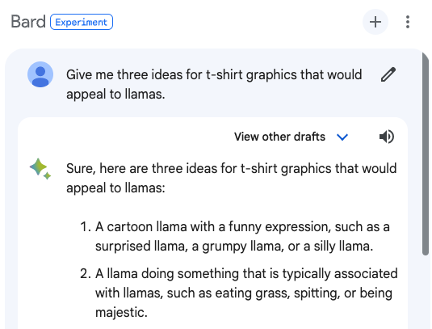
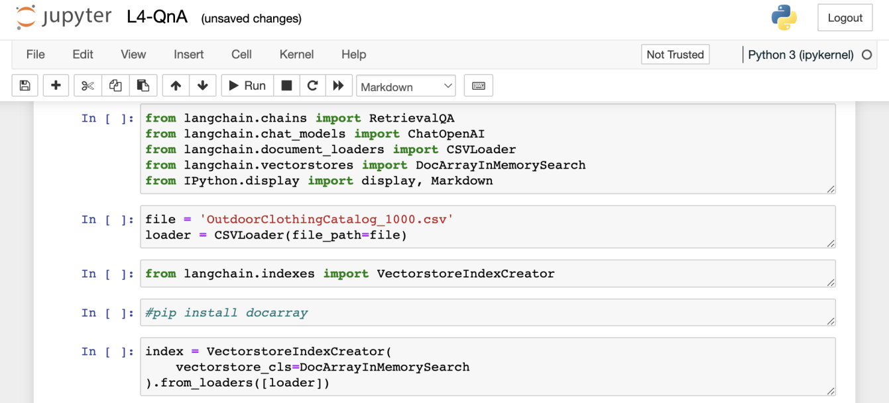
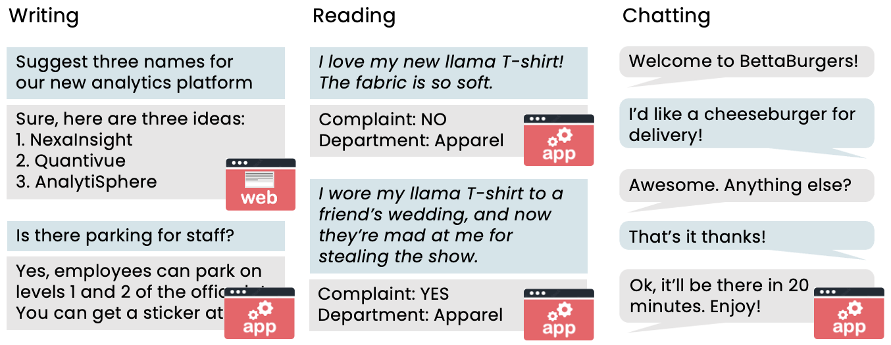
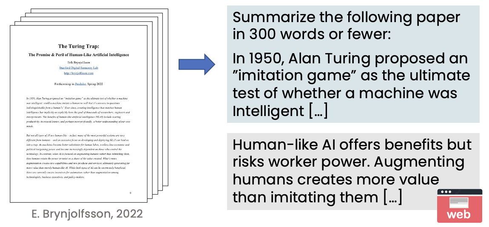
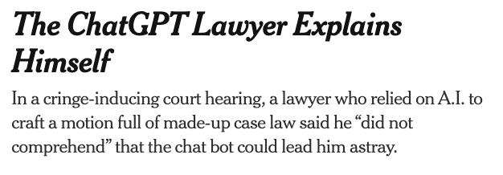

<!-- ABOUTME: Complete introduction to Generative AI covering concepts, applications, and prompting. -->
<!-- ABOUTME: French body with English technical terms, business-framed for M2 Entrepreneurship. -->

<!-- _class: title -->
<!-- _paginate: skip -->
<!-- _header: "" -->
<!-- _footer: "" -->

# Deep Tech & Machine Learning

## Séance 1 — Comprendre la Generative AI

M2 Entrepreneuriat · Sorbonne · 2026

---

<!-- _class: section -->

# Qu'est-ce que la Generative AI ?

## What is Generative AI

---

# 01 — L'essor de la Generative AI

- *$2,6 – 4,4 trillions* de valeur annuelle potentielle *(McKinsey)*
- *+7% du PIB mondial* sur 10 ans *(Goldman Sachs)*
- *80% des travailleurs* verront au moins 10% de leurs tâches impactées *(OpenAI / UPenn)*

> Après le lancement de ChatGPT (nov. 2022), les mentions d'"IA" dans les *earnings calls* du S&P 500 ont explosé.

*Question pour la classe* : Si le coût de l'intelligence machine tend vers zéro, quel service aujourd'hui trop coûteux pour être automatisé devient une opportunité de startup demain ?

---

# 02 — Qu'est-ce que la Generative AI ?

Des systèmes d'intelligence artificielle capables de *produire du contenu de haute qualité* : texte, images, audio, vidéo.

*Fonctionnement de base* :
- L'utilisateur écrit un *prompt* (une instruction en langage naturel)
- Le modèle génère une *réponse* (texte, image, code...)

*Acteurs majeurs en 2026* :
- *ChatGPT* (OpenAI) — rédaction, analyse, code
- *Claude* (Anthropic) — raisonnement, analyse documentaire
- *Gemini* (Google) — recherche augmentée
- *Le Chat* (Mistral AI) — alternative européenne

---

# 03 — La Generative AI, aussi un outil de développement

Au-delà des chatbots grand public, la Generative AI est un *developer tool* puissant :

- Génération de code et debugging
- Automatisation de pipelines de données
- Prototypage rapide d'applications

*Pour les entrepreneurs* : même sans équipe technique, les LLMs permettent de construire des *MVPs fonctionnels* en quelques jours.

> En 2025, des startups comme Bolt.new et Lovable permettent de coder des apps entières via prompt.

---

# 04 — L'IA est déjà partout

| Technologie IA | Exemples | Vous l'utilisez déjà ? |
|---|---|---|
| Web Search | Google, Bing | Tous les jours |
| Fraud Detection | Paiements CB | À chaque achat |
| Recommender Systems | Amazon, Netflix, Spotify | Constamment |
| Machine Translation | DeepL, Google Translate | Régulièrement |
| Speech Recognition | Siri, Alexa, Whisper | Souvent |

> *Point clé pour entrepreneurs* : L'IA "classique" (prédictive) crée de la valeur depuis 15 ans. La *Generative AI* ouvre un nouvel espace — la création de contenu et le raisonnement.

---

# 05 — Au-delà du texte : images, audio, vidéo

La Generative AI ne se limite pas au texte :

- *Images* : Midjourney, DALL-E, Stable Diffusion, Flux
- *Audio* : génération de voix (ElevenLabs), musique (Suno)
- *Vidéo* : Sora (OpenAI), Runway, Kling

*Cas d'usage business* :
- Créer des visuels marketing sans graphiste
- Produire des voix-off pour des formations
- Générer des vidéos de démonstration produit

---

# 06 — Ce que vous allez apprendre

Trois piliers pour maîtriser la Generative AI en tant qu'entrepreneur :

| Pilier | Ce que vous saurez faire |
|---|---|
| *Comprendre la technologie* | Ce que l'IA peut et ne peut pas faire, les cas d'usage |
| *Construire des projets GenAI* | Identifier, cadrer et construire des solutions IA |
| *Impact business et société* | Comment les équipes peuvent en tirer parti, risques et IA responsable |

> Objectif du cours : vous donner les clés de décision, pas vous transformer en Data Scientists.

---

<!-- _class: section -->

# L'IA : un ensemble d'outils

## AI is a Set of Tools

---

<!-- _class: cols -->

# 07 — Les grandes familles de l'IA

### Supervised Learning
- *Input A → Output B* — ex : email → spam ? image → diagnostic ?

### Unsupervised Learning
- Patterns sans labels (ex : segmentation clients)

### Generative AI
- Génère du *contenu original* (texte, images, audio, vidéo, code)

### Reinforcement Learning
- Apprend par essai/erreur (ex : jeux, robotique, trading)

---

# 08 — Supervised Learning — exemples business

| Input (A) | Output (B) | Application métier |
|---|---|---|
| Email | Spam ? (0/1) | Filtrage automatique |
| Pub + profil utilisateur | Clic ? (0/1) | Publicité ciblée |
| Image radar | Position véhicules | Conduite autonome |
| Image radio | Diagnostic | Healthcare |
| Photo produit | Défaut ? (0/1) | Contrôle qualité |
| Enregistrement audio | Transcription texte | Speech Recognition |
| Avis client | Sentiment (pos/neg) | Veille e-réputation |

> *Pour un entrepreneur* : le Supervised Learning reste la technologie IA la plus *déployée* et la plus *rentable*. La Generative AI est plus récente mais croît le plus vite.

---

# 09 — Pourquoi l'IA explose maintenant

*2010–2020 : l'ère du Large Scale Supervised Learning*

- La performance des modèles IA augmente avec *plus de données* et des *modèles plus grands*
- Les petits modèles plafonnent vite — les grands modèles continuent de progresser
- Cela a motivé la course au *scale* : plus de compute, plus de data

*2020+ : l'ère des Large Language Models*

- Application du même principe au texte : entraîner des modèles *massifs* sur des *centaines de milliards de mots*
- Résultat : des modèles capables de générer du texte de qualité humaine

*#TODO ADD IMAGE — scaling curves: performance vs data (W1 p17)*

---

# 10 — Comment fonctionnent les LLMs

Les LLMs utilisent le Supervised Learning pour *prédire le mot suivant*, mot par mot :

| Input (A) | Output (B) |
|---|---|
| My favorite food is a | *bagel* |
| My favorite food is a bagel | *with* |
| My favorite food is a bagel with | *cream* |
| My favorite food is a bagel with cream | *cheese* |

> Un LLM entraîné sur des centaines de milliards de mots apprend les patterns du langage et devient capable de générer du texte cohérent et pertinent.

*#TODO ADD IMAGE — next-word prediction + iterative generation (W1 p18-19)*

---

# 11 — Les LLMs comme partenaire de réflexion

Un LLM n'est pas juste un moteur de recherche amélioré. C'est un *Writing Partner* :

- *Réécriture* : "Reformule ce paragraphe pour plus de clarté"
- *Création* : "Écris une histoire de 300 mots pour enfants sur le brossage de dents"
- *Analyse* : "Quels sont les points faibles de mon business plan ?"

*Différence clé avec Google* :
- *Web Search* : retrouve des pages existantes
- *LLM* : synthétise et génère du contenu original

*#TODO ADD IMAGE — writing partner examples (W1 p21)*

---

<!-- _class: cols -->

# 12 — Web Search vs. LLM

### Web Search classique
- Trouve des *pages existantes*, requêtes *standard*
- Ex : "recette tarte aux pommes" → liens pertinents

### LLM
- *Synthétise* une réponse sur mesure, excelle pour le *créatif*
- Ex : "recette tarte pomme-café" → recette originale
- Attention : peut *inventer* des informations

> *Règle d'or* : utilisez un LLM quand vous voulez de la *synthèse ou de la création*. Utilisez le Web quand vous avez besoin de *sources vérifiables*.

---

# 13 — L'IA comme technologie à usage général

Comme *l'électricité* au début du XXe siècle, l'IA est une *General Purpose Technology* :

- L'électricité a transformé tous les secteurs (industrie, transport, santé...)
- L'IA transforme aujourd'hui tous les secteurs de la même manière
- Pas une seule application killer — des *milliers d'applications* dans tous les métiers

> L'erreur courante : penser que l'IA = chatbots. En réalité, la plus grande valeur vient des *applications spécialisées* intégrées dans les processus métier.

---

# 14 — Les trois familles de tâches LLM

| Catégorie | Exemples | Type d'app |
|---|---|---|
| *Writing* | Brainstorming noms de produits, communiqués de presse, traduction | Web + App |
| *Reading* | Classification d'emails, résumé de conversations, analyse de sentiment | Surtout App |
| *Chatting* | Service client bot, coaching, FAQ interne | Web + App |

*Deux modes d'utilisation* :
- *Web-based* : ChatGPT, Claude, Le Chat — interaction directe
- *Software application* : le LLM est intégré dans un produit (email routing, analyse automatisée)

---

<!-- _class: section -->

# Applications GenAI : Writing

## Generative AI Applications — Writing

---

# 15 — Brainstorming et idéation

Les LLMs excellent pour le *brainstorming* — tâche à faible risque et forte valeur créative :

*Exemples pour entrepreneurs* :
- "Propose 5 noms créatifs pour une marque de cookies au beurre de cacahuète"
- "Donne 5 idées pour augmenter les ventes en Q4"
- "Suggère 3 angles marketing pour cibler les étudiants"

> *Astuce* : ne prenez jamais la première réponse. Demandez des variations, combinez, itérez. Le LLM est un *point de départ*, pas un résultat final.

*#TODO ADD IMAGE — brainstorming product names + sales strategy (W1 p31-32)*

---

# 16 — Rédaction assistée : le communiqué de presse

*Prompt vague* → résultat générique :

*"Écris un communiqué de presse annonçant un nouveau COO"*
→ Texte rempli de [placeholders], inutilisable en l'état

*Prompt détaillé* → résultat exploitable :

*"Écris un communiqué de presse annonçant notre nouveau COO, avec les infos suivantes : COO bio: Nadiya Grenner, MBA Cornell... Company: General Robotics, Boston..."*
→ Texte personnalisé et prêt à l'emploi

> *Leçon clé* : plus vous donnez de *contexte*, meilleur est le résultat. C'est vrai pour tous les LLMs.

*#TODO ADD IMAGE — press release: generic vs improved (W1 p33-35)*

---

# 17 — Traduction et adaptation de ton

Les LLMs gèrent les *nuances de registre* bien au-delà de la traduction mot-à-mot :

- *Hindi formel* : traduction classique avec termes anglais ("front desk")
- *Hindi parlé* : registre informel, termes locaux ("reception")
- *Anglais pirate* : "Ahoy matey! Have a parley with the front desk, arrr!"

*Application business* :
- Adapter la communication à différents marchés et audiences
- Localisation de contenu marketing
- Adapter le ton d'un même message (formel, conversationnel, technique)

*#TODO ADD IMAGE — translation examples: formal Hindi, spoken Hindi, pirate English (W1 p36-38)*

---

<!-- _class: section -->

# Applications GenAI : Reading

## Generative AI Applications — Reading

---

# 18 — Relecture et correction

Le LLM comme *assistant de relecture* :

*"Proofread the following text, intended for a website selling children's stuffed toys, for spelling and grammatical errors, and rewrite it with corrections."*

- *snuggle* → *snuggly* (orthographe)
- *easy to wash in the machine* → *machine-washable* (style)

*Applications business* :
- Relecture de fiches produit avant publication
- Correction de newsletters et communications internes
- Vérification de contrats en multi-langues

*#TODO ADD IMAGE — proofreading example: snuggle → snuggly (W1 p39)*

---

# 19 — Résumer des documents longs

Un des cas d'usage les plus puissants pour les entreprises :

- *Résumé d'articles académiques* en quelques phrases
- *Synthèse de rapports* de 50+ pages en bullet points
- *Extraction des points clés* de contrats

*Exemple* : résumer un article de Brynjolfsson (2022) sur le "Turing Trap" en 300 mots → résumé exploitable en 30 secondes au lieu de 20 minutes de lecture.

> *Pour les entrepreneurs* : imaginez traiter 100 feedbacks clients en 5 minutes au lieu de 2 heures. C'est le gain de productivité offert par les LLMs en tâches de Reading.

---

# 20 — Résumer des conversations de call center

*Le problème* : un manager supervise des dizaines d'appels, chacun produit un transcript — trop de texte à lire.

*La solution* : un LLM résume chaque conversation en une phrase :

| Client ID | Résumé |
|---|---|
| 5402 | MK401-27KX signalé défectueux. Câble identifié. Remplacement envoyé. |
| 3981 | Livraison en retard... |
| 79478 | TV801HD télécommande défectueuse... |

> Déployé comme *software application* (pas un chatbot), ce type de solution tourne en arrière-plan et alimente des dashboards.

*#TODO ADD IMAGE — call center pipeline: conversations → summaries → dashboard (W1 p41-43)*

---

# 21 — Routage d'emails et classification

Le LLM peut *lire un email et le classifier* automatiquement :

*Prompt basique* : *"Indicate which department to route the following email to"*
→ Résultat vague : "Department: Complaints"

*Prompt structuré* : *"Read the email below and choose the most appropriate department to route the email to. Choose from: Apparel, Electronics, Home appliances."*
→ Résultat précis : "Department: Apparel"

*Anatomie d'un bon prompt de classification* :
1. *Tâche* : décrire ce que le modèle doit faire
2. *Choix* : lister les options de réponse
3. *Données* : inclure le contenu à analyser

*#TODO ADD IMAGE — email routing prompt anatomy — progressive improvement (W1 p44-47)*

---

# 22 — Veille e-réputation automatisée

Combiner *Sentiment Analysis* + dashboard = outil de monitoring puissant :

- Le LLM classe chaque avis client comme *positif* ou *négatif*
- Les résultats alimentent un *graphique temporel* : nombre d'avis positifs/négatifs par jour
- Les alertes se déclenchent quand le ratio se dégrade

*Pour un entrepreneur* : c'est un outil de veille e-réputation quasi gratuit, là où les solutions SaaS coûtent des centaines d'euros par mois.

*#TODO ADD IMAGE — reputation monitoring dashboard (W1 p48)*

*Question pour la classe* : Quels autres signaux business pourrait-on monitorer automatiquement avec un LLM ?

---

<!-- _class: section -->

# Applications GenAI : Chatting

## Generative AI Applications — Chatting

---

# 23 — Chatbots de service client

*BettaBurgers* — un chatbot de prise de commande :

- Le client commande un cheeseburger en livraison
- Le bot confirme, demande si autre chose, donne un temps de livraison
- *Pas de friction*, pas d'attente téléphonique

*Autres exemples de chatbots spécialisés* :
- *Trip planner* : "Comment visiter Paris avec un petit budget ?"
- *Career coach* : "Je suis stressé par ma présentation..."
- *Recipe assistant* : "Que faire avec des pâtes, des oeufs et du citron ?"

*#TODO ADD IMAGE — BettaBurgers chatbot + specialized chatbots (W1 p50-51)*

---

# 24 — Le spectre de déploiement des chatbots

| Niveau | Description | Risque |
|---|---|---|
| *Humains seuls* | Agents humains uniquement | Zéro risque IA |
| *Bot assiste l'humain* | Le bot suggère, l'humain décide | Faible |
| *Bot trie, humain traite* | Le bot oriente les demandes | Moyen |
| *Bot seul* | Le bot gère tout sans humain | Élevé |

*Conseil d'Andrew Ng pour les entrepreneurs* :
1. Commencer par un chatbot *interne* (équipe seulement)
2. Déployer avec *Human-in-the-Loop* (un humain vérifie)
3. Seulement après validation, ouvrir au *client final*

*#TODO ADD IMAGE — chatbot deployment spectrum + advice (W1 p53-55)*

---

<!-- _class: section -->

# Capacités, limites et Prompting

## What LLMs Can and Cannot Do

---

# 25 — Le test du "fresh college grad"

Comment évaluer si un LLM peut réaliser une tâche ? Utilisez cette heuristique :

> *Un jeune diplômé compétent pourrait-il suivre les instructions du prompt pour accomplir la tâche ?*

- Déterminer si un email est une réclamation ? *Oui* → le LLM peut le faire
- Classifier un avis comme positif ou négatif ? *Oui* → le LLM peut le faire
- Rédiger un communiqué de presse *sans aucune info* ? *Difficilement* → le LLM fera du générique
- Rédiger un communiqué *avec le contexte* ? *Oui* → le LLM fera du bon travail

*#TODO ADD IMAGE — fresh college grad test — progressive examples (W1 p57-59)*

---

# 26 — Limites du "fresh college grad"

Pour que l'analogie fonctionne, imaginez un diplômé *sans aucune ressource externe* :

- *Pas d'accès à Internet* ni à d'autres sources
- *Pas de formation spécifique* à votre entreprise
- *Pas de mémoire* des tâches précédentes
- Vous obtenez un *diplômé différent* à chaque requête !

*Conséquences pratiques* :
- Le LLM ne connaît pas vos données internes
- Il ne se souvient pas de la conversation d'hier
- Il peut ne pas connaître les événements récents

> C'est l'heuristique la plus utile du cours. Gardez-la en tête à chaque fois que vous évaluez un cas d'usage.

---

# 27 — Knowledge Cutoffs : l'IA vit dans le passé

Les connaissances d'un LLM sont *figées à la date de son entraînement* :

- Un modèle entraîné sur des données jusqu'à janvier 2022 *ne connaît pas* les événements postérieurs
- Exemple : "Quel est le film le plus rentable de 2022 ?" → "Je n'ai pas cette information" (alors que c'est *Avatar: The Way of Water*)

*En 2026, les cutoffs reculent mais le problème persiste* :
- Les modèles les plus récents sont entraînés jusqu'à mi-2025
- Mais les données de la semaine dernière restent inaccessibles (sauf si le modèle a accès au web)

---

# 28 — Hallucinations : quand l'IA invente

Les LLMs peuvent *générer des informations fausses avec un ton très confiant* :

*Exemple anodin* :
- "Donne 3 citations de Shakespeare sur Beyoncé" → le LLM invente des citations plausibles mais fictives

*Exemple grave* :
- Un avocat américain a soumis un mémoire juridique rédigé par ChatGPT contenant des *affaires judiciaires inventées* (*New York Times*, 2023)
- Le juge a découvert que les cas n'existaient pas → sanctions disciplinaires

> *Règle d'or pour entrepreneurs* : ne jamais publier un contenu généré par IA sans *vérification humaine*, surtout pour les informations factuelles.

---

# 29 — La longueur du contexte est limitée

*Context Length* = limite de la quantité de texte qu'un LLM peut traiter (input + output combinés).

*Stratégie pour les documents longs* :
- Découper le document en sections
- Résumer chaque section individuellement
- Combiner les résumés

*Évolution rapide* :
| Année | Context length typique |
|---|---|
| 2023 | ~4 000 – 8 000 tokens |
| 2024 | ~128 000 tokens (GPT-4, Claude 3) |
| 2025–26 | ~200 000+ tokens (Claude 3.5, Gemini 1.5) |

*#TODO ADD IMAGE — context length limitation + chunking strategy (W1 p65-67)*

---

<!-- _class: cols -->

# 30 — Structured vs. Unstructured Data

### Structured Data (tabulaire)
- Tableaux, bases de données, CSV (ex : prix immobilier, achats)
- *Le Supervised Learning classique est souvent meilleur* — LLMs non optimisés

### Unstructured Data
- Texte, images, audio, vidéo (ex : emails, avis clients)
- *Terrain de jeu de la Generative AI* — Writing, Reading, Chatting

> *Règle pratique* : si votre cas d'usage repose sur un *tableur*, pensez Supervised Learning. S'il repose sur du *texte libre*, pensez Generative AI.

*#TODO ADD IMAGE — structured vs unstructured data comparison (W1 p69-70)*

---

# 31 — Biais et toxicité

Les LLMs *reflètent les biais* présents dans leurs données d'entraînement :

*Exemple de biais de genre* :
- "The surgeon walked to the parking lot and took out *his* car keys."
- "The nurse walked to the parking lot and took out *her* phone."
- Le modèle associe des métiers à des genres par défaut

*Toxicité* : certains LLMs peuvent produire du contenu offensant, bien que les modèles récents soient beaucoup plus sûrs grâce au RLHF (Reinforcement Learning from Human Feedback).

> *Pour les entrepreneurs* : intégrez des tests de biais dans vos processus de validation, surtout si votre produit touche au recrutement, au crédit ou à la santé.

*#TODO ADD IMAGE — bias example: surgeon/nurse gender completion (W1 p71)*

---

<!-- _class: section -->

# Bien prompter

## Tips for Prompting

---

# 32 — Les 3 principes du Prompting

| Principe | Description |
|---|---|
| *1. Soyez détaillé et spécifique* | Donnez assez de contexte pour que le LLM comprenne exactement ce que vous voulez |
| *2. Guidez le raisonnement* | Décomposez les tâches complexes en étapes (Chain-of-Thought) |
| *3. Expérimentez et itérez* | Il n'existe pas de prompt parfait — améliorez par itération |

> Le Prompt Engineering n'est pas un talent mystique. C'est une *compétence itérative* que tout le monde peut développer.

---

# 33 — Principe 1 : soyez détaillé et spécifique

*Mauvais prompt* : *"Aide-moi à écrire un email pour rejoindre le projet legal documents."*

*Bon prompt* :
*"Help me write an email asking to be assigned to the legal documents project. I'm applying for a job on the legal documents project, which will check legal documents using LLMs. I have ample experience prompting LLMs to generate accurate text in a professional tone. Write a paragraph explaining why my background makes me a strong candidate."*

*Règles* :
- Donnez le *contexte* (qui vous êtes, quel est le projet)
- Décrivez la *tâche* en détail
- Précisez le *format* de sortie souhaité
- Spécifiez le *ton* (professionnel, décontracté, technique)

*#TODO ADD IMAGE — be detailed and specific example (W1 p73)*

---

# 34 — Principe 2 : guidez le raisonnement (Chain-of-Thought)

Décomposer une tâche complexe en *étapes explicites* améliore la qualité :

*Prompt* : *"Brainstorm 5 names for a new cat toy.*
*Step 1: Come up with 5 fun, joyful words that relate to cats.*
*Step 2: For each word, come up with a rhyming name for a toy.*
*Step 3: For each toy name, add a fun, relevant emoji."*

| Step 1 | Step 2 | Step 3 |
|---|---|---|
| Purr | Purr-Twirl | Purr-Twirl (cat) |
| Whisker | Whisker-Whisper | Whisker-Whisper (cat face) |
| Feline | Feline-Beeline | Feline-Beeline (paw) |
| Pounce | Pounce-Bounce | Pounce-Bounce (ball) |

*#TODO ADD IMAGE — chain-of-thought: cat toy naming, 3-step table (W1 p75-76)*

---

# 35 — Principe 3 : expérimentez et itérez

Il n'existe *pas de prompt parfait universel* — mais un *processus* pour s'améliorer :

1. *Écrivez* un premier prompt (ne réfléchissez pas trop)
2. *Évaluez* la sortie — qu'est-ce qui manque ?
3. *Affinez* le prompt (ajoutez du contexte, changez le format)
4. *Répétez* jusqu'à satisfaction

*Exemple d'itération* :
- V1 : *"Help me rewrite this"* → trop vague
- V2 : *"Correct any grammatical and spelling errors in this"* → mieux
- V3 : *"Correct errors and rewrite in a tone appropriate for a professional resume"* → exploitable

*#TODO ADD IMAGE — experiment and iterate — 3 versions (W1 p77)*

---

# 36 — Le cycle d'itération du prompt

Le Prompt Engineering suit un cycle identique au *cycle produit* des startups :

*Idée → Prompt → Réponse LLM → Évaluation → Nouveau prompt → ...*

*Conseils pratiques* :
- Ne sur-réfléchissez pas le premier prompt — *lancez-vous vite*
- Analysez *pourquoi* le résultat ne correspond pas
- Ajustez une variable à la fois

*Précautions* :
- Attention aux *informations confidentielles* dans les prompts
- Vérifiez toujours si vous pouvez *faire confiance* à la sortie

*Question pour la classe* : Quelles informations de votre entreprise ne devriez-vous JAMAIS mettre dans un prompt ChatGPT ?

---

<!-- _class: section -->

# Générer des images

## Image Generation

---

# 37 — La génération d'images par IA

Les modèles de génération d'images créent des visuels à partir de *descriptions textuelles* :

- *"A picture of a woman smiling"*
- *"A futuristic city scene"*
- *"A cool, happy robot"*

*Outils majeurs en 2026* :
- *Midjourney* — qualité artistique, très populaire
- *DALL-E 3* (OpenAI) — intégré à ChatGPT
- *Flux* (Black Forest Labs) — open source, haute qualité
- *Stable Diffusion* — open source, très personnalisable

---

# 38 — Comment ça marche : les Diffusion Models

Le principe est élégant — on entraîne un modèle à *enlever du bruit* d'une image :

*Phase d'entraînement* :
1. Prendre une image nette (ex : une pomme)
2. Ajouter du bruit progressivement (4 niveaux)
3. Entraîner le modèle : image bruitée → image moins bruitée (Supervised Learning A→B)

*Phase de génération* :
1. Partir de *bruit pur* (image aléatoire)
2. Appliquer le modèle ~100 fois de suite
3. L'image émerge progressivement du bruit

> C'est comme un sculpteur qui retire la pierre pour révéler la statue — sauf que le sculpteur est un réseau de neurones.

*#TODO ADD IMAGE — diffusion model: apple noise sequence + watermelon denoising (W1 p81-86)*

---

# 39 — Ajouter du texte : de la noise à l'image souhaitée

Pour générer une image *spécifique*, on ajoute le *texte du prompt* comme condition :

- Entraînement : (image bruitée + caption "red apple") → image moins bruitée
- Génération : bruit pur + "green banana" → image d'une banane verte

*C'est ce qui permet d'écrire* : *"Un logo minimaliste pour une startup fintech parisienne"* et d'obtenir un résultat pertinent.

*Pour les entrepreneurs* :
- Prototypage visuel rapide et quasi gratuit
- A/B testing de visuels marketing
- Attention aux *droits d'auteur* — sujet juridique en évolution

*#TODO ADD IMAGE — adding text: caption-conditioned diffusion (W1 p87-88)*

---

# 40 — Ce que l'IA sait et ne sait pas faire — récapitulatif

| L'IA *sait* faire | L'IA *ne sait pas* (encore) faire |
|---|---|
| Résumer des documents | Raisonner de manière fiable sur des sujets complexes |
| Classifier du texte (sentiment, catégorie) | Accéder à des données en temps réel (sans outils) |
| Traduire et adapter le ton | Garantir la véracité de ses réponses |
| Brainstormer et générer du contenu | Comprendre le contexte spécifique de votre entreprise |
| Générer des images à partir de texte | Travailler sur des données structurées/tabulaires |
| Corriger et réécrire | Remplacer le jugement humain sur des décisions critiques |

> Testez avec l'heuristique du *fresh college grad* : si un jeune diplômé pourrait le faire avec les instructions du prompt, le LLM peut probablement le faire aussi.

---

# 41 — Les points clés à retenir

*Comprendre* :
- La Generative AI produit du contenu (texte, image, audio, vidéo) à partir de prompts
- Les LLMs fonctionnent par *prédiction du mot suivant* à très grande échelle

*Appliquer* :
- Trois familles de tâches : *Writing*, *Reading*, *Chatting*
- Les tâches de *Reading* sont souvent les plus rentables (automatisation)
- Déployez progressivement : interne → human-in-the-loop → client final

*Rester vigilant* :
- Les *Hallucinations* sont un risque réel — toujours vérifier
- Les *biais* existent — tester avant de déployer
- Le *Prompt Engineering* est une compétence itérative, pas un don

> *Prochain chapitre* : comment passer de l'utilisation à la *construction* de projets Generative AI.
