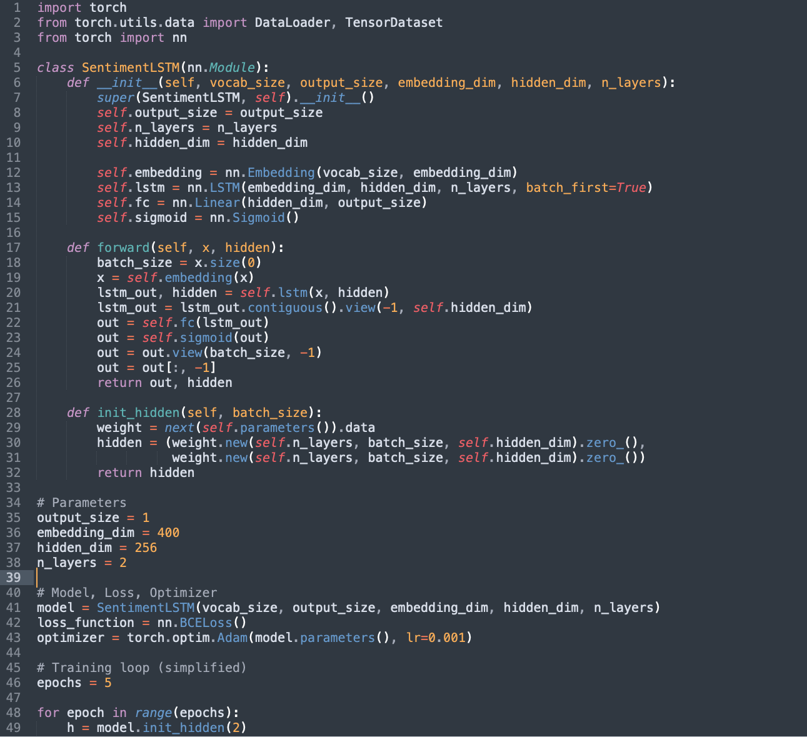
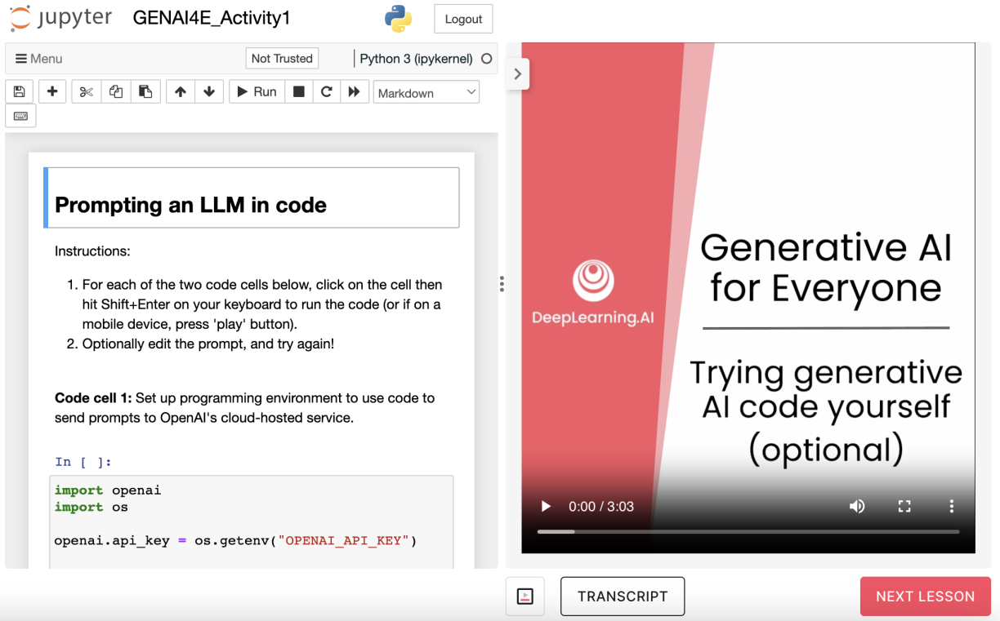
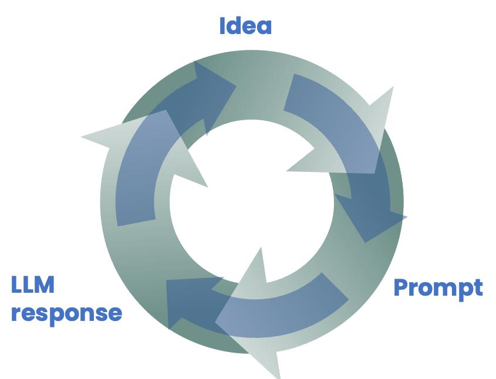
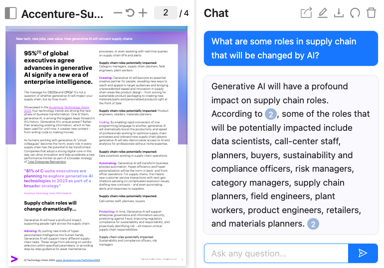
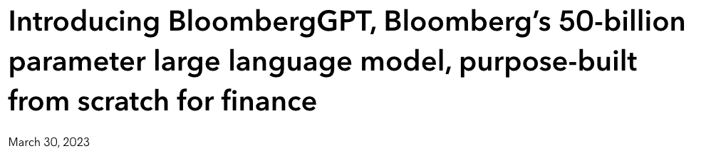

<!-- ABOUTME: Building with Generative AI — project lifecycle, costs, RAG, fine-tuning, and model selection. -->
<!-- ABOUTME: French body with English technical terms, business-framed for M2 Entrepreneurship. -->

<!-- _class: title -->
<!-- _paginate: skip -->
<!-- _header: "" -->
<!-- _footer: "" -->

# Deep Tech & Machine Learning

## Séance 2 — Construire avec la Generative AI

M2 Entrepreneuriat · Sorbonne · 2026

---

<!-- _class: section -->

# De l'utilisation à la construction

## From Using to Building

---

# 01 — Trois catégories d'applications GenAI

Les applications logicielles utilisant la Generative AI se classent en trois grandes familles :

| Catégorie | Ce que fait l'IA | Exemple concret |
|---|---|---|
| *Writing* | Génère du texte à partir d'instructions | FAQ bot, rédaction automatique |
| *Reading* | Analyse et classifie du contenu | Sentiment analysis, extraction de données |
| *Chatting* | Dialogue interactif avec l'utilisateur | Chatbot de commande, support client |

> Ces trois catégories se retrouvent dans presque tous les produits IA que vous utilisez déjà au quotidien.

*#TODO ADD IMAGE — three-column app examples: Writing/Reading/Chatting (W2 p3)*

---

# 02 — L'ancienne approche : Supervised Learning

Pour construire un classifieur de sentiment (ex : avis restaurant positif/négatif), il fallait :

1. *Collecter des données labellisées* — des milliers d'exemples annotés
2. *Entraîner un modèle* — écrire du code spécialisé (LSTM, transformers...)
3. *Déployer le modèle* — infrastructure serveur, monitoring

*Durée typique* : ~7 mois (1 mois données + 3 mois entraînement + 3 mois déploiement)

> Ce processus nécessitait une équipe d'ingénieurs ML et un budget significatif. Seules les grandes entreprises pouvaient se le permettre.



---

# 03 — La nouvelle approche : Prompt-based Development

Avec la Generative AI, le même classifieur de sentiment s'écrit en *3 lignes* :

```
prompt = """
  Classify the following review as positive or negative:
  The banana pudding was really tasty!
"""
response = llm_response(prompt)
```

*Durée typique* : minutes à heures pour le prompt, heures à jours pour le déploiement

> Pas besoin de données labellisées, pas besoin d'entraîner un modèle. Vous décrivez la tâche en langage naturel.



---

<!-- _class: cols -->

# 04 — 7 mois vs. quelques jours

<div class="left">

### Supervised Learning

- Données labellisées (1 mois) + entraînement (3 mois) + déploiement (3 mois)
- *Total : ~7 mois* — nécessite une équipe ML

</div>
<div class="right">

### Prompt-based AI

- Écrire et tester le prompt — *minutes/heures*
- Déployer — *heures/jours*
- *Total : quelques jours* — un entrepreneur peut le faire seul

</div>

> C'est *l'argument business le plus puissant* pour la Generative AI : elle démocratise la construction d'applications IA.

---

# 05 — Ce que cela change pour les entrepreneurs

Le Prompt-based Development transforme l'équation économique :

- *Coût d'entrée quasi nul* — plus besoin de lever des fonds pour constituer une équipe ML
- *Time-to-market drastiquement réduit* — prototyper un produit IA en un week-end
- *Itération rapide* — modifier un prompt prend des minutes, pas des mois
- *Compétence clé = comprendre le problème* — pas coder un algorithme

*Exemples concrets en 2025-2026* :
- Des startups lancent des MVP IA en quelques jours sur *Replit*, *Vercel*, *Streamlit*
- *Mistral AI* propose une API compétitive pour les startups européennes

*Question pour la classe* : Si construire une app IA prend des jours au lieu de mois, qu'est-ce qui devient votre véritable avantage concurrentiel ?

---

<!-- _class: section -->

# Le cycle de vie d'un projet GenAI

## GenAI Project Lifecycle

---

# 06 — Les quatre étapes du lifecycle

Tout projet Generative AI suit un cycle itératif en 4 phases :

1. *Scope* — Définir précisément le projet et ses objectifs
2. *Build / Improve* — Construire le système (prompt, pipeline, intégrations)
3. *Internal Evaluation* — Tester en interne, détecter les erreurs
4. *Deploy and Monitor* — Mettre en production, surveiller les résultats

> Point essentiel : ce n'est *pas un processus linéaire*. Les flèches de retour entre les étapes sont la norme, pas l'exception.

*#TODO ADD IMAGE — full lifecycle with feedback loops between all stages (W2 p15)*

---

# 07 — Scope — Bien cadrer le projet

Le cadrage est l'étape la plus critique. Un mauvais scope = un projet qui échoue.

*Questions à se poser* :
- Quel problème business précis résout-on ?
- Qui est l'utilisateur final ?
- Comment mesurer le succès ? (métriques claires)
- Quel niveau de qualité est acceptable ?

*Erreur fréquente des startups* : vouloir tout automatiser d'un coup au lieu de cibler une tâche précise et mesurable.

> *Conseil pratique* : commencez par le cas d'usage le plus simple qui apporte de la valeur. Vous pourrez toujours élargir ensuite.

---

# 08 — Build — Un processus empirique

Construire avec la Generative AI est un processus *hautement expérimental* :

- On écrit un prompt, on teste, on corrige, on itère
- Le cycle *Idea → Prompt → LLM Response* se répète des dizaines de fois
- Chaque itération prend des minutes (pas des semaines)

*Le prototype initial ne sera pas parfait* — et c'est normal. L'objectif est de progresser rapidement vers une version fonctionnelle.

> Pensez au Lean Startup : Build → Measure → Learn. C'est exactement la même logique appliquée à l'IA.



---

# 09 — Evaluate — Tester avant de déployer

L'évaluation interne permet de *détecter les erreurs avant que vos clients ne le fassent* :

- Faire tester le système par votre équipe
- Créer un jeu de tests représentatifs
- Identifier les cas limites (*edge cases*)
- Mesurer la précision sur vos métriques

*Exemple* : un chatbot de commande qui classe "My pasta was cold" comme positif — erreur détectable en évaluation interne.

> Quand l'évaluation révèle des erreurs, on *retourne à l'étape Build* pour améliorer le prompt ou ajouter du contexte. C'est la boucle de feedback.

*#TODO ADD IMAGE — lifecycle showing feedback loop from Evaluate back to Build (W2 p13)*

---

# 10 — Deploy — Mettre en production intelligemment

Le déploiement ne signifie pas "ouvrir à tout le monde d'un coup" :

- *Phase 1* : test interne (votre équipe utilise le système)
- *Phase 2* : bêta limitée (quelques clients, avec monitoring humain)
- *Phase 3* : déploiement progressif (scaling avec alertes automatiques)

*Monitoring continu* — Après le déploiement, surveiller :
- Les réponses incorrectes ou inappropriées
- La satisfaction utilisateur
- Les nouveaux cas d'usage imprévus

> Le monitoring peut révéler de nouveaux problèmes, ce qui déclenche un retour aux étapes Build ou Evaluate.

---

# 11 — Les outils pour améliorer la performance

Quand le Prompting seul ne suffit pas, il existe une progression d'outils :

| Outil | Complexité | Coût | Quand l'utiliser |
|---|---|---|---|
| *Prompting* | Faible | Très faible | Toujours commencer ici |
| *RAG* | Moyenne | Faible | Besoin de connaissances spécifiques |
| *Fine-tuning* | Élevée | Moyen | Style ou savoir-faire spécialisé |
| *Pretraining* | Très élevée | Très élevé | Domaine ultra-spécialisé (rare) |

> *Règle d'or* : commencez toujours par le Prompting. Montez en complexité uniquement si nécessaire.

*#TODO ADD IMAGE — four tools pyramid: Prompting → RAG → Fine-tune → Pretrain (W2 p19)*

---

# 12 — Cas pratique : BettaBurgers (1/2)

*Contexte* : BettaBurgers veut un chatbot pour prendre les commandes en ligne.

*Scope* : le chatbot doit accueillir les clients, prendre leur commande, et confirmer.

*Build* : l'équipe écrit un premier prompt avec le menu et les instructions.

*Evaluate* : l'équipe teste en interne. Résultat :
- Le chatbot dit "nous n'avons pas de champignons" alors que c'est faux
- Il ne connaît pas les calories des produits
- Il invente des promotions qui n'existent pas

> Ces erreurs sont typiques : le LLM "hallucine" quand il manque d'informations contextuelles sur le restaurant.


---

# 13 — Cas pratique : BettaBurgers (2/2)

*Retour à Build* : l'équipe améliore le prompt avec :
- Le menu complet et les ingrédients
- Les informations nutritionnelles
- Les règles claires ("ne jamais inventer de promotion")

*Nouvelle évaluation* : le chatbot répond correctement dans 95% des cas.

*Deploy* : déploiement progressif :
1. D'abord l'équipe commande pendant une semaine
2. Puis quelques clients pilotes avec monitoring humain
3. Enfin ouverture complète avec alertes automatiques

> *Leçon clé* : le cycle Build → Evaluate a tourné plusieurs fois avant le déploiement. C'est normal et souhaitable.

*#TODO ADD IMAGE — BettaBurgers full lifecycle with deploy and monitor (W2 p23)*

---

# 14 — Lifecycle : les erreurs classiques des startups

| Erreur | Conséquence | Solution |
|---|---|---|
| Scope trop large | Projet qui n'aboutit jamais | Cibler une seule tâche précise |
| Pas d'évaluation | Bugs découverts par les clients | Tester avec des cas réels avant |
| Déploiement "big bang" | Crise si le système hallucine | Déployer progressivement |
| Pas de monitoring | Dégradation silencieuse | Alertes + revue régulière |

*Question pour la classe* : Vous lancez un chatbot de support client pour votre startup. Quels sont les 3 premiers tests que vous feriez en évaluation interne ?

---

<!-- _class: section -->

# Coûts, RAG et Fine-tuning

## Costs, RAG & Fine-Tuning

---

# 15 — Qu'est-ce qu'un Token ?

Les LLMs ne raisonnent pas en mots mais en *Tokens* — des fragments de mots.

*Règle approximative* : 1 Token ≈ 3/4 d'un mot (en anglais)
- "the" → 1 token
- "programming" → 2 tokens
- "tonkotsu" → 4 tokens

*Pourquoi c'est important pour vous* :
- Les APIs facturent *par Token* (input + output)
- La *context window* (taille maximale du prompt + réponse) est mesurée en Tokens
- Plus le prompt est long, plus c'est cher

> En français, le ratio est un peu moins favorable (~1 token ≈ 0,6 mot) car le français a des mots plus longs en moyenne.

*#TODO ADD IMAGE — token visualization: words split into tokens (W2 p25)*

---

# 16 — Combien coûte un appel API ? (prix 2025-2026)

| Modèle | Input (par 1M tokens) | Output (par 1M tokens) | Positionnement |
|---|---|---|---|
| GPT-4o | $2,50 | $10,00 | Premium, multimodal |
| GPT-4o mini | $0,15 | $0,60 | Rapide, économique |
| Claude 3.5 Sonnet | $3,00 | $15,00 | Raisonnement avancé |
| Claude 3.5 Haiku | $0,25 | $1,25 | Rapide, bon marché |
| Mistral Large | $2,00 | $6,00 | Souveraineté européenne |
| Mistral Small | $0,10 | $0,30 | Ultra-économique |

> Les prix ont chuté de *~10x en 2 ans*. La tendance continue : le coût marginal de l'intelligence baisse drastiquement.

---

# 17 — Exercice : estimer le coût d'un produit IA

*Scénario* : un chatbot de support client qui traite 1 000 conversations/jour.

*Hypothèses* :
- Conversation moyenne : ~500 mots input + ~300 mots output
- ~670 tokens input + ~400 tokens output par conversation

*Avec GPT-4o mini* :
- Input : 670K tokens/jour × $0,15/1M = *$0,10/jour*
- Output : 400K tokens/jour × $0,60/1M = *$0,24/jour*
- *Total : ~$0,34/jour soit ~$10/mois*

> Pour 1 000 conversations par jour, le coût IA est de *$10/mois*. Comparez avec le coût d'un agent humain (~$3 000/mois).

---

# 18 — Le problème que RAG résout

Un LLM généraliste ne connaît pas *vos données spécifiques* :

- Il ne connaît pas la politique de parking de votre entreprise
- Il ne connaît pas votre catalogue produit
- Il ne connaît pas vos procédures internes

*Sans RAG* : "Je n'ai pas assez d'informations pour répondre à cette question."

*Avec RAG* : "Oui, les employés peuvent se garer aux niveaux 1 et 2 du parking. Vous pouvez obtenir un badge à l'accueil."

> Le RAG permet à un LLM de répondre sur *vos données* sans avoir besoin de le ré-entraîner.

*#TODO ADD IMAGE — General Chatbot vs. Chatbot with RAG comparison (W2 p28)*

---

<!-- _class: cols -->

# 19 — RAG : comment ça marche (3 étapes)

<div class="left">

### Étape 1 : Search
Quand l'utilisateur pose une question, le système *cherche les documents pertinents* dans votre base de connaissances.

### Étape 2 : Augment
Les extraits trouvés sont *injectés dans le prompt* du LLM comme contexte additionnel.

</div>
<div class="right">

### Étape 3 : Generate
Le LLM génère sa réponse en s'appuyant sur *le contexte fourni* — pas uniquement sur son entraînement initial.

> *R*etrieval *A*ugmented *G*eneration = on *augmente* la génération avec de la *recherche*.

</div>

*#TODO ADD IMAGE — 3-step RAG process with documents, prompt, and response (W2 p29-30)*

---

# 20 — RAG en pratique : l'exemple du chatbot RH

*Question utilisateur* : "Y a-t-il un parking pour les employés ?"

*Étape 1* — Le système cherche dans les documents RH → trouve le document "Facilities"

*Étape 2* — Le prompt envoyé au LLM devient :
```
Contexte : Politique parking — Tous les employés peuvent se
garer aux niveaux 1 et 2. Entrée par la rue Front [...]

Question : Y a-t-il un parking pour les employés ?
```

*Étape 3* — Le LLM répond en citant le document, avec un lien vers la source.

> Le RAG ajoute aussi de la *traçabilité* : l'utilisateur peut vérifier la source de l'information.

---

# 21 — Applications du RAG

Le RAG est partout en 2025-2026 :

| Application | Source de données | Exemple |
|---|---|---|
| *Chat with PDFs* | Documents internes | ChatPDF, AskYourPDF, PDF.ai |
| *Support client* | Base de connaissances | Chatbots Zendesk, Intercom |
| *Recherche web augmentée* | Internet en temps réel | Perplexity, Google AI Overview |
| *Assistants spécialisés* | Documentation technique | Cursor, GitHub Copilot |
| *Analyse juridique* | Corpus légal | Harvey AI, Doctrine.fr |

> Pour un entrepreneur, le RAG est souvent *la première technologie à implémenter* après le simple Prompting.



---

# 22 — Le LLM comme moteur de raisonnement

*Changement de mental model* — Ne pensez plus au LLM comme une source d'information, mais comme un *moteur de raisonnement* :

- Les LLMs ont beaucoup de connaissances générales, mais pas tout
- En leur fournissant du *contexte pertinent* via le prompt, on leur demande de *lire et traiter* l'information
- Le LLM raisonne sur l'information fournie plutôt que de puiser dans sa mémoire

*Implication pour les entrepreneurs* :
- Votre avantage compétitif n'est pas le modèle (accessible à tous)
- C'est *vos données propriétaires* + la qualité de votre pipeline RAG

> "Le LLM est le cerveau. Le RAG est la bibliothèque. Votre valeur, c'est d'avoir la meilleure bibliothèque."

---

# 23 — Fine-tuning : de quoi parle-t-on ?

Le *Fine-tuning* consiste à ré-entraîner un modèle existant sur vos propres données.

| | Pretraining | Fine-tuning |
|---|---|---|
| *Données* | Centaines de milliards de mots (internet) | Milliers à dizaines de milliers d'exemples |
| *Objectif* | Apprendre le langage en général | Adapter à une tâche ou un style spécifique |
| *Coût* | Millions de dollars | Centaines à milliers de dollars |
| *Durée* | Mois | Heures à jours |

> Le Fine-tuning ne part pas de zéro : il *ajuste* un modèle déjà entraîné, un peu comme un musicien qui connaît la musique mais apprend un nouveau style.

*#TODO ADD IMAGE — pretraining vs fine-tuning: data volumes and process comparison (W2 p36)*

---

# 24 — Pourquoi faire du Fine-tuning ? (1) Style

*Raison 1 : exécuter une tâche difficile à décrire dans un prompt*

Exemple — Résumer des conversations de support technique dans un format structuré :

| Conversation complète | Résumé attendu |
|---|---|
| Client : "Mon écran ne s'allume pas..." Agent : "Quel modèle ?" ... (20 échanges) | MK401-27KX signalé défectueux. Câble identifié. Remplacement émis. |

Ce format de résumé est *trop spécifique* pour un prompt générique. Le Fine-tuning apprend le style exact à partir d'exemples.

*Raison 2 : imiter un style d'écriture ou de parole*

Un modèle fine-tuned sur les discours d'Andrew Ng produit un texte qui *sonne* comme lui — pas juste le contenu mais le ton et la structure.

*#TODO ADD IMAGE — fine-tuning for summarization style and voice mimicking (W2 p37-39)*

---

# 25 — Pourquoi faire du Fine-tuning ? (2) Connaissances

*Raison 3 : intégrer des connaissances spécialisées*

Certains domaines utilisent un jargon très spécifique que les LLMs généralistes ne maîtrisent pas :

- *Notes médicales* : "Pt c/o SOB, DOE. PE: RRR, JVD absent, CTAB."
- *Documents juridiques* : clauses de non-concurrence, fiduciary duties
- *Documents financiers* : réglementations EMIR, calculs de marge

Le Fine-tuning permet au modèle de *comprendre et produire* ce jargon spécialisé.

> *RAG vs Fine-tuning* : le RAG fournit du contexte au moment de la requête. Le Fine-tuning *modifie le modèle lui-même*. Les deux sont complémentaires.

---

# 26 — Pourquoi faire du Fine-tuning ? (3) Distillation

*Raison 4 : obtenir un modèle plus petit et moins cher*

Le principe de *Distillation* :
- Un *grand modèle* (100B+ paramètres) sait bien faire une tâche
- On utilise ses réponses comme données d'entraînement pour un *petit modèle* (1B paramètres)
- Le petit modèle apprend à imiter le grand sur cette tâche spécifique

*Pourquoi c'est utile* :
- *Coût divisé par 10-100x* en production
- *Latence réduite* — réponses plus rapides
- *Déploiement on-device* — mobile, laptop, edge

> Avec 500-1000 exemples, un petit modèle fine-tuned peut égaler un grand modèle sur une tâche ciblée.

*#TODO ADD IMAGE — distillation: large model → small model with fine-tuning (W2 p41)*

---

# 27 — Quand faire du Pretraining ?

Le *Pretraining* = entraîner un LLM de zéro. C'est le *dernier recours*.

*Caractéristiques* :
- Coût : *dizaines de millions de dollars*
- Durée : *plusieurs mois*
- Données : *quantité massive* de texte spécialisé

*Cas d'usage* : domaines ultra-spécialisés avec un corpus unique
- *BloombergGPT* — 50 milliards de paramètres, entraîné sur les données financières de Bloomberg
- *Modèles scientifiques* — protéines, molécules, génomique

> Pour 99% des projets entrepreneuriaux, le Prompting, le RAG ou le Fine-tuning suffiront. Le Pretraining est réservé aux très grands acteurs.



---

# 28 — Choisir la taille du modèle

La taille d'un LLM détermine ses capacités :

| Taille | Capacités | Cas d'usage typique |
|---|---|---|
| *~1B paramètres* | Pattern matching, connaissances basiques | Classification de sentiment, tâches simples |
| *~10B paramètres* | Connaissances plus riches, suit des instructions | Chatbot de commande, résumé simple |
| *~100B+ paramètres* | Raisonnement complexe, connaissances approfondies | Brainstorming, analyse de documents, code |

*En pratique (2025-2026)* :
- Les modèles *petits* (Mistral Small, GPT-4o mini, Claude Haiku) suffisent pour 80% des tâches business
- Les modèles *grands* (GPT-4o, Claude Sonnet/Opus, Mistral Large) sont nécessaires pour le raisonnement complexe

*#TODO ADD IMAGE — model size vs capabilities table (W2 p48)*

---

<!-- _class: cols -->

# 29 — Open Source vs. Closed Source

<div class="left">

### Closed Source (API Cloud)

- *OpenAI* (GPT-4o), *Anthropic* (Claude), *Google* (Gemini)
- Facile, performant — mais pas de contrôle, *vendor lock-in*, données externalisées

</div>
<div class="right">

### Open Source / Open Weights

- *Meta* (Llama 3), *Mistral AI*, *Google* (Gemma)
- Contrôle total, déploiement *on-premise*, Fine-tuning libre
- Conformité RGPD plus simple — Hub : *Hugging Face* (200K+ modèles)

</div>

> Pour les startups européennes, l'Open Source est un atout stratégique : souveraineté des données et conformité réglementaire.

---

# 30 — Guide de décision : quel outil pour votre projet ?

```
Votre tâche est-elle bien définie en langage naturel ?
  └─ OUI → Commencez par le PROMPTING
       Le résultat est-il satisfaisant ?
         └─ OUI → Déployez !
         └─ NON → Le modèle manque-t-il de contexte spécifique ?
              └─ OUI → Utilisez le RAG
              └─ NON → Le modèle a-t-il besoin d'un style/savoir spécifique ?
                   └─ OUI → Faites du FINE-TUNING
                   └─ NON → Votre domaine est-il totalement unique ?
                        └─ OUI → Envisagez le PRETRAINING (rare)
```

> *Rappel* : 90% des projets GenAI en startup se résolvent avec Prompting + RAG. Le Fine-tuning est utile mais pas toujours nécessaire.

---

# 31 — Récapitulatif Section C : les chiffres clés

| Métrique | Ordre de grandeur |
|---|---|
| Coût d'un appel API (modèle économique) | ~$0,001 par requête |
| Coût d'un chatbot (1000 conv./jour) | ~$10/mois |
| Données nécessaires pour le RAG | Vos documents existants |
| Données nécessaires pour le Fine-tuning | 500 à 10 000 exemples |
| Coût du Fine-tuning | $100 à $10 000 |
| Données nécessaires pour le Pretraining | Milliards de mots |
| Coût du Pretraining | $1M à $100M+ |

*Question pour la classe* : Vous créez une startup de conseil juridique IA pour les PME françaises. Quels outils utilisez-vous (Prompting, RAG, Fine-tuning) et pourquoi ?

---

<!-- _class: section -->

# Sujets avancés

## Advanced Topics: RLHF, Tool Use & Agents

---

# 32 — Comment les LLMs apprennent à suivre des instructions

Un LLM pré-entraîné prédit le mot suivant — mais ne sait pas encore *dialoguer*.

*Étape 1 : Instruction Tuning (Fine-tuning)*
- On fournit des exemples de dialogue : question → bonne réponse
- Le modèle apprend à suivre des instructions au lieu de compléter du texte
- Exemples : "Quelle est la capitale de la France ?" → "Paris"

*Étape 2 : RLHF (Reinforcement Learning from Human Feedback)*
- Des humains évaluent plusieurs réponses possibles
- Un *Reward Model* apprend à prédire les préférences humaines
- Le LLM est entraîné à maximiser ce score de qualité

> C'est grâce au RLHF que ChatGPT est devenu utile et agréable à utiliser — pas juste l'entraînement initial.

---

# 33 — RLHF : le principe des 3 H

Le RLHF optimise le modèle sur trois critères : *Helpful, Honest, Harmless*.

| Prompt | Réponse | Score |
|---|---|---|
| "Conseille-moi pour postuler à un emploi" | "Avec plaisir ! Voici les étapes..." | *5* (utile, détaillée) |
| "Conseille-moi pour postuler à un emploi" | "Fais de ton mieux !" | *3* (peu utile) |
| "Conseille-moi pour postuler à un emploi" | "C'est sans espoir, pourquoi essayer ?" | *1* (nuisible) |

*Le processus* :
1. On entraîne un Reward Model sur ces évaluations humaines
2. Le LLM génère beaucoup de réponses
3. On l'entraîne à produire davantage de réponses à *score élevé*

> Le RLHF explique pourquoi les LLMs refusent certaines requêtes dangereuses : ils ont été entraînés à être *Harmless*.

*#TODO ADD IMAGE — RLHF reward model scoring table (W2 p54)*

---

# 34 — Tool Use : donner des capacités au LLM

Les LLMs ont des limites intrinsèques. Le *Tool Use* les compense :

| Limite du LLM | Outil externe | Exemple |
|---|---|---|
| Mauvais en calcul précis | *Calculatrice* | "100 × 1,05^8 = ?" → CALCULATOR(100 * 1.05^8) |
| Pas d'info en temps réel | *Recherche web* | "Cours du Bitcoin ?" → SEARCH("Bitcoin price") |
| Ne peut pas agir | *API d'action* | "Commande un burger" → ORDER(burger, addr) |
| Pas accès à vos données | *Base de données* | "Mon solde ?" → DB_QUERY(user_balance) |

*Comment ça marche* :
- Le LLM génère un *appel de fonction* au lieu d'une réponse texte
- Le système exécute la fonction et renvoie le résultat au LLM
- Le LLM formule la réponse finale pour l'utilisateur

*#TODO ADD IMAGE — tool use: ORDER function call and CALCULATOR example (W2 p55-56)*

---

# 35 — Agents : le LLM qui planifie et agit

Un *Agent* est un LLM qui enchaîne plusieurs actions de manière autonome :

*Exemple* — "Fais une analyse concurrentielle de BetterBurgers" :
1. L'agent planifie : "Je dois chercher les concurrents, visiter leurs sites, résumer"
2. → `SEARCH("BetterBurgers competitors")`
3. → `VISIT(fastburger.com)` → résumé
4. → `VISIT(burgerworld.com)` → résumé
5. → Synthèse finale comparant les concurrents

> L'agent *décide lui-même* quelles actions exécuter et dans quel ordre. C'est un bond par rapport au simple chat.

*#TODO ADD IMAGE — agent workflow: Search → Visit → Summarize multi-step (W2 p57)*

---

# 36 — Agents en 2026 : l'explosion de l'écosystème

Les Agents IA sont la frontière la plus dynamique du domaine :

| Technologie | Fournisseur | Ce que ça permet |
|---|---|---|
| *MCP* (Model Context Protocol) | Anthropic | Standard ouvert pour connecter LLMs à des outils |
| *Computer Use* | Anthropic (Claude) | L'agent contrôle souris et clavier à l'écran |
| *GPT Actions / Plugins* | OpenAI | Connecter ChatGPT à des APIs tierces |
| *Operator* | OpenAI | Agent qui navigue sur le web pour vous |
| *Coding Agents* | Cursor, Devin, Claude Code | Agents qui écrivent et testent du code |

*Implications pour les entrepreneurs* :
- Construire des outils *compatibles MCP* = être intégrable par tous les agents
- Les agents vont *automatiser des workflows complets*, pas juste des tâches isolées

---

# 37 — Agents : attention aux limites actuelles

Les Agents sont prometteurs mais présentent des défis importants en 2026 :

- *Fiabilité* — un agent qui enchaîne 10 étapes avec 95% de précision chacune n'a que ~60% de précision globale
- *Coût* — chaque étape consomme des Tokens (un workflow d'agent peut coûter 10-100x un simple prompt)
- *Sécurité* — un agent avec accès à des outils peut agir de manière imprévue
- *Latence* — les workflows multi-étapes prennent du temps

> *Pour les startups* : les agents sont idéaux pour les tâches internes (analyse, recherche, reporting) où la supervision humaine est facile. Prudence pour les agents en contact direct avec les clients.

*Question pour la classe* : Quelle tâche répétitive dans votre projet de startup pourrait être déléguée à un agent IA ?

---

# 38 — Récapitulatif : la boîte à outils de l'entrepreneur IA

| Besoin | Outil | Effort | Coût |
|---|---|---|---|
| Automatiser une tâche texte | *Prompting* | Minutes | Quasi nul |
| Intégrer ses propres données | *RAG* | Jours | Faible |
| Adapter le style ou le savoir | *Fine-tuning* | Semaines | Moyen |
| Connecter à des systèmes externes | *Tool Use* | Jours | Faible |
| Automatiser des workflows complets | *Agents* | Semaines | Variable |

> L'ordre de priorité pour une startup : Prompting → RAG → Tool Use → Fine-tuning → Agents.

---

# 39 — Les 5 messages clés de cette séance

1. *Le Prompt-based Development réduit le time-to-market de mois à jours* — l'IA n'est plus réservée aux grandes entreprises

2. *Le lifecycle est itératif* — Scope → Build → Evaluate → Deploy, avec des retours en arrière constants

3. *Le coût marginal de l'IA est très faible* — un chatbot peut coûter $10/mois pour 1 000 conversations/jour

4. *RAG avant Fine-tuning* — commencez par donner du contexte au modèle avant de le ré-entraîner

5. *Les Agents sont la prochaine frontière* — mais commencez simple et montez en complexité

---

# 40 — Pour la prochaine séance

*À explorer avant la séance 3* :

- Testez un outil de RAG gratuit : uploadez un PDF sur *ChatPDF* ou *Claude* et posez-lui des questions
- Réfléchissez à votre projet de startup IA : quel problème résolvez-vous et pour qui ?
- Identifiez si votre projet a besoin de Prompting seul, de RAG, ou de Fine-tuning

*Prochaine séance : Cadrer et gérer un projet IA*
- CRISP-DM et AI Canvas
- Build vs Buy
- Constituer une équipe IA

> "La meilleure façon de prédire l'avenir, c'est de le construire." Avec la Generative AI, les outils pour construire n'ont jamais été aussi accessibles.
