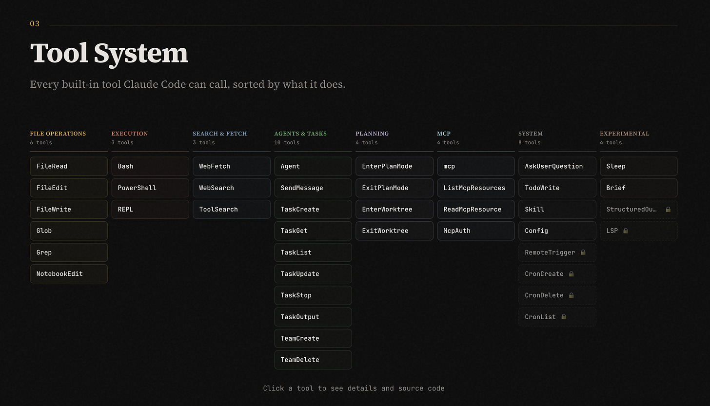
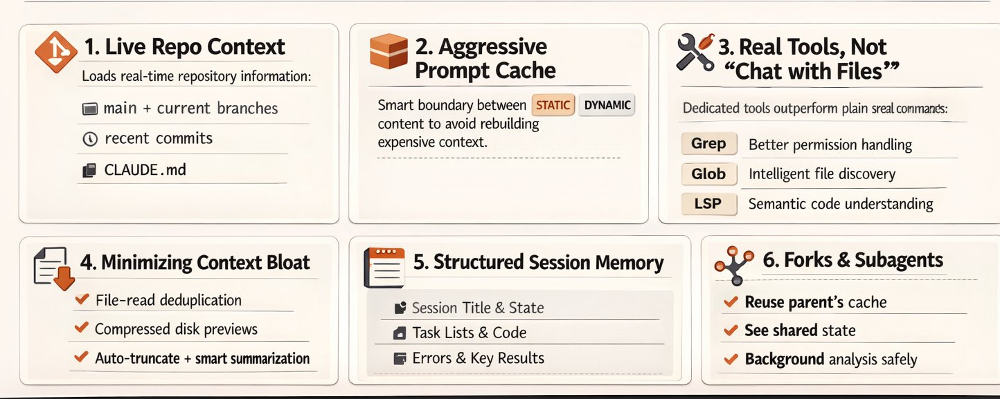
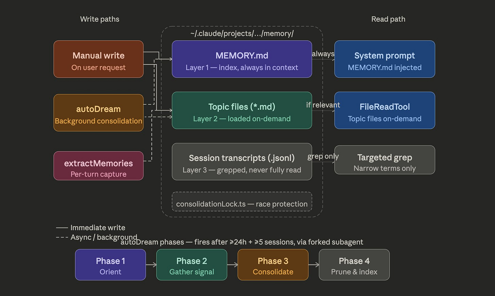
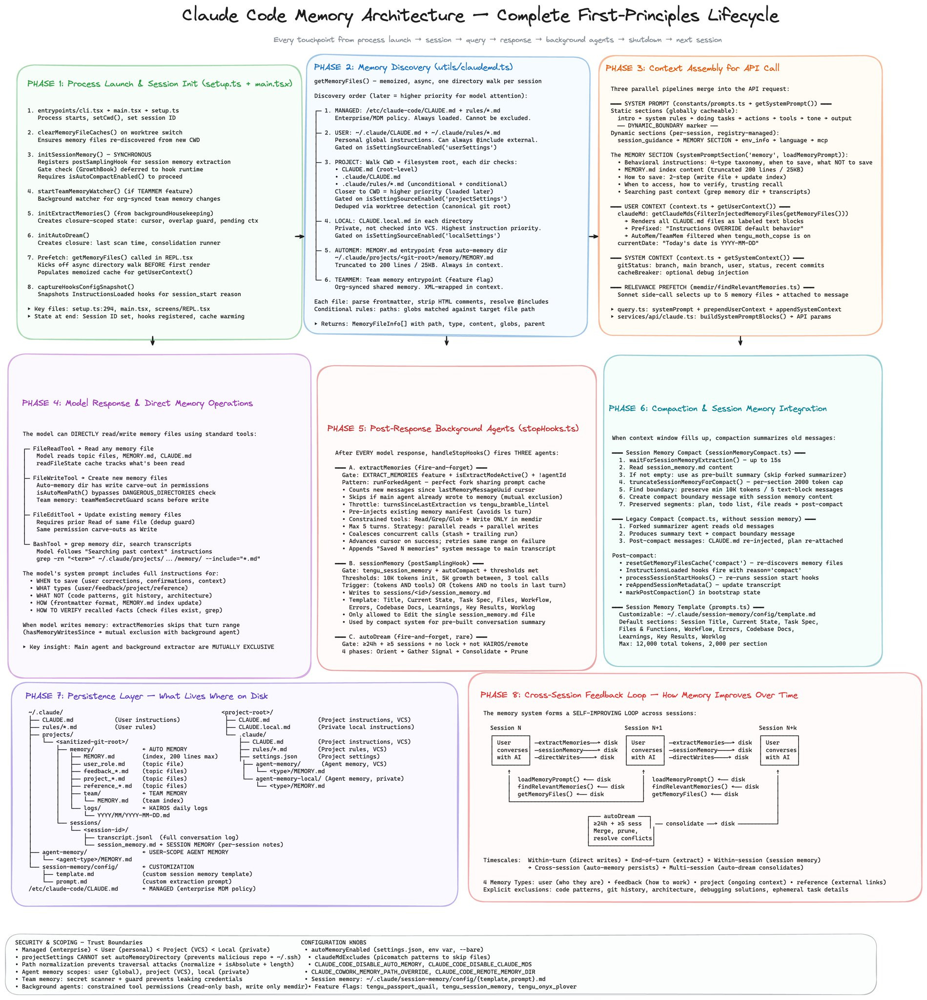
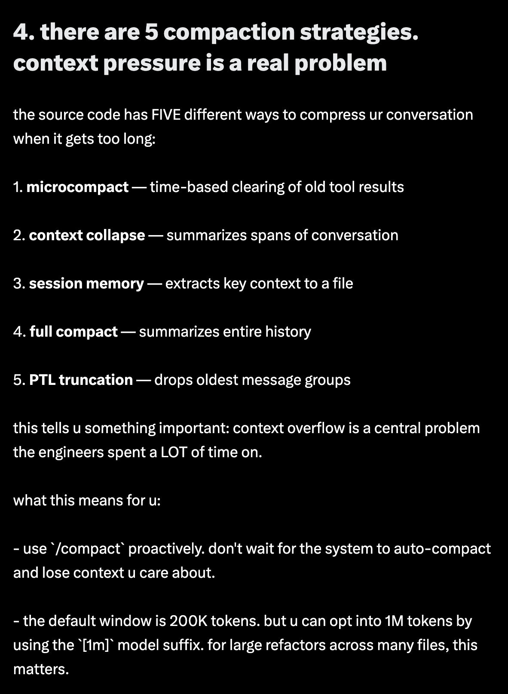
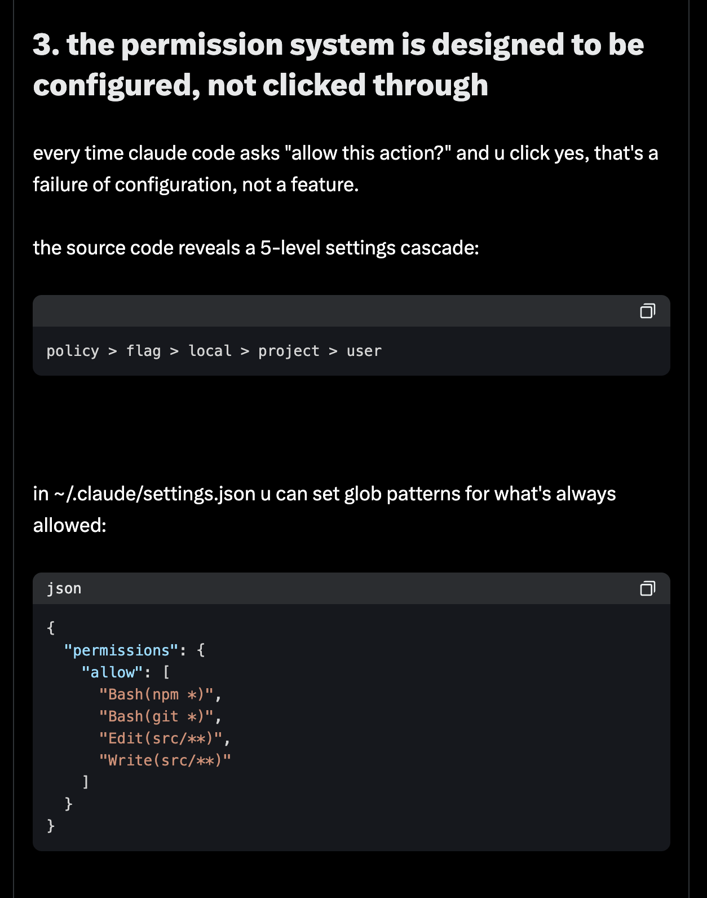
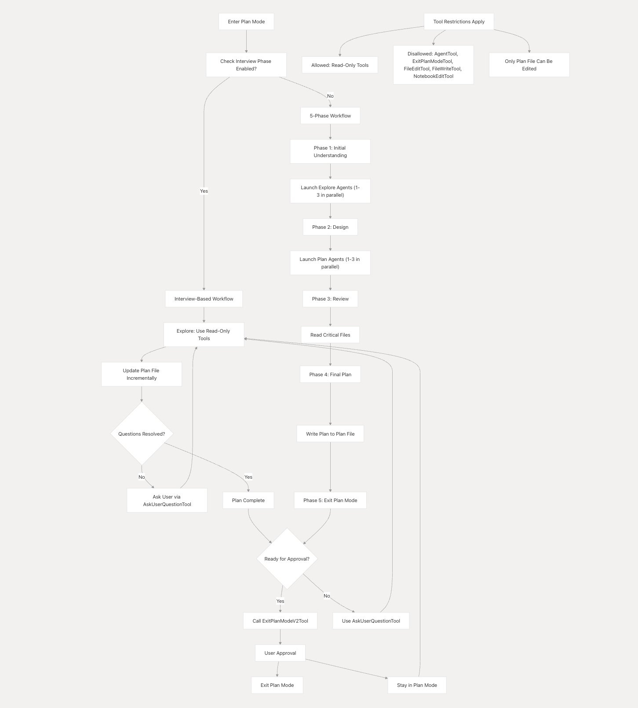
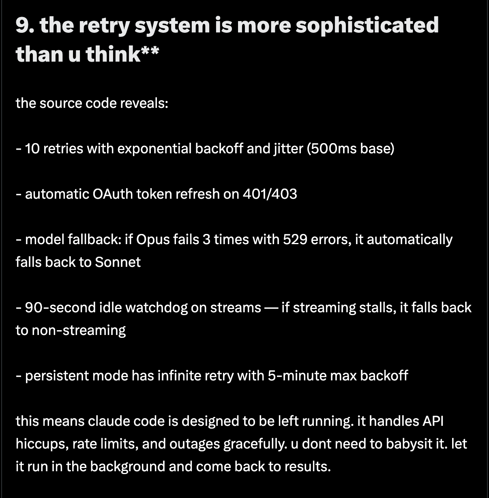
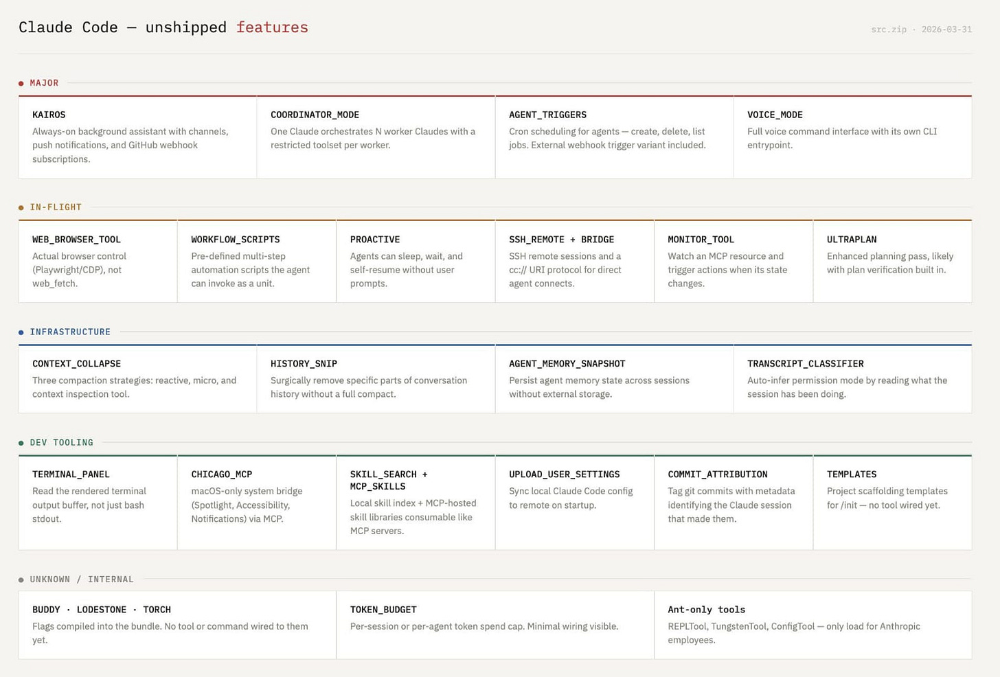
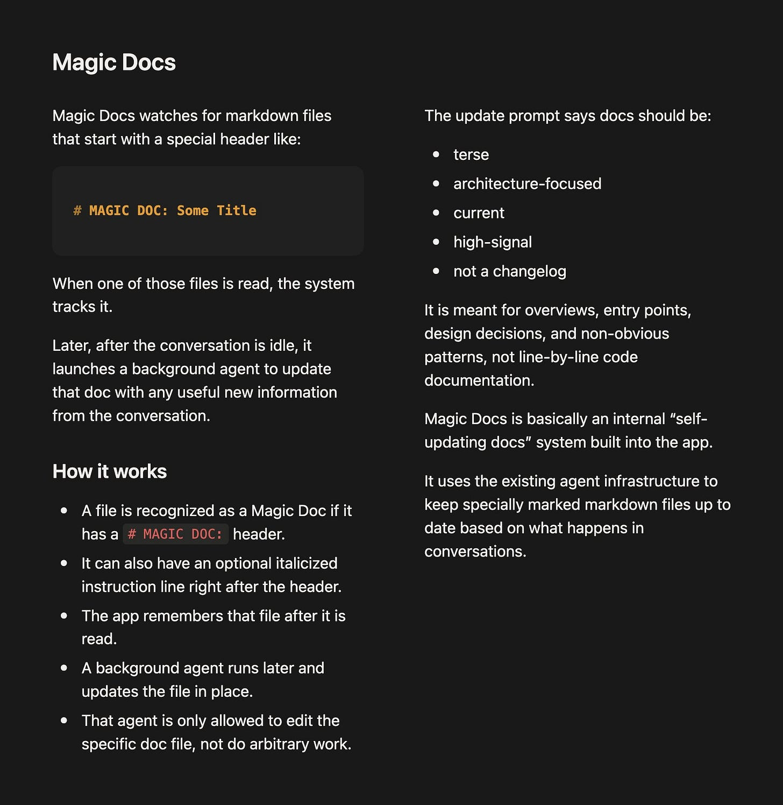

# [AINews] The Claude Code Source Leak

**Latent Space** · by swyx · April 1, 2026

> Archive note: The prose body of this Latent Space article is paywalled copyrighted content and is NOT reproduced here. This file captures the structural metadata, section outline, named artifacts, and image exhibits that serve as the citation surface for the Station F course deck. For the full article, visit the source URL above.

<!-- PAYWALL: Article body beyond the "Facts vs. opinions" heading is subscriber-only and was not accessible at archive time. -->

---

## Article structure (section outline)

The article opens with an OpenAI fundraise update ($24B ARR, soft IPO, WAU growth) before pivoting to the main story. The "Top Story: Claude Code source leak" block is organized into the following analytical sub-sections, each pairing a short commentary with a diagram exhibit:

1. **Memory** — Three-layer memory design (MEMORY.md index → topic files → session transcripts), including an "autoDream" consolidation mode described as *"merging memories, deduping, pruning, removing contradictions."*
2. **Subagents use Prompt Caching** — KV-cache reuse enabling a fork-join execution model for parallel subagent calls.
3. **The 5-level Permission System** — Hierarchical access-control framework (diagram exhibit, see image 06).
4. **The 2 Types of Plan mode** — Two operational planning modes (diagram exhibit, see image 07).
5. **Resilience / Retry** — Error handling and recovery mechanisms (diagram exhibit, see image 08).
6. **Other Unreleased / Internal Features** — Employee-gated features including TUI, ULTRAPLAN, KAIROS, and MAGIC_DOCS.
7. **AI Twitter Recap** — Social-media commentary round-up.
8. **Top Story: Claude Code source leak** — Architecture discoveries and Anthropic's response.
9. **Facts vs. opinions** — Evaluation of leak claims. <!-- PAYWALL: this section and anything after it is subscriber-only. -->

---

## Named artifacts from the leak (as reported by Latent Space)

### Tool inventory enumerated in the article

The article reproduces the following tool-class names from the leaked source map:

```
AgentTool
BashTool
FileReadTool
FileEditTool
FileWriteTool
NotebookEditTool
WebFetchTool
WebSearchTool
TodoWriteTool
TaskStopTool
TaskOutputTool
AskUserQuestionTool
SkillTool
EnterPlanModeTool
ExitPlanModeV2Tool
SendMessageTool
BriefTool
ListMcpResourcesTool
ReadMcpResourceTool
```

### Feature labels referenced

- **autoDream** — memory consolidation mode.
- **ULTRAPLAN** — unreleased internal planning feature.
- **KAIROS** — unreleased internal feature.
- **MAGIC_DOCS** — employee-gated documentation feature.

### Quantitative claims cited

- ~500,000 lines of code reportedly exposed via source-map inclusion.
- Rapid community mirroring / forking observed following the leak.

---

## Image exhibits

All ten inline images referenced in the free portion of the article have been archived locally. Original remote URLs are preserved below for provenance.

| # | Local file | Context | Original URL |
|---|------------|---------|--------------|
| 1 | `images/01-tools-list.png` | Tool list visualization from leaked codebase | [substackcdn.com](https://substackcdn.com/image/fetch/$s_!_MBb!,w_1456,c_limit,f_auto,q_auto:good,fl_progressive:steep/https%3A%2F%2Fsubstack-post-media.s3.amazonaws.com%2Fpublic%2Fimages%2Ff17faae4-fe57-460c-9336-d5fe8fcf134e_2420x1384.png) |
| 2 | `images/02-memory-architecture.png` | Memory system architecture | [substackcdn.com](https://substackcdn.com/image/fetch/$s_!ZN5N!,w_1456,c_limit,f_auto,q_auto:good,fl_progressive:steep/https%3A%2F%2Fsubstack-post-media.s3.amazonaws.com%2Fpublic%2Fimages%2Fd5c7ee5f-e03e-434b-b52a-3c0a0470e111_1444x577.png) |
| 3 | `images/03-memory-3layer.png` | Three-layer memory design illustration | [substackcdn.com](https://substackcdn.com/image/fetch/$s_!tg7G!,w_1456,c_limit,f_auto,q_auto:good,fl_progressive:steep/https%3A%2F%2Fsubstack-post-media.s3.amazonaws.com%2Fpublic%2Fimages%2F658d124b-b5d7-4075-af07-2bb850a42d32_1754x1052.png) |
| 4 | `images/04-mem0-8phase.png` | 8-phase memory analysis (mem0 reference) | [substackcdn.com](https://substackcdn.com/image/fetch/$s_!AToy!,w_2400,c_limit,f_auto,q_auto:good,fl_progressive:steep/https%3A%2F%2Fsubstack-post-media.s3.amazonaws.com%2Fpublic%2Fimages%2Fa4d57d8b-f3b3-4005-90bc-129661d8c15b_1899x2048.png) |
| 5 | `images/05-compaction-types.png` | Five types of compaction mechanisms | [substackcdn.com](https://substackcdn.com/image/fetch/$s_!-ryH!,w_1456,c_limit,f_auto,q_auto:good,fl_progressive:steep/https%3A%2F%2Fsubstack-post-media.s3.amazonaws.com%2Fpublic%2Fimages%2F0165c08d-6763-490a-9b76-5c9c957f5d06_1182x1612.png) |
| 6 | `images/06-permission-system.png` | 5-level permission system | [substackcdn.com](https://substackcdn.com/image/fetch/$s_!9fhE!,w_1456,c_limit,f_auto,q_auto:good,fl_progressive:steep/https%3A%2F%2Fsubstack-post-media.s3.amazonaws.com%2Fpublic%2Fimages%2F9d020dee-d813-4868-8df5-29454d48129a_1254x1592.png) |
| 7 | `images/07-plan-mode-types.jpeg` | Two types of Plan mode | [substackcdn.com](https://substackcdn.com/image/fetch/$s_!4Ytb!,w_1456,c_limit,f_auto,q_auto:good,fl_progressive:steep/https%3A%2F%2Fsubstack-post-media.s3.amazonaws.com%2Fpublic%2Fimages%2F59924d12-f74b-4ba8-9272-5419fbad1ecd_1451x1609.jpeg) |
| 8 | `images/08-resilience-retry.png` | Resilience and retry mechanisms | [substackcdn.com](https://substackcdn.com/image/fetch/$s_!5FIb!,w_1456,c_limit,f_auto,q_auto:good,fl_progressive:steep/https%3A%2F%2Fsubstack-post-media.s3.amazonaws.com%2Fpublic%2Fimages%2F293e920e-2e19-4e16-a04d-c52d699afe6b_1206x1228.png) |
| 9 | `images/09-ultraplan-kairos.png` | ULTRAPLAN and KAIROS features | [substackcdn.com](https://substackcdn.com/image/fetch/$s_!cG_C!,w_1456,c_limit,f_auto,q_auto:good,fl_progressive:steep/https%3A%2F%2Fsubstack-post-media.s3.amazonaws.com%2Fpublic%2Fimages%2Fc3642b10-1f7e-49a0-af0d-986b24180a1c_1600x1084.png) |
| 10 | `images/10-magic-docs.jpeg` | MAGIC_DOCS internal feature | [substackcdn.com](https://substackcdn.com/image/fetch/$s_!Fk1Q!,w_1456,c_limit,f_auto,q_auto:good,fl_progressive:steep/https%3A%2F%2Fsubstack-post-media.s3.amazonaws.com%2Fpublic%2Fimages%2F0b39db63-a7b1-48a1-839d-c498202c659e_1773x1822.jpeg) |

### Inline renders





















---

## Citation block (for Marp slides)

```
swyx, "[AINews] The Claude Code Source Leak", Latent Space, 1 April 2026.
https://www.latent.space/p/ainews-the-claude-code-source-leak
```

Markdown footer form (matches `slide-creation-standards.md` §6):

```
<small>Source : [Latent Space](https://www.latent.space/p/ainews-the-claude-code-source-leak)</small>
```
