# RLAIF on a tiny VLM — hackathon presentation

*Slide-structured write-up of the project: what we built, what we learned, and what's next.*
*Figures live in `report/figures/`; regenerate with `make report`, `make sweep-report`, `make validate-report`.*

---

## Slide 1 — TL;DR

- **Goal:** train a tiny VLM (SmolVLM-500M) with **RLAIF** via offline **DPO** on RTX-3090, with **first-class observability**.
- **Built:** a one-command remote-training harness (`deploy / monitor / fetch / verify / sweep / validate`) on the `smic` box, live **Trackio** dashboard, and a presentation-report generator.
- **Verified the training is bug-free** (DPO overfit test: loss `0.693 → ~0`), and the guard immediately **caught a real bug** (LoRA silently adapting the "frozen" vision tower).
- **Tuned the learning rate systematically:** the baseline LR was **~200× too low**. Best stable LR = **1e-3**.
- **Key discipline lesson:** the naive "max reward margin" points at a **diverged** run — reward can be gamed by over-optimization; the honest metric matters.
- **Scaled to 3B:** held-out preference accuracy **0.50 → 0.65** — the real delta DESIGN predicted.
- **Closed-loop RLAIF (Phase 4b):** Qwen-3B generates → a **free** AI judge scores → fresh preferences → DPO. Loop proven end-to-end at **$0**; RLAIF'd beats base **~56%** (48-prompt eval, above chance but modest at 1 round). The honest "we did RLAIF".
- **Honest note:** at 500M the held-out signal is weak (model ceiling); scale + the closed loop are where it pays off.

---

## Slide 2 — Goal & guiding philosophy

Train a tiny VLM with RLAIF on a single RTX-3090 (24 GB), and — the actual point — do it with **observability of the learning signal**, so at any moment we can see (a) whether the reward is moving and (b) what the model actually outputs.

Design rules: simplest loop first · add one axis of complexity at a time · config-driven · observability wired from day 0.

---

## Slide 3 — Why DPO (not GRPO) for the baseline

DPO on the RLAIF-V dataset **is** RLAIF — the preferences were produced by an AI labeler. It's the honest simplest starting point:

| | DPO (baseline) | GRPO (later) |
|---|---|---|
| Data | static preference set | prompts only; online rollouts |
| Generation in loop | no | yes (needs vLLM) |
| Reward | *implicit* (β·log π/π_ref) | *explicit* reward fn |
| Stability on 24 GB | high | fiddly |

DPO loss = `−log σ(β·(r_chosen − r_rejected))`, `r = log(π/π_ref)`. At init policy==ref → margin 0 → **loss = −log 0.5 = 0.6931** (this exact number matters later).

---

## Slide 4 — The remote-training harness (one-command loop)

Everything runs on `smic` via `ssh`; we drive it from the laptop with `make`:

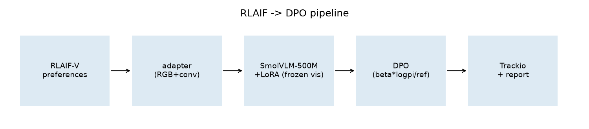

- `make deploy` — rsync code → bootstrap `uv` + Python 3.13 → inject `HF_TOKEN` → launch training + dashboard in **tmux** (survives disconnect).
- `make monitor` / public board at **`http://smic.<domain>:22041`** — live Trackio curves + probe tables.
- `make fetch` — pull results back (rsync, non-destructive).
- `make verify` — DPO wiring regression test (below).
- `make sweep` / `make validate` — **parallel** LR experiments.
- `make report` — regenerate this deck's figures.

Observability writes **twice**: to Trackio (live) *and* to plain files in the run dir (so the report is reproducible from a fetched run, no DB parsing).

---

## Slide 5 — Research findings (3 parallel agents)

- **Stack:** py3.13 has wheels for everything except flash-attn → use **sdpa**. torch 2.11 (cu128) runs under driver 580. Modern `trl 1.7` / `transformers 4.57` required (older SmolVLM-DPO cookbook pins predate the Trackio integration).
- **Dataset (RLAIF-V):** ships `image/question/chosen/rejected` as **plain strings**; TRL VLM-DPO needs a conversational schema with a `{"type":"image"}` placeholder + an `images` list. `.convert("RGB")` is the #1 crash guard; `max_length=None` avoids truncating image tokens.
- **Trackio:** renders image cells in tables but has **no step slider** → probe view is a cumulative table. `Table(columns=,data=)` is stubbed in 0.29 → must use `Table(dataframe=…)`.

---

## Slide 6 — Phase 1: DPO baseline + full observability

SmolVLM-500M, LoRA (vision frozen), ~2k RLAIF-V pairs, 1 epoch. Every channel logged:

- **Scalars:** reward margins / accuracies, logps chosen/rejected, loss, grad-norm.
- **Data-sanity table** (step 0): 8 training pairs — catches template bugs before a wasted run.
- **Probe table** (cumulative): the frozen probe set generated every N steps.
- **Eval scalar** (before/after).

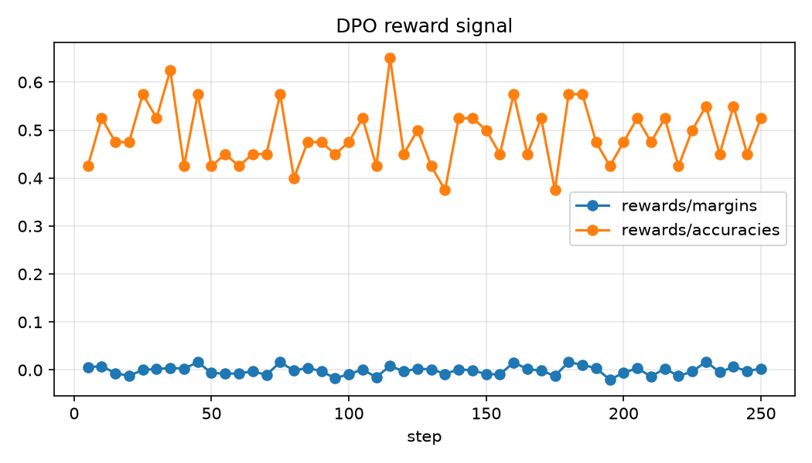
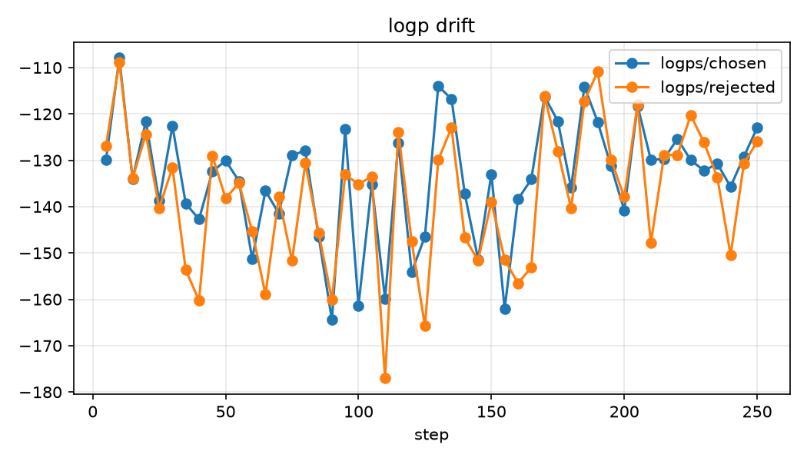

---

## Slide 7 — Results at 500M: honest read

The reward margin stays flat and the frozen-probe answers **don't drift** across training:

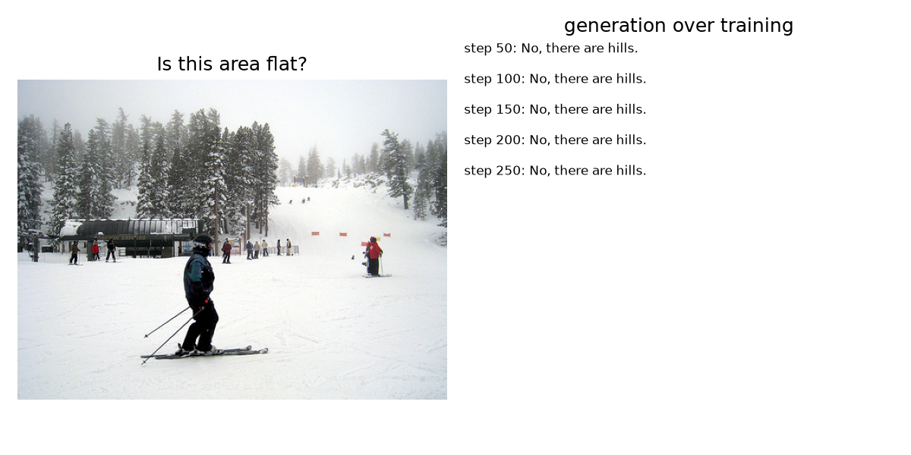

As DESIGN predicted, **500M validates the plumbing, not hallucination gains.** But is "flat" a *bug* or the *model*? That question is the whole next section.

---

## Slide 8 — Is the training correct? (verification)

We ran the DPO analogue of the classic **overfit-a-tiny-batch** test — memorize 2 preference pairs:

| step | loss | margin | acc |
|---:|---:|---:|---:|
| 1 | **0.69310** (= ln2) | 0.000 | 0.00 |
| 7 | **0.00010** | 9.39 | 1.00 |
| 9 | ~0.00000 | 10.95 | 1.00 |

- **Step-1 loss = exactly ln2** ⇒ policy==reference, β/sign wired right (the `ref_model=None` adapter-disable reference is correct).
- Loss craters to ~0, accuracy → 1.0 ⇒ **gradients flow, optimizer works. The loop is bug-free.**
- ⇒ the flat baseline is the **model size**, not a bug.

Codified as **`make verify`** (7 assertions, exits non-zero on failure). On its **first run it caught a real bug**: `target_modules=[q/k/v/o_proj]` matched the *vision* tower's attention, so LoRA was adapting the "frozen" vision encoder (72 vision params trainable). Fixed with `exclude_modules=".*vision.*"` → memory dropped 4.2 → 3.0 GB. Full battery in `tasks/rl-verification-checklist.md`.

---

## Slide 9 — Systematic HP tuning (methodology)

Applying the methodology from *"Stop Guessing"*: tune **architecture → optimizer → scheduler → regularization**, LR as the nuisance parameter, **one robust single-number metric**, **quasi-random wide net**, and **bracket the optimum** (best surrounded by worse on all sides).

For us: batch size is the fixed precondition, AdamW is fixed, scheduler/regularization held constant → **tune LR first**, on a **held-out eval reward margin**. The baseline LR `5e-6` is **20–200× below** AdamW's usual `1e-4–1e-3` band — prime suspect for the flat reward.

---

## Slide 10 — LR sweep: the 200× finding + the divergence trap

Wide net `1e-6 → 1e-1`, one per decade:

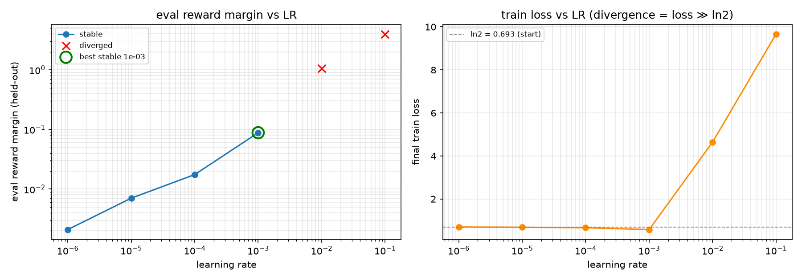

- Eval margin rises smoothly to **1e-3**; train loss dips below ln2 there (real learning).
- **The trap:** the raw max-margin pick is **1e-1** (margin 4.0) — but its train loss is **9.7** (loss *exploded*). That's **divergence / reward-hacking**, not learning; accuracy stays at chance. The summarizer now flags `train_loss ≫ ln2` as **DIVERGED** and picks the best **stable** run.
- **Best stable LR = 1e-3** (≈200× the baseline). Bracketed cleanly: worse below, diverged above.

---

## Slide 11 — Parallelizing the sweep (use the whole GPU)

A single batch-1 trial used ~3 GB / 24 GB at ~40% util — the card was mostly idle. But a batch-8 VLM trial peaks at **~19 GB** (image-token activations), so naively only one fits.

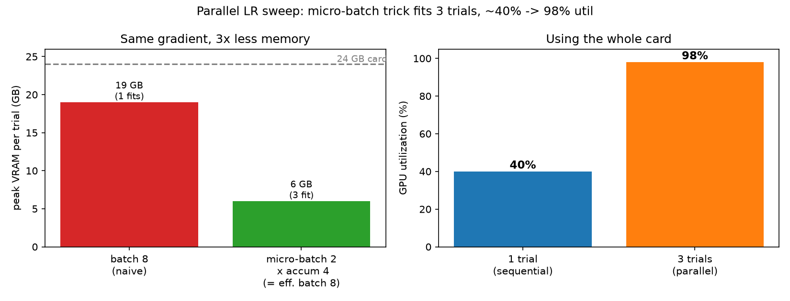

**Trick:** micro-batch 2 × grad-accum 4 = the **identical effective-batch-8 gradient at ~6 GB** (accumulation adds compute, not memory). Three fit in ~16 GB, run via `xargs -P 3`:

- GPU utilization **~40% → 98%**, 3 trials concurrent, no OOM.
- Each trial isolates its dataset cache (`/dev/shm`) so parallel runs don't collide; NaN-safe logging so a diverging trial can't corrupt the shared Trackio DB.

---

## Slide 12 — Validation (longer runs at the winner)

Three parallel longer runs (150 steps, 2k train, **256 held-out eval**) at **5e-3 / 1e-3 / 5e-2**:

| lr | eval margin | eval acc | train loss | status |
|---|---:|---:|---:|---|
| **1e-3** | **0.1725** | **0.578** | 0.6801 | **stable** |
| 5e-3 | 0.077 | 0.543 | 5.10 | DIVERGED |
| 5e-2 | 0.105 | 0.539 | 5.64 | DIVERGED |

- **The tuned LR pays off:** at 1e-3, held-out accuracy moved **0.50 → 0.578** (~2.5σ over chance on 256 pairs) and margin rose to 0.17 (from 0.088 at 48 steps). So fixing the LR (200×) **does** buy a measurable held-out gain — modest, but real, where the baseline was flat.
- **Stability edge is tight:** `5e-3` *diverged* over 150 steps even though the 48-step sweep hinted it was pushable. **Short sweeps hide late-onset divergence — validate at length.** `1e-3` is the confirmed production LR.

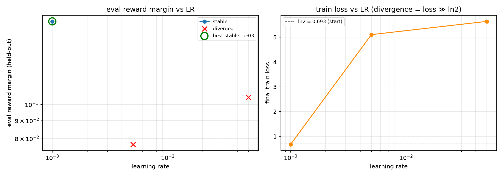

---

## Slide 12a — Scaling the model is the real delta

DESIGN predicted 500M validates plumbing, not gains — and the delta shows up at 3B:

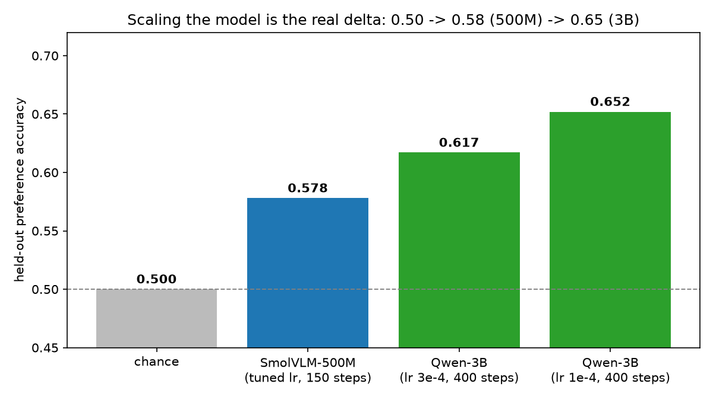

Held-out preference accuracy: **0.50 (chance) → 0.58 (500M) → 0.65 (3B)**. Same harness, one config swap
(+ the Qwen processor/freeze fixes). (Aside: 3B trials are ~11 GB, so they run **solo** — the free
parallelism was a 500M luxury.) With a model that actually learns, we can now do real RLAIF on it →

## Slide 12a-bis — Full-resolution 3B headline run

The clean full-res 3B DPO run (500 steps, full `max_pixels`, probes on) shows the strongest learning
signal of the project:

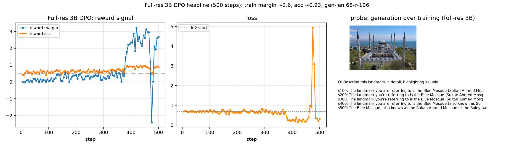

Train reward margin **~2.7**, accuracy **~0.88**, loss **0.69 → 0.30** — a model that clearly learns the
preference. Probe generations lengthen and shift across steps (gen-len 68 → 106). This is the "3B on the
proven harness, at full fidelity" result — and the launch pad for the RLAIF loop below.

## Slide 12b — Phase 4b: TRUE closed-loop RLAIF (the payoff)

Everything before this was **offline** RLAIF (DPO on the static, AI-labeled RLAIF-V set). Here we close
the loop: **our own model generates, an AI judges, we build a fresh preference set, we retrain.**

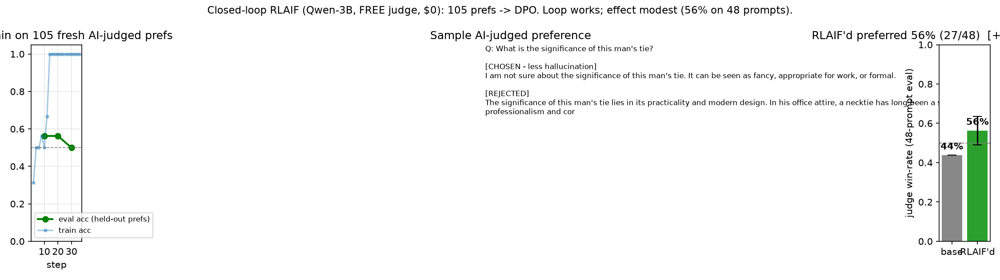

- **Generate:** Qwen-3B samples K=2 answers on 128 held-out prompts (diverse — e.g. one confidently
  hallucinated, one cautious).
- **Judge (the AI feedback):** a **FREE** OpenRouter vision model scores each pair for faithfulness /
  less hallucination → **105 fresh preferences at $0 cost**. It picks *sensibly* on clear cases — e.g.
  CHOSEN "It is unknown..." over REJECTED "suits and ties overlapping in the image" — though at the
  aggregate the signal is weak (chosen/rejected lengths near-equal), foreshadowing the modest effect.
- **Retrain:** DPO on the fresh AI-judged set → RLAIF'd Qwen-3B (eval acc 0.625 on held-out prefs).
- **Did it help? Modestly — win-rate 27/48 = 56% (±7%).** The same judge, comparing **RLAIF'd vs base
  answers** on *fresh* held-out prompts, prefers the RLAIF'd model ~56% of the time. Above chance, but
  within noise at this scale. (A first 24-prompt eval read 71% — small-sample optimism; the 48-prompt
  eval is the honest number.) At **$0 API cost**.
- Budget-safe by construction: free-first judge, hard call cap, credit-fallback, idempotent cache.

**This is the honest "we did RLAIF" story** — on-policy, model-generated preferences scored by an AI,
retrained end-to-end. The *loop is proven to work*; the measured effect at 1 round / 105 prefs / a small
free judge is modest. Levers to sharpen it: a stronger judge, more rounds (on-policy iteration), more data.

## Slide 12c — Does iterating help? No — and *that's* the interesting result

We ran **round 2 on-policy**: sample from the round-1 RLAIF'd model → judge → retrain → eval.

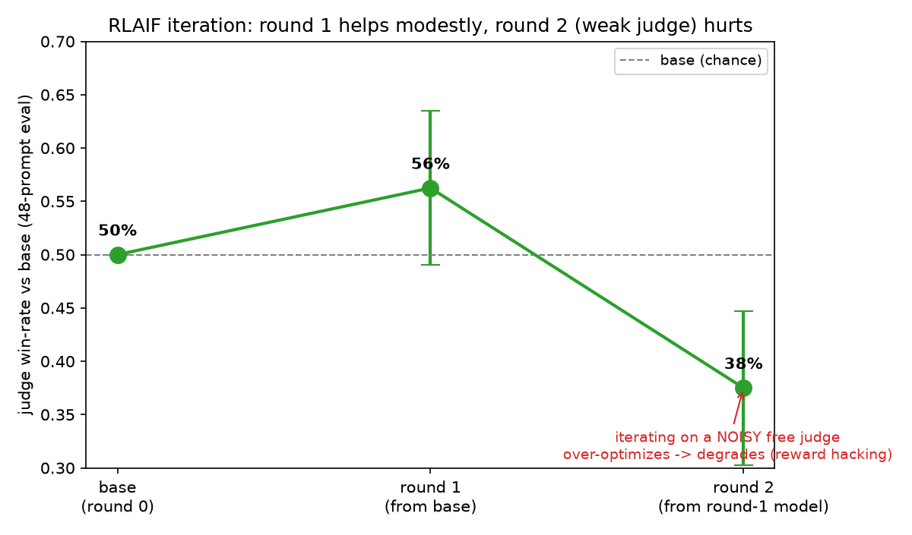

- Round 1 (from base): **56%** vs base — modest help.
- Round 2 (from the round-1 model): **37.5%** vs base — **worse than base.**

**Iterating on a weak/noisy free judge *degraded* the model** — textbook **reward over-optimization**
(Gao et al.): push hard against a cheap proxy and true quality falls. The preference analysis backs it
up — by round 2 the model's answers had already shrunk toward the judge's taste (58 vs 69 words), so the
pairs were near-indistinguishable and the judge's noise dominated.

**The takeaway:** the closed loop is *mechanically sound* (it runs, produces sensible preferences, and one
round modestly helps), but **the judge is the bottleneck.** A stronger judge (paid VLM or an ensemble),
KL-regularization to the reference, and early-stopping on a gold metric are the levers — exactly the
RLHF-over-optimization playbook. Honest negative results are results.

## Slide 12d — Day 2: making it actually work (diagnosis → fix → measure)

Day-1 results were weak. Day-2 diagnosis found **three concrete causes, none of them a training bug**
(the overfit test + step-0 sanity checks had already ruled that out):

1. **Undertrained** — 2k pairs / 400 steps / LoRA r=16 on attention only (~1.5 passes over 2.4% of the data).
2. **No external metric** — the "hallucination proxy" was a stub logging *generation length*; nothing
   could visibly "work" because the thing that matters was never measured.
3. **Two measurement bugs found & fixed:** (a) *eval-slice confound* — each run evaluated on "the rows
   right after its train_size", so changing train size silently changed the eval distribution (RLAIF-V is
   unshuffled source-blocks); (b) *judge noise quantified* — 20% of the free judge's verdicts don't
   survive an A/B order swap (3-vote consistency test).

**The fix (phase3 recipe):** 8k pairs · 1000 steps · LoRA **r=32 + MLP modules** · lr 1e-4 **cosine** · full-res —
then **scale the data again (16k)** with the recipe held fixed:

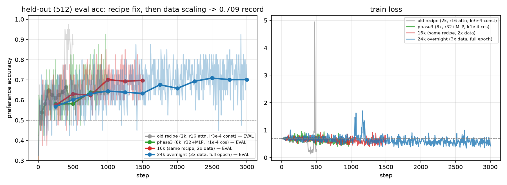

- phase3 (8k): **0.580 → 0.643**, monotone to epoch 1.0, no over-optimization (the old recipe's loss *rose*
  past epoch 1 as it memorized repeats).
- 16k (2× data, same recipe): flat phase, then upturn → **0.7012** (best ckpt, step 1000).
- 24k overnight (3× data, full epoch): same shape again → **0.709 (best ckpt 2500) — project record**,
  final eval holds 0.7012. **Own-slice arc: 0.58 → 0.643 → 0.701 → 0.709.**

**An empirical regularity we didn't expect:** all three runs inflect upward at **epoch ≈ 0.6-0.75**
(phase3 @750/1000, 16k @1000, 24k @1750-2500) after a flat phase — regardless of dataset size. A
step-matched early-stopping rule would have killed both scaled runs *right before* their jump; the
epoch-aware gates (amended mid-day, pre-registered before each verdict) are what let them finish.

Discipline upgrade to match the compute budget: every run carries **pre-declared kill-gates** (epoch-aware —
a step-matched rule would have killed the 16k right before its upturn) and ships its **best checkpoint**, not
its last.

**The confound-free comparison** — every adapter rescored on one fixed, never-trained slice (@20000, n=256, ±3.1%):

| adapter | preference acc | mean margin |
|---|---:|---:|
| **16k best (ckpt-1000)** | **0.617** | **+0.46** |
| phase3 (8k, r32+MLP) | 0.609 | +0.32 |
| consensus-RLAIF (just 108 on-policy prefs) | 0.570 | +0.20 |
| old recipe (r16 attn-only) | 0.531 | +0.26 |

Three honest reads: the recipe fix is a **real +8pt (>2σ)** gain; own-slice numbers ran hot (the fixed slice
is the number to quote across models); and 108 *clean on-policy* preferences beat the old recipe's 3k dataset
pairs — label quality competes with label quantity.

**And the final head-to-head** (the @20000 slice sits *inside* the 24k run's training data — it scored 0.887
there, textbook memorization, **caught by our own contamination check** — so the two contenders were rescored
on a fresh slice @25000 beyond all training data):

| clean slice @25000 (n=256) | acc | margin |
|---|---:|---:|
| **24k overnight (ckpt-2500) — final model** | **0.7227** | **+0.62** |
| 16k (ckpt-1000) | 0.6562 | +0.34 |

The full-epoch 24k model wins by **+6.6pts** on uncontaminated data — the deliverable model. Description-level
eval (fixed grouping): present-object **coverage 0.32 → 0.36** (more thorough descriptions), absent-object
mentions at floor for both (1-2/174) — hallucination-by-insertion is not this base model's failure mode.

**And the honest external measurement (POPE, n=600, paired):**

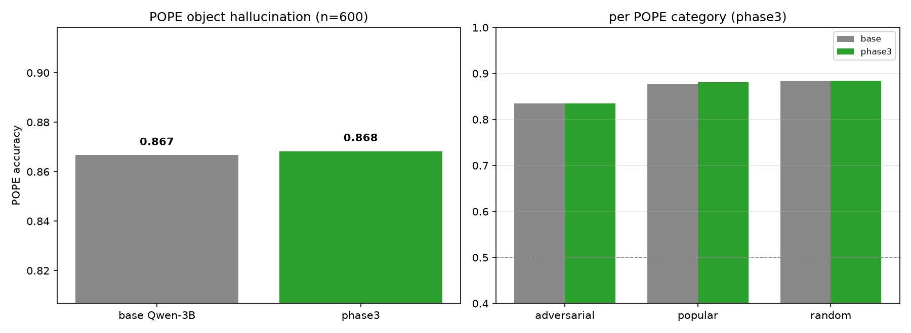

Base 0.867 → tuned 0.868; adversarial *exactly equal*; the two models disagree on **7/600** questions.
**Finding: metric mismatch.** RLAIF-V trains *long-form description faithfulness*; POPE probes *binary
object existence*, where the base instruct model is already heavily aligned. The preference metric and the
binary benchmark **decouple** at this scale — so we built a description-level hallucination eval
(CHAIR-style over POPE's own object labels) measuring what the training actually targets. Results below.

## Slide 13 — Gotchas hall of fame (integration reality)

Every one of these cost real time and is now documented in `tasks/lessons.md`:

- tmux windows die under `TERM=dumb` over non-interactive ssh → explicit per-window commands.
- RLAIF-V has non-RGB images → `.convert("RGB")`.
- Trackio auto-deploys a HF Space (hangs on a token prompt) → own the run, `report_to=[]`.
- Trackio `Table(columns=,data=)` → int keys → orjson crash → use `Table(dataframe=…)`.
- A crashed run corrupts the SQLite DB → wipe + NaN-safe logging.
- smic home disk tight → stream RLAIF-V + cache on `/dev/shm`.
- The research agent invented `torch==2.12.1` (doesn't exist) → verify versions against the real index.

---

## Slide 14 — Next steps

We covered the whole DESIGN arc (Phase 0→4b: harness, 500M, 3B, closed-loop RLAIF). What's left is
sharpening the RLAIF effect — the judge is the bottleneck:

1. **Stronger judge** — a paid frontier VLM or a small ensemble; the free judge's noise capped the gain
   and made iteration over-optimize. This is the single highest-leverage change.
2. **Over-optimization controls** — KL-regularize to the reference, early-stop on a held-out *gold*
   metric (not the proxy judge), so iteration stops helping-then-hurting.
3. **Real hallucination eval** (Object-HalBench / AMBER with ground-truth objects) — an external number
   independent of the training judge.
4. **Scale the preference data** and try **DPO → MPO** (adds an NLL/SFT term against fluency collapse).
5. **GRPO** for fully-online RLAIF (needs vLLM for fast rollouts).

---

## Appendix — the toolkit

`make deploy | monitor | fetch | verify | smoke | overfit | sweep | validate | report | scale | rlaif | rlaif-round2 | overnight`
(+ `sweep-report | validate-report | sweep-qwen-report` for analysis)

Repo: `configs/` (per-experiment YAML) · `data/build_dataset.py` (RLAIF-V→TRL adapter) · `src/train_dpo.py` (entrypoint) · `src/callbacks.py` (dual-write observability) · `src/verify_wiring.py` (regression guard) · `src/sweep_report.py` (LR analysis) · `src/report.py` (deck figures) · `scripts/` (harness) · `docs/superpowers/` (specs + plans) · `tasks/` (lessons + RL-verification checklist).
