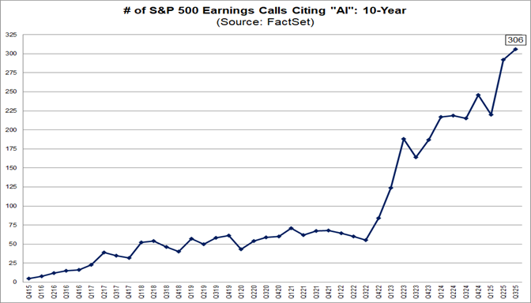
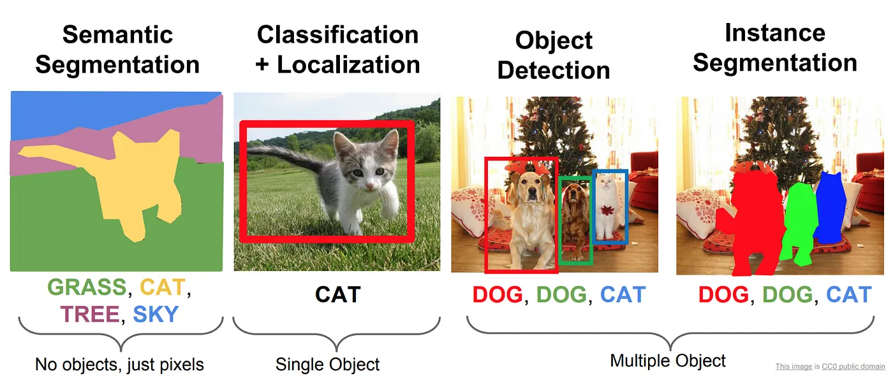

<!-- ABOUTME: Panorama complet de l'IA — capacités GenAI, taxonomie des techniques, paradigmes d'apprentissage et tâches. -->
<!-- ABOUTME: Première moitié de la Session 1, business-framed pour étudiants M2 IMT&E Paris 1 Panthéon-Sorbonne. -->

<!-- _class: title -->
<!-- _paginate: skip -->
<!-- _header: "" -->
<!-- _footer: "" -->

# Deep Tech & Machine Learning

## Session 1A — L'IA Générative : ce qu'elle sait faire

M2 IMT&E · Paris 1 Panthéon-Sorbonne · 2026

---

<!-- _class: section -->

# Qu'est-ce que la Generative AI ?

## What is Generative AI

---

# 01 — L'essor de la Generative AI

- *$2,6 – 4,4 trillions* de valeur annuelle potentielle [1]
- *+15% du PIB mondial* d'ici 2035 [2]
- *66% des jobs aux US* veront leurs taches quotidiennes transformees par l'IA [3]

> Après le lancement de ChatGPT (nov. 2022), les mentions d'"IA" dans les *earnings calls* du S&P 500 ont explosé.

 [4]

*Question pour la classe* : Si le coût de l'intelligence machine tend vers zéro, quel service aujourd'hui trop coûteux pour être automatisé devient une opportunité de startup demain ?

<small>Sources : [1] [McKinsey](https://www.mckinsey.com/capabilities/tech-and-ai/our-insights/the-economic-potential-of-generative-ai-the-next-productivity-frontier) [2] [PWC](https://www.pwc.com/gx/en/news-room/press-releases/2025/ai-adoption-could-boost-global-gdp-by-an-additional-15-percentage.html) [3] [EY](https://www.ey.com/en_gl/insights/ai/how-gen-ai-will-impact-the-labor-market) [4] [Factset](https://insight.factset.com/highest-number-of-sp-500-earnings-calls-citing-ai-over-the-past-10-years-1)</small>

---

# 02 — Qu'est-ce que la Generative AI ?

Des systèmes d'intelligence artificielle capables de *produire du contenu de haute qualité* : texte, code, images, audio, vidéo.

---

# 03 — La Generative AI, aussi un outil de développement

Au-delà des chatbots grand public, la Generative AI est un *developer tool* puissant :

- Génération de code et debugging
- Automatisation de pipelines de données
- Prototypage rapide d'applications

*Pour les entrepreneurs* : même sans équipe technique, les LLMs permettent de construire des *MVPs fonctionnels* en quelques jours.

> En 2025, des startups comme Bolt.new et Lovable permettent de coder des apps entières via prompt. [1][2]

<small>Sources : [1] [Bolt.new](https://bolt.new/) · [2] [Lovable](https://lovable.dev/)</small>

---

# 04 — L'IA est déjà partout

| Technologie IA | Exemples |
|---|---|
| Web Search | Google, Bing |
| Fraud Detection | Paiements CB |
| Recommender Systems | Amazon, Netflix, Spotify |
| Machine Translation | DeepL, Google Translate |
| Speech Recognition | Siri, Alexa, Whisper |

> *Point clé pour entrepreneurs* : L'IA "classique" (prédictive) crée de la valeur depuis 15 ans. La *Generative AI* ouvre un nouvel espace — la création de contenu et le raisonnement.

---

# 05 — Au-delà du texte : images, audio, vidéo

La Generative AI ne se limite pas au texte :

- *Images* : Midjourney [1], DALL-E [2], Stable Diffusion [3], Flux [4]

*Cas d'usage business* :
- Créer des visuels marketing sans graphiste

<small>Sources : [1] [Midjourney](https://www.midjourney.com/) · [2] [OpenAI DALL-E](https://openai.com/dall-e-3) · [3] [Stability AI](https://stability.ai/) · [4] [Black Forest Labs](https://blackforestlabs.ai/)</small>

---

# 06 — Au-delà du texte : audio

La Generative AI ne se limite pas au texte :

- *Audio* : génération de voix (ElevenLabs [1]), musique (Suno [2])

[Suno](https://suno.com/s/0wLOtKpawnA132Pz)

*Cas d'usage business* :
- Produire des voix-off pour des formations

<small>Sources : [1] [ElevenLabs](https://elevenlabs.io/) · [2] [Suno](https://suno.com/)</small>

---

# 07 — Au-delà du texte : vidéo

La Generative AI ne se limite pas au texte :

- *Vidéo* : Sora (OpenAI) [1], Runway [2], Kling (Kuaishou) [3], Seedance2

[Prompt example : drone racing an abandoned factory](https://www.youtube.com/watch?v=-MluR9dqt5w&t=12s)

*Cas d'usage business* :
- Générer des vidéos de démonstration produit

<small>Sources : [1] [OpenAI Sora](https://openai.com/sora) · [2] [Runway](https://runwayml.com/) · [3] [Kling AI](https://klingai.com/)</small>

---

<!-- _class: section -->

# L'IA : bien plus que la Generative AI

## AI is Much More Than GenAI

---

# 08 — L'IA traditionnelle reste la majorité de la valeur

La Generative AI fait les gros titres — mais le Machine Learning traditionnel crée *plus de valeur économique* :

| | ML traditionnel | Generative AI |
|---|---|---|
| **Valeur potentielle** | $11 – 17,7 trillions/an [1] | + $2,6 – 4,4 trillions/an [1] |
| **Part du total** | ~70-80% | ~20-30% |
| **Déploiement** | 71% des entreprises [2] | 29% comme type le plus fréquent [3] |
| **Maturité** | Prouvé depuis 15 ans | En phase d'adoption rapide |
| **Cas typiques** | Prédiction, optimisation, détection | Génération de contenu, raisonnement |

> *Pour un entrepreneur* : connaître les deux mondes est un avantage compétitif. La GenAI fait le buzz, le ML classique fait le chiffre d'affaires.

<small>Sources : [1] [McKinsey](https://www.mckinsey.com/capabilities/tech-and-ai/our-insights/the-economic-potential-of-generative-ai-the-next-productivity-frontier) · [2] [McKinsey State of AI 2025](https://www.mckinsey.com/capabilities/quantumblack/our-insights/the-state-of-ai) · [3] [Gartner](https://www.gartner.com/en/newsroom/press-releases/2024-05-07-gartner-survey-finds-generative-ai-is-now-the-most-frequently-deployed-ai-solution-in-organizations)</small>

---

# 09 — Les multiples facettes de l'IA

L'IA se classe selon trois axes complémentaires :

| Axe | Question | Exemples |
|---|---|---|
| **Par technique** | *Comment* est construit le modèle ? | Statistics, ML, Deep Learning, GenAI |
| **Par paradigme** | *Comment* le modèle apprend-il ? | Supervised, Unsupervised, RL, Self-Supervised |
| **Par tâche** | *Que fait* le modèle ? | Classification, détection, génération |

> Les slides suivantes explorent chaque axe avec des exemples concrets et des démos interactives.

---

<!-- _class: section -->

# Par technique — de la Statistique à la GenAI

## From Statistics to Generative AI

---

<!-- _class: cols -->

# 10 — Vue d'ensemble : Stats → ML → DL → GenAI

Chaque couche ajoute de la complexité et de la capacité :

- **Statistics** — analyser et quantifier des données
- **Machine Learning** — apprendre des patterns à partir de données
- **Deep Learning** — réseaux de neurones profonds, données massives
- **Generative AI** — créer du contenu original

> Chaque couche *inclut* les précédentes : la GenAI repose sur le Deep Learning, qui repose sur le ML, qui repose sur les statistiques.

---

# 11 — Statistics : l'A/B Testing

L'outil statistique le plus accessible — et le plus utilisé par les startups :

| | Version A | Version B |
|---|---|---|
| **Bouton** | "Acheter" (vert) | "Commander maintenant" (orange) |
| **Visiteurs** | 10 000 | 10 000 |
| **Conversions** | 230 (2,3%) | 310 (3,1%) |
| **p-value** | — | 0,0005 (significatif) |

> Pas besoin de modèle ML — une simple comparaison statistique suffit pour prendre des décisions business basées sur des données.

*Question pour la classe* : Quelle variable de votre projet pourriez-vous tester avec un A/B test cette semaine ?

---

# 12 — Machine Learning : la Linear Regression

L'algorithme ML le plus simple — tracer une droite à travers des données :

- **Input** : budget marketing mensuel (€)
- **Output** : chiffre d'affaires prédit (€)
- Le modèle apprend la relation `CA = a × Budget + b`

*Exemples business* :
- Prédire le prix d'un bien immobilier à partir de sa surface
- Estimer les revenus en fonction des dépenses publicitaires
- Prévoir la demande d'un produit

> La Linear Regression est le "Hello World" du Machine Learning. Simple, interprétable, et souvent suffisante.

---

# 13 — Deep Learning : les Neural Networks

Un réseau de neurones apprend des *représentations hiérarchiques* des données :

- **Input Layer** — reçoit les données brutes (pixels, mots, nombres)
- **Hidden Layers** — extrait des features de plus en plus abstraites
- **Output Layer** — produit la prédiction finale

*Démo interactive* : [TensorFlow Playground](https://playground.tensorflow.org) — visualisez comment un réseau apprend en temps réel.

> *Business framing* : plus on ajoute de couches (= "deep"), plus le réseau peut capturer des patterns complexes. C'est ce qui permet la reconnaissance d'images, la traduction, la génération de texte.

---

# 14 — Generative AI : les Transformers

L'architecture qui a tout changé — le *Self-Attention* permet au modèle de pondérer l'importance de chaque mot par rapport à tous les autres.

*Démos interactives* :
- [Transformer Explainer](https://poloclub.github.io/transformer-explainer/) — visualisation pas-à-pas
- [LLM Visualization](https://bbycroft.net/llm) — architecture 3D d'un LLM
- [BertViz](https://colab.research.google.com/drive/1hXIQ77A4TYS4y3UthWF-Ci7V7vVUoxmQ) — visualiser les attention heads

> Les Transformers (2017) sont la brique fondamentale de *tous* les LLMs modernes : GPT, Claude, Mistral, Llama, Gemini.

<small>Sources : [1] [Vaswani et al. 2017](https://arxiv.org/abs/1706.03762)</small>

---

<!-- _class: section -->

# Par paradigme — comment l'IA apprend

## How AI Learns

---

# 15 — Vue d'ensemble des paradigmes d'apprentissage

| Paradigme | Données | Principe | Cas d'usage |
|---|---|---|---|
| **Supervised Learning** | Étiquetées (input → output) | Un prof corrige des copies | Spam, diagnostic, prédiction prix |
| **Unsupervised Learning** | Brutes, sans étiquettes | Un explorateur classe ses découvertes | Segmentation clients, anomalies |
| **Self-Supervised Learning** | Brutes, auto-générées | Apprend seul en masquant des parties | LLMs, BERT, Diffusion Models |
| **Reinforcement Learning** | Environnement + récompense | Essai-erreur, comme un jeu vidéo | AlphaGo, robotique, RLHF |

---

<!-- _class: cols -->

# 16 — Supervised Learning

Le paradigme le plus déployé en production [1] :

- Le modèle apprend à partir d'**exemples étiquetés** (input A → output B)
- Algorithmes classiques : Linear Regression, Random Forest, KNN
- Fonctionne bien avec des données structurées (tableaux, CSV)

| Input (A) | Output (B) |
|---|---|
| Email | Spam ? (0/1) |
| Photo produit | Défaut ? (0/1) |
| Profil client | Score de crédit |

<small>Sources : [1] [McKinsey State of AI 2024](https://www.mckinsey.com/capabilities/quantumblack/our-insights/the-state-of-ai-2024)</small>

---

# 17 — Unsupervised Learning : K-Means

L'algorithme le plus intuitif — regrouper des données en *clusters* sans supervision :

1. **Initialiser** — placer K centres aléatoirement
2. **Assigner** — chaque point rejoint le centre le plus proche
3. **Recalculer** — déplacer chaque centre au barycentre de son cluster
4. **Répéter** — jusqu'à stabilisation

*Cas business* :
- Segmentation clients (groupes de comportement d'achat similaire)
- Détection d'anomalies (transactions frauduleuses = points isolés)
- Topic modeling (regrouper des avis produits par thème)

> *Pour un entrepreneur* : le K-Means révèle des segments de marché que vos clients ne vous décrivent pas explicitement.

---

# 18 — Self-Supervised Learning : le secret de la GenAI

Le paradigme qui a rendu la Generative AI possible — apprendre *sans données étiquetées* :

| Modalité | Méthode | Modèles |
|---|---|---|
| **Texte** | Prédire le mot suivant / masqué | GPT, BERT, Claude, Mistral |
| **Image** | Retirer le bruit d'une image bruitée | Stable Diffusion, DALL-E, Flux |

*Pourquoi c'est révolutionnaire* :
- Pas besoin d'humains pour étiqueter les données
- S'entraîne sur *tout Internet* — des trillions de tokens
- Plus de données = meilleur modèle (loi d'échelle)

---

# 19 — Reinforcement Learning

L'agent apprend par *essai-erreur*, guidé par un signal de récompense :

| Environnement | Agent | Application |
|---|---|---|
| Jeu de Go | AlphaGo (DeepMind) [1] | Bat le champion du monde (2016) |
| Échecs | AlphaZero | Réinvente les ouvertures en 4h |
| Marchés financiers | Trading agents | Optimisation de portefeuille |
| Conversations humaines | ChatGPT, Claude | RLHF aligne le modèle sur les préférences humaines |

> Le RLHF (Reinforcement Learning from Human Feedback) est l'étape qui transforme un LLM brut en assistant utile et sûr.

<small>Sources : [1] [DeepMind](https://deepmind.google/research/breakthroughs/alphago/)</small>

---

<!-- _class: section -->

# Par tâche — que fait l'IA concrètement ?

## What Does AI Actually Do?

---

<!-- _class: cols -->

# 20 — Classification & Regression

### Classification — attribuer une catégorie

- Email → spam ou non-spam
- Image → chat, chien, voiture
- Transaction → frauduleuse ou légitime
- CV → shortlist ou rejet

> La sortie est une *catégorie discrète*.

### Regression — prédire une valeur

- Surface → prix immobilier (€)
- Budget pub → chiffre d'affaires (€)
- Données patient → risque (0-100%)
- Historique → demande future (unités)

> La sortie est une *valeur continue*.

---

# 21 — Object Detection & Segmentation

Des tâches de vision qui vont au-delà de la simple Classification :

| Tâche | Ce qu'elle fait | Exemple |
|---|---|---|
| **Image Classification** | Une étiquette par image | "C'est un chat" |
| **Object Detection** | Localise chaque objet (bounding box) | "Chat à (x,y), chien à (x,y)" |
| **Semantic Segmentation** | Colore chaque pixel par catégorie | Route vs trottoir vs piéton |
| **Instance Segmentation** | Sépare chaque objet individuel | "Piéton 1, Piéton 2, Piéton 3" |

*Outils clés* : YOLO (détection temps réel) [1], Segment Anything (Meta) [2]

> Ces tâches sont au cœur de la conduite autonome, du contrôle qualité industriel et de l'imagerie médicale.

<small>Sources : [1] [Ultralytics YOLO](https://ultralytics.com/) · [2] [Meta SAM](https://segment-anything.com/)</small>

---

# 22 — Génération de texte : le terrain de jeu des LLMs

L'architecture Transformer alimente *toutes* ces tâches de génération :

| Tâche | Input | Output |
|---|---|---|
| **Traduction** | Texte en français | Texte en anglais |
| **Résumé** | Document de 50 pages | 5 bullet points |
| **Question-Answering** | Question + contexte | Réponse précise |
| **Génération de code** | Description en langage naturel | Code fonctionnel |
| **Analyse de sentiment** | Avis client | Positif / Négatif / Neutre |

> Un même modèle Transformer peut accomplir toutes ces tâches — c'est la puissance du *Transfer Learning* et du *Self-Supervised Pretraining*.

---

# 23 — HuggingFace Tasks : votre vocabulaire de recherche

Ces noms de tâches sont votre *vocabulaire* pour chercher des modèles sur HuggingFace :

**Lien** : [huggingface.co/models](https://huggingface.co/models)

| Domaine | Tâches clés |
|---|---|
| **NLP** | Text Classification, Summarization, Translation, Question Answering |
| **Vision** | Image Classification, Object Detection, Image Segmentation |
| **Audio** | Speech Recognition, Text-to-Speech, Audio Classification |
| **Multimodal** | Image-to-Text, Visual Question Answering |

> Maîtrisez ces noms de tâches en anglais — c'est le langage commun de l'écosystème IA open source.

---

<!-- _class: section -->

# Chronologie de l'IA

## From Linear Regression to Autonomous Agents

---

# 24 — Timeline Machine Learning

Les jalons du ML classique — des algorithmes qui restent en production aujourd'hui :

| Année | Jalon | Impact |
|---|---|---|
| 1805 | Linear Regression (Legendre) | Le premier algorithme de prédiction |
| 1951 | KNN (Fix & Hodges) | Classification par voisinage |
| 1958 | Logistic Regression (Cox) | Classification binaire — toujours utilisée |
| 1963/1995 | SVM (Vapnik) | Classification haute dimension |
| 2001 | Random Forest (Breiman) | Ensembles d'arbres de décision |
| 2014 | XGBoost (Chen & Guestrin) [1] | Champion des compétitions Kaggle |

> Ces algorithmes ne font pas la une, mais ils sont derrière la détection de fraude, le scoring crédit, et la recommandation produit.

<small>Sources : [1] [XGBoost (arXiv)](https://arxiv.org/abs/1603.02754)</small>

---

# 25 — Timeline Deep Learning

La convergence *GPU + Data + Algorithmes* déclenche une accélération sans précédent :

| Année | Jalon | Impact |
|---|---|---|
| 1986 | Backpropagation (Hinton) [1] | Rend l'entraînement de réseaux profonds possible |
| 1998 | LeNet / MNIST (LeCun) [2] | Première reconnaissance d'écriture industrielle |
| 2012 | AlexNet + ImageNet [3] | Erreur divisée par 2 — lance l'ère du Deep Learning |
| 2017 | "Attention Is All You Need" [4] | Naissance des Transformers |

> Chaque percée repose sur la précédente : sans la Backpropagation de 1986, pas d'AlexNet en 2012 ; sans AlexNet, pas de Transformers en 2017.

<small>Sources : [1] [Nature](https://www.nature.com/articles/323533a0) · [2] [IEEE](https://ieeexplore.ieee.org/document/726791) · [3] [NeurIPS](https://papers.nips.cc/paper/2012/hash/c399862d3b9d6b76c8436e924a68c45b-Abstract.html) · [4] [arXiv](https://arxiv.org/abs/1706.03762)</small>

---

# 26 — Timeline Generative AI : l'accélération

| Année | Jalon | Impact |
|---|---|---|
| 2018 | BERT (Google) [1] | Pre-Training bidirectionnel révolutionne le NLP |
| 2019 | BERT déployé sur Google Search [2] | L'IA touche des milliards de requêtes |
| 2022 | ChatGPT (OpenAI) [3] | 100 millions d'utilisateurs en 2 mois |
| 2023 | DALL-E 3, GPT-4V | L'IA devient multimodale |
| 2024 | O1 (OpenAI) | Premier Reasoning Model grand public |
| 2025 | DeepSeek-R1 [4], Claude Code [5] | Raisonnement open source + agents autonomes |
| 2026 | OpenClaw [6] | Agent autonome viral — 150K ⭐ GitHub, créateur recruté par OpenAI |

> En 8 ans, l'IA est passée d'une avancée académique (BERT) à des agents autonomes (OpenClaw). Le rythme *s'accélère*.

<small>Sources : [1] [Google AI Blog](https://ai.googleblog.com/2018/11/open-sourcing-bert-state-of-art-pre.html) · [2] [Google Blog](https://blog.google/products/search/search-language-understanding-bert/) · [3] [Reuters](https://www.reuters.com/technology/chatgpt-sets-record-fastest-growing-user-base-analyst-note-2023-02-01/) · [4] [GitHub DeepSeek-R1](https://github.com/deepseek-ai/DeepSeek-R1) · [5] [Anthropic](https://docs.anthropic.com/en/docs/claude-code/overview) · [6] [OpenClaw](https://openclaw.ai/)</small>

---

<!-- _class: section -->

# Points clés à retenir

## Key Takeaways

---

# 27 — Récapitulatif Session 1A

### La Generative AI en contexte
- La GenAI produit du contenu (texte, image, audio, vidéo, code) — mais le ML traditionnel représente *~70% de la valeur IA totale*
- L'IA classique (recherche web, détection de fraude, recommandation) reste le moteur de revenus

### La taxonomie de l'IA
- **Par technique** : Statistics → ML → Deep Learning → GenAI (chaque couche inclut les précédentes)
- **Par paradigme** : Supervised, Unsupervised, Self-Supervised, Reinforcement Learning
- **Par tâche** : Classification, Regression, Object Detection, Segmentation, Génération

### Le vocabulaire HuggingFace
- Les noms de tâches en anglais sont votre clé pour chercher des modèles open source

### Les timelines
- ML (1805–2014) → Deep Learning (1986–2017) → GenAI (2018–2026) : accélération exponentielle
