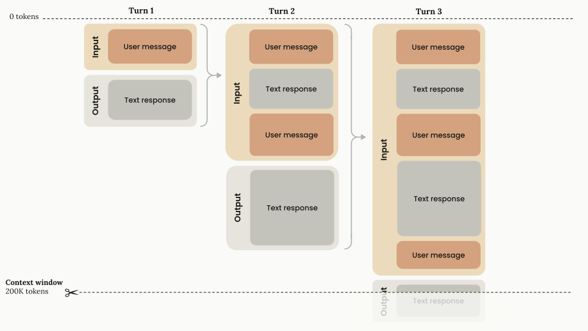
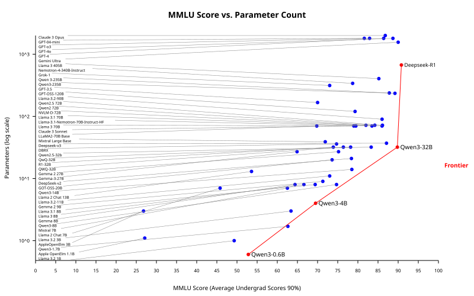

<!-- ABOUTME: Comprendre les LLMs — impact, mécanique, glossaire (Tokens, Context Window, MoE), pipeline d'entraînement, coûts (training + inference), accès, taille, structured output avancé (field ordering, confidence). -->
<!-- ABOUTME: Première moitié de la Session 2, business-framed pour étudiants M2 IMT&E Paris 1 Panthéon-Sorbonne. -->

<!-- _class: title -->
<!-- _paginate: skip -->
<!-- _header: "" -->
<!-- _footer: "" -->

# Les LLMs

## Session 2A — Comprendre et utiliser les modèles de langage

M2 IMT&E · Paris 1 Panthéon-Sorbonne · 2026

---

<!-- _class: section -->

# Impact et capacités des LLMs

## Why LLMs Matter

---

# 01 — Benchmarks : progrès réels, plafonds visibles


- MMLU (connaissances générales) : **saturé à 90%+** — les LLMs rattrapent les experts humains [1]
- Nouveaux benchmarks plus durs : Humanity's Last Exam **8,8%**, FrontierMath **2%** [2]
- Efficience : de **540B params** à **3,8B** pour atteindre 60% au MMLU — réduction de **142x** [1]

> Les benchmarks faciles saturent, mais les problèmes réellement difficiles restent hors de portée. La course n'est pas terminée.

<small>Sources : [1] [Epoch AI](https://epoch.ai/trends) · [2] [Stanford HAI AI Index 2025](https://aiindex.stanford.edu/report/)</small>

---

# 02 — Ce que les LLMs permettent

| Catégorie | Exemples | Type d'app |
|---|---|---|
| *Writing* | Brainstorming noms de produits, communiqués de presse, traduction | Web + App |
| *Reading* | Classification d'emails, résumé de conversations, analyse de sentiment | Surtout App |
| *Chatting* | Service client bot, coaching, FAQ interne | Web + App |
| *Coding* | Copilot, Cursor, Claude Code — 76% des développeurs utilisent des outils IA [1] | Web + App |

*Deux modes d'utilisation* :
- *Web-based* : ChatGPT, Claude, Le Chat — interaction directe
- *Software application* : le LLM est intégré dans un produit (email routing, analyse automatisée)


<small>Sources : [1] [Stack Overflow 2024](https://survey.stackoverflow.co/2024/ai)</small>

---

<!-- _class: section -->

# Comment fonctionne un LLM

## Next-Token Prediction

---

# 03 — Le mécanisme fondamental


Le LLM utilise le **Self-Supervised Learning** pour prédire le token suivant :

- **Input** : la séquence complète jusqu'ici → le modèle produit une distribution de probabilités
- **Sampling** : un token est sélectionné (ex : "love") et ajouté à la séquence
- **Boucle** : le processus se répète jusqu'au token de fin `<eos>`

> Chaque token dépend de *tous* les tokens précédents — c'est pourquoi la génération est séquentielle, et les réponses longues coûtent plus cher.

---

<!-- _class: section -->

# Glossaire technique

## Tokens, Context Window, MoE

---

# 04 — Tokens : le vocabulaire des LLMs


Les LLMs ne raisonnent pas en mots mais en **Tokens** — des fragments de mots.

**Règle approximative** : 1 Token ≈ 3/4 d'un mot (en anglais)

[Tokenizer demo](https://platform.openai.com/tokenizer)

> En français, le ratio est moins favorable (~1 token ≈ 0,6 mot). Vocabulaire plus large = moins de tokens = *moins cher*.

---

# 04b — Tokens : taille du vocabulaire

| Modèle | Taille du vocabulaire | Particularité |
|---|---|---|
| Llama 2 | 32 000 tokens | Optimisé anglais |
| Llama 3 | 128 256 tokens | +4x, meilleur multilingue |
| Qwen 3 | 151 669 tokens [1] | Optimisé CJK + multilingue |

- **+4x de vocabulaire** entre Llama 2 et 3 : meilleur encodage multilingue
- Impact direct : moins de tokens par requête = **coût API réduit**

<small>Sources : [1] [Qwen3 Technical Report](https://arxiv.org/abs/2505.09388)</small>

---

# 05 — Context Window : la mémoire de conversation



La **Context Window** = mémoire de travail du LLM, tout ce qu'il "voit" pour répondre.

- Input + Output partagent la même fenêtre (200K tokens pour Claude)
- Le contexte *s'accumule* à chaque tour — rien n'est supprimé
- Les **Thinking Tokens** comptent pendant la génération, puis sont retirés [1]
- Facturation **par Token** (input + output)

<small>Sources : [1] [Anthropic](https://docs.anthropic.com/en/docs/build-with-claude/context-windows)</small>

<!--
Speaker notes:
La Context Window limite la longueur des conversations et la taille des documents analysables.
-->

---

<!-- _class: compact -->

# 06 — Context Window : une croissance exponentielle


| Modèle | Année | Context Window |
|--------|-------|---------------|
| GPT-2 | 2019 | 1K tokens |
| GPT-4 | 2023 | 128K tokens |
| Claude 3.5 | 2024 | 200K tokens |
| Gemini 1.5 | 2024 | 2M tokens |
| Llama 4 Scout | 2025 | **10M tokens** |

Depuis mi-2023, la context window croît d'environ **~30x par an** [1].

> 10M tokens ≈ 15 000 pages — de "résumer un email" à "analyser une base documentaire entière".

<small>Sources : [1] [Epoch AI](https://epoch.ai/data-insights/context-windows)</small>

---

# 07 — Sampling : Temperature, Top-k, Top-p


Quand le LLM génère un token, il produit une distribution de probabilités. Trois paramètres contrôlent comment le token est *échantillonné* :

| Paramètre | Ce qu'il fait | Valeurs typiques |
|-----------|--------------|-----------------|
| **Temperature** | Aplatit ou accentue la distribution | 0.0–2.0 |
| **Top-k** | Garde seulement les *k* tokens les plus probables | 10–100 |
| **Top-p** (nucleus) | Garde les tokens dont la probabilité cumulée ≤ *p* | 0.7–0.95 |

> **Temperature basse** (0.1) = réponses déterministes et sûres. **Temperature haute** (1.5) = créatif mais risqué. Top-k et Top-p filtrent les tokens improbables pour éviter les absurdités.

---

<!-- _class: compact -->

# 08 — Mixture of Experts (MoE) : l'architecture qui change tout


Un modèle MoE contient *plusieurs sous-réseaux spécialisés* (experts). Un **Router** sélectionne les experts pertinents pour chaque token.

- Le modèle a la *capacité* de tous les experts (total params)
- Mais n'*active* qu'une fraction par token (active params)
- *Résultat* : performance d'un gros modèle, vitesse d'un petit

| Modèle | Total | Actifs/token |
|--------|-------|-------------|
| Mixtral 8x7B 🇫🇷 | 46,7B | 12,9B |
| DeepSeek-V3 🇨🇳 | 671B | 37B |
| Qwen3 235B 🇨🇳 | 235B | 22B |

<small>Sources : [1] [Mixtral](https://arxiv.org/abs/2401.04088) · [2] [DeepSeek-V3](https://arxiv.org/abs/2412.19437) · [3] [Qwen3](https://arxiv.org/abs/2505.09388)</small>

---

<!-- _class: section -->

# Le pipeline d'entraînement

## Pre-train → Instruct → Thinking → Fine-tune

---

<!-- _class: compact compact-table -->

# 09 — Vue d'ensemble du pipeline


| Étape | Ce qu'il apprend | Données | Résultat |
|-------|-----------------|---------|----------|
| **Pretraining** | Langage, faits | ~15T tokens [1] | Base Model |
| **SFT** (Instruct) | Suivre des instructions | ~25K–1M ex. [2] | Instruct Model |
| **RLHF / DPO** | Être utile et honnête | ~100K–1M paires [3] | Chatbot aligné |
| **Reasoning** | Réfléchir avant de répondre | ~5K seeds → 800K [4] | Thinking Model |

> Chaque étape **ajoute une couche** sur la précédente — avec *exponentiellement moins de données*.

<small>Sources : [1] [Meta Llama 3](https://ai.meta.com/blog/meta-llama-3/) · [2] [RLHF Book](https://arxiv.org/abs/2504.12501) · [3] [Anthropic hh-rlhf](https://huggingface.co/datasets/Anthropic/hh-rlhf) + Tulu 3 · [4] [DeepSeek-R1](https://arxiv.org/abs/2501.12948)</small>

---

# 10 — Les trois générations de LLMs

| Génération | Entraînement | Cas d'usage | Exemples |
|---|---|---|---|
| **Base Model** | Pretraining seul | Complétion de texte, Embeddings | GPT-3, BERT |
| **Instruct Model** | + SFT + RLHF | Chatbot, assistant | ChatGPT, Claude, Mistral |
| **Thinking Model** | + Reasoning Training | Maths, code, raisonnement | o3, DeepSeek-R1 |

> La disponibilité de modèles open-weights à toutes les tailles permet de choisir le bon rapport qualité/coût pour chaque usage. Voir la [Qwen3 Collection](https://huggingface.co/collections/Qwen/qwen3) sur HuggingFace.

---

# 11 — Thinking Models : penser avant de répondre

*Ce que font les Reasoning Models différemment* :

- *Extended Thinking* — le modèle génère une chaîne de raisonnement *avant* de répondre
- *Token budget* — plus on alloue de "Thinking Tokens", meilleure est la réponse (mais plus cher)
- *Vérification interne* — le modèle vérifie ses propres étapes, réduisant les hallucinations

| Modèle | AIME 2024 (maths) | Prix input / 1M tokens |
|--------|-----------|-----------------|
| GPT-4o | ~26% | $2,50 [1] |
| DeepSeek-R1 | 79,8% | $0,55 [2] |
| o3 | 91,6% | $2,00 [1] |
| o4-mini | 93,4% | $1,10 [1] |


<small>Sources : [1] [OpenAI](https://openai.com/index/introducing-o3-and-o4-mini/) · [2] [DeepSeek](https://arxiv.org/abs/2501.12948)</small>

---

<!-- _class: cols -->

# 12 — Fine-tuning : adapter un modèle à vos besoins

<div class="left">

| | Pretraining | Fine-tuning |
|---|---|---|
| **Données** | Milliards de mots | Milliers d'exemples |
| **Objectif** | Apprendre le langage | Adapter à une tâche |
| **Coût** | Millions $ | Centaines $ |

**Quand ?** Style spécifique, jargon technique, ou format que le RAG ne capture pas

</div>
<div class="right">

**LoRA** — 0,1-1% des params, 90-95% qualité [1]
- 7B LoRA : ~16-24 GB ($5-15) · QLoRA : ~8-10 GB (**$0-5**)

**Distillation** — DeepSeek-R1 sur Qwen-7B : **55,5%** AIME [2]. Coût ÷10-100x.

<small>Sources : [1] [Hu et al.](https://arxiv.org/abs/2106.09685) · [2] [DeepSeek](https://arxiv.org/abs/2501.12948)</small>

</div>

---

# 13 — Le coût d'entraînement : de milliers à milliards

| Modèle | Année | Params | Coût (compute seul) |
|--------|-------|--------|---------------------|
| BERT | 2018 | 340M | ~$3 300 |
| GPT-3 | 2020 | 175B | ~$4,6M |
| Llama 2 | 2023 | 70B | ~$3M |
| GPT-4 | 2023 | ~1,8T MoE | **$78M** [1] |
| Llama 3.1 405B | 2024 | 405B | $60–170M |
| DeepSeek-V3 🇨🇳 | 2024 | 671B MoE | **$5,6M** [2] |

- Chiffres = **compute du run final** — coût total (R&D, infra) : **2–10x** plus élevé [1]
- DeepSeek-V3 ≈ GPT-4o pour **14x moins cher** (H800 à $2/h) [2]

<small>Sources : [1] [Epoch AI](https://arxiv.org/abs/2405.21015) · [2] [DeepSeek-V3](https://arxiv.org/abs/2412.19437)</small>

---

<!-- _class: cols -->

# 14 — L'efficience explose : reproduire GPT-2 pour $672

<div class="left">

**Reproduire coûte de moins en moins** :
- GPT-2 : $50K → **$672** (Karpathy, 2024) [1]
- BERT : $3 300 → **$20** (MosaicBERT) [2]
- DeepSeek-R1 RL : **$294K** sur V3 [3]

</div>
<div class="right">

**Mais le frontier explose** :
- Coût frontier : **×2 tous les 8 mois** [4]
- MMLU 60% : 540B → **3,8B** params = 142× [5]
- Prochaine génération : **$500M–1B+** attendus

</div>

> Deux tendances opposées : les leaders dépensent plus, mais reproduire leur niveau coûte de moins en moins.

<small>Sources : [1] [Karpathy/llm.c](https://github.com/karpathy/llm.c/discussions/677) · [2] [Databricks](https://www.databricks.com/blog/mosaicbert) · [3] [Nature/DeepSeek](https://www.nature.com/articles/s41586-025-09422-z) · [4][5] [Stanford HAI 2025](https://aiindex.stanford.edu/report/)</small>

---

<!-- _class: section -->

# Accéder aux LLMs

## Web, API, Open-Weights

---

# 15 — Interface web : le plus simple

Les chatbots grand public — aucune compétence technique requise :

| Service | Fournisseur | Modèle(s) | Prix |
|---------|------------|-----------|------|
| **ChatGPT** | OpenAI | GPT-4o, o3 | Gratuit / $20/mois |
| **Claude** | Anthropic | Claude Sonnet 4.5, Opus 4.6 | Gratuit / $20/mois |
| **Gemini** | Google | Gemini 2.5 | Gratuit / $20/mois |
| **Le Chat** | Mistral AI 🇫🇷 | Mistral Large 3 | Gratuit / $15/mois |
| **Perplexity** | Perplexity AI | Multi-modèle + recherche web | Gratuit / $20/mois |

> *Pour les entrepreneurs* : commencez ici. Testez vos cas d'usage en 5 minutes, sans code, sans API.

---

# 16 — Accès API : intégrer un LLM dans votre produit

Les APIs permettent d'appeler un LLM *depuis votre code* — la base de tout produit IA :

| Fournisseur | Modèle phare | Input / 1M tokens | Output / 1M tokens |
|---|---|---|---|
| **OpenAI** | GPT-4o | $2,50 | $10,00 [1] |
| **Anthropic** | Claude Sonnet 4.5 | $3,00 | $15,00 [2] |
| **Mistral AI** 🇫🇷 | Mistral Large 3 | $2,00 | $6,00 [3] |
| **Google** | Gemini 2.5 Pro | $1,25 | $10,00 |
| **OpenRouter** | Multi-modèle | Variable | Variable |

> Les prix chutent d'environ **~10x par an** à performance équivalente [4]. Le coût marginal de l'intelligence baisse drastiquement.

<small>Sources : [1] [OpenAI](https://openai.com/api/pricing/) · [2] [Anthropic](https://docs.anthropic.com/en/docs/about-claude/models) · [3] [Mistral AI](https://mistral.ai/pricing) · [4] [a16z](https://a16z.com/llmflation-llm-inference-cost/)</small>

---

# 17 — Le coût d'inference chute de 10x à 900x par an

Epoch AI (avril 2025) a mesuré la chute des prix d'inference **à performance fixe** sur 6 benchmarks [1] :

| Benchmark | Tâche | Chute annuelle |
|-----------|-------|----------------|
| MMLU | Connaissances générales | 9–40×/an |
| GPQA Diamond | Science niveau PhD | 40–900×/an |
| MATH-500 | Mathématiques | 20–700×/an |
| Coding | Software engineering | 9–40×/an |

- **Médiane** : ~50×/an (accélère à ~200×/an après janvier 2024) [1]
- Stanford HAI : GPT-3.5 equivalent **$20 → $0,07** / 1M tokens en 18 mois = **280×** [2]

> C'est plus rapide que la loi de Moore. Le coût marginal de l'intelligence baisse plus vite que n'importe quelle technologie précédente.

<small>Sources : [1] [Epoch AI](https://epoch.ai/data-insights/llm-inference-price-trends) · [2] [Stanford HAI 2025](https://aiindex.stanford.edu/report/)</small>

---

# 18 — Prix API : la trajectoire OpenAI

| Modèle | Date | Input / 1M tokens | MMLU approx |
|--------|------|--------------------|-------------|
| GPT-3 Davinci | 2020 | **$60,00** | ~43% |
| GPT-3.5 Turbo | Mar 2023 | $2,00 | ~70% |
| GPT-4 | Mar 2023 | $30,00 | ~86% |
| GPT-4 Turbo | Nov 2023 | $10,00 | ~86% |
| GPT-4o | Mai 2024 | $2,50 | ~88% |
| GPT-4o mini | Jul 2024 | **$0,15** | ~82% |

- De GPT-4 ($30) à GPT-4o mini ($0,15) en 16 mois : **200× moins cher** à capacité comparable
- Les drivers : hardware (~1,3×/an), algorithmes (~3×/an), quantization, open-source [1][2]

<small>Sources : [1] [OpenAI](https://openai.com/api/pricing/) · [2] [Epoch AI](https://epoch.ai/data-insights/llm-inference-price-trends)</small>

---

<!-- _class: cols -->

# 19 — Open-Weights : télécharger et exécuter en local

<div class="left">

**HuggingFace** — +1M modèles gratuits [1]
**Ollama** — `ollama run llama3.1:8b`
RGPD (données locales), pas de coût API, hors ligne

</div>
<div class="right">

| Modèle | Taille | Force clé |
|--------|--------|-----------|
| Llama 3.1 🇺🇸 | 8-405B | Écosystème Meta |
| Mistral Large 3 🇫🇷 | 123B | Souveraineté EU |
| Qwen 3 🇨🇳 | 0,6-235B | 119 langues |
| DeepSeek-R1 🇨🇳 | 671B MoE | Reasoning SOTA |

<small>Sources : [1] [HuggingFace](https://huggingface.co/models)</small>

</div>

---

# 20 — Licences : ce que vous pouvez (et ne pouvez pas) faire

| Licence | Modèles | Usage commercial | Restrictions |
|---------|---------|-----------------|-------------|
| **Apache 2.0** | Mistral, Qwen 3, DBRX | ✅ Libre | Aucune |
| **Llama License** | Llama 3-4 | ✅ Sous conditions | >700M utilisateurs → licence spéciale |
| **DeepSeek License** | DeepSeek-R1, V3 | ✅ Sous conditions | Pas de modèles concurrents |
| **Propriétaire** | GPT-4, Claude | ❌ API uniquement | Pas de téléchargement |

> *Pour les entrepreneurs* : Apache 2.0 offre la liberté maximale. Vérifiez toujours la licence *avant* de construire votre produit dessus.

---

<!-- _class: section -->

# Taille des modèles

## Parameters, vRAM, Hardware

---

# 21 — Quantization : comprimer un modèle sans (trop) perdre

Chaque paramètre est un nombre à virgule flottante. La **Quantization** réduit sa précision pour consommer moins de mémoire :

| Précision | Octets/param | 7B modèle | Impact qualité |
|-----------|-------------|-----------|----------------|
| FP32 | 4 | 28 GB | Référence |
| FP16 | 2 | 14 GB | ~0% |
| INT8 | 1 | 7 GB | <1% (MMLU) |
| **INT4** | 0,5 | **3,5 GB** | 1-4% MMLU, **5-15% raisonnement** [1][2] |

> La perte dépend du *modèle* et de la *méthode*. Grands modèles (70B+) : ~1-2% MMLU avec AWQ/GPTQ. Petits modèles (7B) : jusqu'à **5-53% de perte sur le raisonnement** (GSM8K). Méthode : AWQ > GPTQ >> BNB-NF4. Tailles réelles : [Qwen3 Collection](https://huggingface.co/collections/Qwen/qwen3).

<small>Sources : [1] [Kurtic et al. 2024](https://arxiv.org/abs/2411.02355) · [2] [IJCAI 2025](https://arxiv.org/abs/2409.11055)</small>

---

# 22 — Paramètres → vRAM → Hardware

Les LLMs tournent sur **GPU**. La **vRAM** (mémoire GPU) est la contrainte principale : si le modèle dépasse votre vRAM, il ne tient pas.

**La formule** : `vRAM (GB) = Params (B) × Octets/param`

| Hardware | vRAM | Modèle max (Q4) |
|----------|------|-----------------|
| MacBook M4 Pro | 24-48 GB | 14B-32B |
| RTX 4090 | 24 GB | 32B |
| RTX 5090 | 32 GB | 70B |
| MacBook M4 Max | 128 GB | 70B |
| H100 (cloud) | 80 GB | 70B FP16 |

> *Exemple* : Qwen3-32B en INT4 = 32 × 0,5 = **16 GB** — ça tient sur un MacBook M4 Pro.

<small>Sources : [1] [IntuitionLabs](https://intuitionlabs.ai/articles/local-llm-deployment-24gb-gpu-optimization)</small>

---

# 23 — Le paradoxe MoE : rapide mais gourmand en mémoire

Le MoE découple la *vitesse* de la *mémoire* :

| Dimension | Dense 70B (Llama 2) | MoE 671B (DeepSeek-V3) |
|-----------|---------------------|------------------------|
| Total params | 70B | 671B |
| Actifs par token | **70B** (tous) | **37B** (5,5%) |
| vRAM nécessaire (FP16) | ~140 GB | ~1 342 GB |
| vRAM nécessaire (INT4) | ~35 GB | ~336 GB |
| Vitesse d'inference | Baseline | **~2x plus rapide** (à compute égal) |

> *Le piège* : même si DeepSeek-V3 n'active que 37B params par token, il faut charger **les 671B** en mémoire. L'inference est rapide, mais le matériel est cher.

*Coût d'entraînement* : DeepSeek-V3 a été entraîné pour ~$5,5M — environ 18x moins cher que GPT-4 (~$100M+) [1].

<small>Sources : [1] [DeepSeek-V3](https://arxiv.org/abs/2412.19437) · [2] [Interconnects](https://www.interconnects.ai/p/deepseek-v3-and-the-actual-cost-of)</small>

---

# 24 — Plus gros = plus intelligent ?



Les benchmarks montrent des *rendements décroissants* :

| Modèle | Params | MMLU |
|--------|--------|------|
| Qwen3-0.6B | 0,6B | 52,8% |
| Qwen3-4B | 4B | 73,0% |
| Qwen3-8B | 8B | 76,9% |
| Qwen3-32B | 32B | **83,6%** |
| Qwen3-235B MoE | 235B | 87,8% |

De 0,6B à 32B (×53 params) : **+30,8 pts**. De 32B à 235B (×7 params) : **+4,2 pts** seulement [1].

> La courbe *s'aplatit*. Mieux vaut un petit modèle bien entraîné qu'un géant coûteux.

<small>Sources : [1] [Qwen3 Technical Report](https://arxiv.org/abs/2505.09388)</small>

---

<!-- _class: cols -->

# 25 — Le bon modèle pour la bonne tâche

<div class="left">

| Modèle | Input / 1M | Output / 1M |
|--------|-----------|-------------|
| Qwen3 30B MoE | $0,06 | $0,22 |
| GPT-4o mini | $0,15 | $0,60 |
| Claude Sonnet 4.5 | $3,00 | $15,00 |
| Claude Opus 4.6 | $15,00 | $75,00 |

</div>
<div class="right">

Support → Mistral Small · Analyse → o3 / Opus · Code → Claude / Devstral

> **1 250x** d'écart entre le moins cher et le plus cher.

</div>

---

# 26 — Exercice : estimer le coût d'un produit IA

**Scénario** : un chatbot de support client, 1 000 conversations/jour.

**Hypothèses** :
- Conversation moyenne : ~500 mots input + ~300 mots output
- ~670 tokens input + ~400 tokens output par conversation

**Avec GPT-4o mini** :
- Input : 670K tokens/jour × $0,15/1M = **$0,10/jour**
- Output : 400K tokens/jour × $0,60/1M = **$0,24/jour**
- **Total : ~$0,34/jour soit ~$10/mois**

> Pour 1 000 conversations par jour, le coût IA est de **$10/mois**. Comparez avec le coût d'un agent humain (~$3 000/mois).

---

# 27 — David bat Goliath : les petits modèles qui surprennent

| Modèle | Params | Performance | Comparé à |
|--------|--------|-------------|-----------|
| **Mistral Small 3** 🇫🇷 | 24B | MMLU 81%, **3x plus rapide** | Llama 3.3 70B (×3 plus gros) [1] |
| **Phi-4 Reasoning** | 14B | AIME 2024 : **75,3%** | o1-mini 63,6% (bien plus gros) [2] |
| **DeepSeek-R1 distillé** | 7B | AIME 2024 : **55,5%** | QwQ-32B-Preview 50,0% (×4,5 plus gros) [3] |
| **DeepSeek-R1 distillé** | 14B | AIME 2024 : **69,7%** | o1-mini 63,6% [3] |

> En 2025, la *méthodologie d'entraînement* et la *qualité des données* comptent plus que la taille brute du modèle. Un 14B bien entraîné bat un 671B sur des tâches spécifiques.

<small>Sources : [1] [Mistral AI](https://mistral.ai/news/mistral-small-3) · [2] [Microsoft Research](https://www.microsoft.com/en-us/research/articles/phi-reasoning-once-again-redefining-what-is-possible-with-small-and-efficient-ai/) · [3] [DeepSeek](https://arxiv.org/abs/2501.12948)</small>

---

<!-- _class: section -->

# Limites et frontières des LLMs

## Ce que les LLMs ne savent pas (encore) faire

---

# 28 — Hallucinations et Knowledge Cutoffs


*Hallucinations* — le LLM *invente des informations avec un ton très confiant* :
- Un avocat américain a soumis un mémoire juridique contenant des *affaires inventées* par ChatGPT [1]
- Règle d'or : ne jamais publier un contenu IA sans *vérification humaine*

*Knowledge Cutoffs* — l'IA vit dans le passé :
- Les connaissances sont *figées à la date d'entraînement*
- Les données de la semaine dernière restent inaccessibles (sauf accès web)

*Question pour la classe* : Quelles informations de votre entreprise ne devriez-vous JAMAIS mettre dans un prompt ?

<small>Sources : [1] [NYT](https://www.nytimes.com/2023/05/27/nyregion/avianca-chatgpt-fake-citations.html)</small>

---

# 29 — Structured Output : quand le texte libre ne suffit pas

Le problème : les LLMs produisent du texte libre, mais les systèmes attendent des **données structurées**.

| Méthode | Comment ça marche | Fiabilité |
|---------|-------------------|-----------|
| **JSON Mode** | Le modèle est contraint de produire du JSON valide | Moyenne |
| **Schema Enforcement** | On fournit un schéma JSON que la sortie doit respecter | Haute |
| **Function Calling** | Le modèle "appelle" une fonction avec des paramètres typés | Haute |
| **Constrained Decoding** | Le vocabulaire est restreint token par token pendant la génération | Très haute |

> **Indispensable** pour les intégrations API, l'extraction de données, et le Tool Calling des agents IA.

<small>Sources : [1] [OpenAI Structured Outputs](https://platform.openai.com/docs/guides/structured-outputs)</small>

---

<!-- _class: cols -->

# 30 — Structured Output : Classifier & Extraction

<div class="left">

**Classifier** — routage de tickets


</div>
<div class="right">

**Data Extraction** — texte → base de données


</div>

---

# 31 — Structured Output : Tool Calling & n8n

Le LLM "appelle" un outil en produisant un JSON correspondant à un schéma de fonction :

```
User : "Planifie une réunion avec Alice et Bob demain à 14h"
```

```json
{ "function": "create_event",
  "params": { "date": "2026-02-23T14:00",
    "participants": ["alice@co.com", "bob@co.com"],
    "topic": "Budget Q3" } }
```

> Le LLM remplit le JSON d'input d'un node **n8n** — c'est la base du **Tool Calling** et des **agents IA**. Il ne clique pas sur un bouton : il produit un JSON qu'un orchestrateur exécute.

---

# 32 — Field Ordering : le schéma comme Chain-of-Thought

Les LLMs génèrent token par token, **de gauche à droite**. L'ordre des champs dans le JSON contrôle *quand* le modèle réfléchit :

- `reasoning` **avant** `answer` → le modèle réfléchit *puis* répond
- `answer` **avant** `reasoning` → le modèle s'engage *puis* rationalise a posteriori

| Ordre des champs | GSM8K (GPT-4o-mini) | Delta |
|------------------|---------------------|-------|
| `reasoning` → `answer` | **94,2%** | — |
| `answer` → `reasoning` | 31,8% | **−62 pts** [1] |

> OpenAI recommande officiellement ce pattern : `steps[]` avant `final_answer` [2]. C'est **gratuit** et le gain est massif.

<small>Sources : [1] [dsdev.in](https://www.dsdev.in/order-of-fields-in-structured-output-can-hurt-llms-output) · [2] [OpenAI Structured Outputs](https://openai.com/index/introducing-structured-outputs-in-the-api/)</small>

---

<!-- _class: cols -->

# 33 — Schema Design : bonnes pratiques

<div class="left">

**Optimal** : `{ reasoning → confidence → answer }`
- Le **nommage** compte : `answer` > `final_choice` → 4,5% à **95%** [1]
- `description` = micro-prompts dans le schéma [2]

</div>
<div class="right">

**Avancé** :
- Gemini réordonne alphabétiquement — nommer pour forcer l'ordre [3]
- Tâches complexes : 2 étapes (raisonnement libre → extraction structurée) [4]

</div>

<small>Sources : [1] [Instructor](https://python.useinstructor.com/blog/2024/09/26/bad-schemas-could-break-your-llm-structured-outputs/) · [2] [PARSE](https://arxiv.org/abs/2408.02442) · [3] [Castillo](https://dylancastillo.co/posts/gemini-structured-outputs.html) · [4] [Goldberg](https://gist.github.com/yoavg/5b106275e38f4ccc796bc8ba7919060b)</small>

---

# 34 — Confidence en classification : le piège du score verbalisé

Demander au LLM *"donne ta confiance"* → **le score est hallucié** [1] :
- Les scores se concentrent entre **80–100%**, multiples de 5 — comme un humain qui parle
- Le modèle prédit le token *qui ressemble à* un score, pas une probabilité calculée

| Méthode | Erreur calib. brute | Après calibration |
|---------|---------------------|-------------------|
| Score verbalisé | 45% | 8% |
| **Logprobs** | 50% | **5%** |
| Logistic Regression | 11% | 6% |

> Les **logprobs** (probabilités des tokens) sont sur-confiantes aussi, mais deviennent les meilleures après calibration avec ~200 exemples labellisés [2].

<small>Sources : [1] [Xiong et al. (ICLR 2024)](https://openreview.net/pdf?id=gjeQKFxFpZ) · [2] [Nyckel](https://www.nyckel.com/blog/calibrating-gpt-classifications/)</small>

---

<!-- _class: cols -->

# 35 — Confidence : patterns de production

<div class="left">

**Logprobs** (OpenAI, vLLM) :
- `exp(logprob)` → probabilité par classe [1]
- Calibrer avec isotonic regression (~200 exemples)

**Self-Consistency** :
- N=5–10 échantillons + vote majoritaire [2]

</div>
<div class="right">

**En pratique** :
- Logprobs dispo → calibrer (isotonic regression)
- Pas de logprobs (Claude) → self-consistency [3]
- Seuil de confiance → items incertains vers humain · Reasoning Models **mieux calibrés** [4]

</div>

<small>Sources : [1] [OpenAI Cookbook](https://developers.openai.com/cookbook/examples/using_logprobs/) · [2] [Wang et al. (ICLR 2023)](https://arxiv.org/abs/2203.11171) · [3] [Taubenfeld et al.](https://arxiv.org/abs/2502.06233) · [4] [OpenReview 2025](https://openreview.net/pdf?id=I0ZI28A9El)</small>

---

# 36 — LLMs multimodaux

Les LLMs récents ne se limitent plus au texte — ils comprennent et génèrent plusieurs **modalités** :

| Modalité | Capacités | Modèles clés |
|----------|-----------|--------------|
| **Vision** 🖼️ | Analyser images, OCR, décrire des visuels | GPT-4o, Claude, Gemini, Qwen-VL |
| **Audio** 🎙️ | Transcrire, traduire, converser en vocal | GPT-4o, Gemini, Whisper |
| **Vidéo** 🎬 | Résumer, analyser des séquences vidéo | Gemini 2.5, GPT-4o |
| **Code** 💻 | Écrire, débugger, exécuter du code | Claude, Codestral, Qwen-Coder |

> La tendance 2025 : un seul modèle qui voit, entend, lit et code. L'interface devient naturelle — vous montrez, vous parlez, l'IA comprend.

---

# 37 — Multimodalité : cas d'usage business

| Cas d'usage | Modalité | Exemple concret |
|-------------|----------|-----------------|
| Analyse de documents | Vision + Texte | Extraire les données d'une facture photographiée |
| Service vocal | Audio + Texte | Chatbot téléphonique avec transcription temps réel |
| Contrôle qualité | Vision | Détecter des défauts sur une ligne de production |
| Compte-rendu de réunion | Audio | Résumé + action items à partir d'un enregistrement |
| Génération marketing | Texte + Image | Créer des visuels et copy adaptés par segment |

*Question pour la classe* : Quel processus de votre projet pourrait bénéficier d'un LLM multimodal ?

---

<!-- _class: section -->

# Bien prompter

## Tips for Prompting

---

# 38 — Les 3 principes du Prompting

| Principe | Description |
|---|---|
| *1. Soyez détaillé et spécifique* | Donnez assez de contexte pour que le LLM comprenne exactement ce que vous voulez |
| *2. Guidez le raisonnement* | Décomposez les tâches complexes en étapes (Chain-of-Thought) |
| *3. Expérimentez et itérez* | Il n'existe pas de prompt parfait — améliorez par itération |

*Exemple* — Mauvais : *"Aide-moi à écrire un email."*
Bon : *"Help me write a professional email asking to join the legal docs project. Explain why my LLM prompting experience makes me a strong candidate. One paragraph."*

> Le Prompt Engineering n'est pas un talent mystique. C'est une *compétence itérative* que tout le monde peut développer.

---

# 39 — Chain-of-Thought et itération

*Chain-of-Thought* — décomposer une tâche complexe en *étapes explicites* améliore la qualité :

*"Step 1: Come up with 5 fun words related to cats. Step 2: For each word, create a rhyming toy name. Step 3: Add an emoji."*

| Step 1 | Step 2 | Step 3 |
|---|---|---|
| Purr | Purr-Twirl | Purr-Twirl 🐱 |
| Whisker | Whisker-Whisper | Whisker-Whisper 😺 |

*Itération* — le cycle du Prompt Engineering = le cycle produit :
1. *Écrivez* un premier prompt (ne réfléchissez pas trop)
2. *Évaluez* la sortie — qu'est-ce qui manque ?
3. *Affinez* le prompt (ajoutez du contexte, changez le format)
4. *Répétez* jusqu'à satisfaction

---

<!-- _class: section -->

# Récapitulatif

## Key Takeaways

---

# 40 — Points clés à retenir

- **Mécanisme** — Next-token prediction : le LLM prédit un token à la fois, séquentiellement
- **Pipeline** — Pretraining (15T tokens) → SFT → RLHF → Reasoning
- **Inference** — Le coût chute de ~10–50×/an à capacité fixe — plus rapide que la loi de Moore
- **MoE** — Découple capacité (total params) et coût d'inference (active params)
- **Accès** — Web (gratuit), API (pay-per-token), open-weights (local/RGPD)
- **Taille** — Plus gros ≠ toujours meilleur. Le bon modèle pour la bonne tâche
- **Hallucinations** — Le LLM invente avec confiance. Knowledge cutoff = données figées → c'est pourquoi on a besoin du RAG
- **Structured Output** — L'ordre des champs JSON = Chain-of-Thought gratuit (+62 pts sur GSM8K)
- **Prompting** — Soyez spécifique, guidez le raisonnement (CoT), itérez

> *Prochaine partie* : comment **évaluer** une solution IA — les métriques qui comptent pour votre business.
