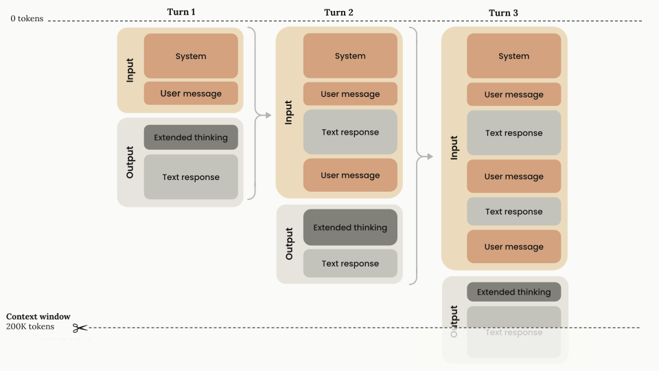

<!-- ABOUTME: Understanding LLMs — impact, mechanics, glossary (Tokens, Context Window, MoE), training pipeline, costs (training + inference), access, size, advanced structured output (field ordering, confidence). -->
<!-- ABOUTME: First half of Session 2, business-framed for M2 IMT&E Paris 1 Panthéon-Sorbonne students. -->

<!-- _class: title -->
<!-- _paginate: skip -->
<!-- _header: "" -->
<!-- _footer: "" -->

# LLMs

## Session 2A — Understanding and using language models

M2 IMT&E · Paris 1 Panthéon-Sorbonne · 2026

---

<!-- _class: section -->

# Impact and capabilities of LLMs

## Why LLMs Matter

---

<!-- _class: img-right -->

# 01 — Benchmarks: real progress, visible ceilings

- MMLU (general knowledge): **saturated at 90%+** — LLMs catch up to human experts [1]
- Newer, harder benchmarks: Humanity's Last Exam **8.8%**, FrontierMath **2%** [2]
- Efficiency: from **540B** to **3.8B** params for 60% on MMLU — a **142x** reduction [1]

> Easy benchmarks saturate, but hard problems remain out of reach.

<small>Sources: [1] [Epoch AI](https://epoch.ai/trends) · [2] [Stanford HAI AI Index 2025](https://aiindex.stanford.edu/report/)</small>

---

<!-- _class: img-right compact-table -->

# 02 — What LLMs enable

| Category | Examples | Type |
|---|---|---|
| *Writing* | Brainstorming, press releases, translation | Web + App |
| *Reading* | Email classification, summarization, sentiment | Mostly App |
| *Chatting* | Customer service bot, coaching, internal FAQ | Web + App |
| *Coding* | Copilot, Cursor, Claude Code — 76% of devs use AI [1] | Web + App |

*Two modes*:
- *Web-based*: ChatGPT, Claude, Le Chat — direct interaction
- *Software app*: LLM embedded in a product (email routing, analysis)

<small>Sources: [1] [Stack Overflow 2024](https://survey.stackoverflow.co/2024/ai)</small>

---

<!-- _class: section -->

# How an LLM works

## Next-Token Prediction

---

<!-- _class: img-right -->

# 03 — The fundamental mechanism

The LLM uses **Self-Supervised Learning** to predict the next token:

- **Input**: full sequence → probability distribution
- **Sampling**: one token is selected (e.g. "love") and appended
- **Loop**: repeated until the end token `<eos>`

> Each token depends on *all* the previous ones — sequential generation, longer answers = more expensive.

---

<!-- _class: section -->

# Technical glossary

## Tokens, Context Window, MoE

---

<!-- _class: img-right -->

# 04 — Tokens: the vocabulary of LLMs

LLMs don't reason in words but in **Tokens** — fragments of words.

**Rule of thumb**: 1 Token ≈ 3/4 of a word (in English)

[Tokenizer demo](https://platform.openai.com/tokenizer)

> In French, the ratio is less favorable (~1 token ≈ 0.6 word). A larger vocabulary = fewer tokens = *cheaper*.

---

# 04b — Tokens: vocabulary size

| Model | Vocabulary size | Notable feature |
|---|---|---|
| Llama 2 | 32,000 tokens | Optimized for English |
| Llama 3 | 128,256 tokens | +4x, better multilingual |
| Qwen 3 | 151,669 tokens [1] | Optimized for CJK + multilingual |

- **+4x vocabulary** between Llama 2 and 3: better multilingual encoding
- Direct impact: fewer tokens per request = **reduced API cost**

<small>Sources: [1] [Qwen3 Technical Report](https://arxiv.org/abs/2505.09388)</small>

---

<!-- _class: img-right -->

# 05 — Context Window: conversation memory

The **Context Window** = the LLM's working memory, everything it "sees" to answer.

- Input + Output share the same window (200K tokens for Claude)
- Context *accumulates* with each turn — if the window is full, older messages are truncated
- **Thinking Tokens** count during generation, then are removed [1]
- Billing is **per Token** (input + output)

<small>Sources: [1] [Anthropic](https://docs.anthropic.com/en/docs/build-with-claude/context-windows)</small>

<!--
Speaker notes:
The Context Window limits the length of conversations and the size of documents that can be analyzed.
-->

---

<!-- _class: img-right -->

# 06 — Context Window: exponential growth

| Model | Year | Context Window |
|--------|-------|---------------|
| GPT-2 | 2019 | 1K tokens |
| GPT-4 | 2023 | 128K tokens |
| Claude 3.5 | 2024 | 200K tokens |
| Gemini 1.5 | 2024 | 2M tokens |
| Llama 4 Scout | 2025 | **10M tokens** |

Since mid-2023, the context window has grown roughly **~30x per year** [1].

> 10M tokens ≈ 15,000 pages — from "summarize an email" to "analyze an entire document base".

<small>Sources: [1] [Epoch AI](https://epoch.ai/data-insights/context-windows)</small>

---

<!-- _class: img-right compact-table -->

# 07 — Sampling: Temperature, Top-k, Top-p

The LLM produces a probability distribution. Three parameters control the *sampling*:

| Parameter | What it does | Values |
|-----------|--------------|---------|
| **Temperature** | Flattens or sharpens the distribution | 0.0–2.0 |
| **Top-k** | Keeps the *k* most probable tokens | 10–100 |
| **Top-p** (nucleus) | Tokens whose cumulative probability ≤ *p* | 0.7–0.95 |

> **Low T** (0.1) = deterministic. **High T** (1.5) = creative but risky. Top-k/Top-p filter out improbable tokens.

---

<!-- _class: img-right -->

# 08 — Mixture of Experts (MoE): the architecture that changes everything

**Multiple sub-networks** (experts) within a model. A **Router** activates the relevant experts per token.

- The *capacity* of all experts (total params)
- Only *activates* a fraction per token (active params)
- Performance of a large model, speed of a small one

| Model | Total | Active/token |
|--------|-------|-------------|
| Mixtral 8x7B 🇫🇷 | 46.7B | 12.9B |
| DeepSeek-V3 🇨🇳 | 671B | 37B |
| Qwen3 235B 🇨🇳 | 235B | 22B |

<small>Sources: [1] [Mixtral](https://arxiv.org/abs/2401.04088) · [2] [DeepSeek-V3](https://arxiv.org/abs/2412.19437) · [3] [Qwen3](https://arxiv.org/abs/2505.09388)</small>

---

<!-- _class: section -->

# The training pipeline

## Pre-train → Instruct → Thinking → Fine-tune

---

<!-- _class: img-right compact-table -->

# 09 — Pipeline overview

| Stage | What it learns | Data | Result |
|-------|-----------------|---------|----------|
| **Pretraining** | Language, facts | ~15T tokens [1] | Base Model |
| **SFT** (Instruct) | Follow instructions | ~25K–1M ex. [2] | Instruct Model |
| **RLHF / DPO** | Be helpful and honest | ~100K–1M pairs [3] | Aligned chatbot |
| **Reasoning** | Think before answering | ~5K seeds → 800K [4] | Thinking Model |

> Each stage **adds a layer** on top of the previous one — with *exponentially less data*.

<small>Sources: [1] [Meta Llama 3](https://ai.meta.com/blog/meta-llama-3/) · [2] [RLHF Book](https://arxiv.org/abs/2504.12501) · [3] [Anthropic hh-rlhf](https://huggingface.co/datasets/Anthropic/hh-rlhf) + Tulu 3 · [4] [DeepSeek-R1](https://arxiv.org/abs/2501.12948)</small>

---

# 10 — The three generations of LLMs

| Generation | Training | Use case | Examples |
|---|---|---|---|
| **Base Model** | Pretraining only | Text completion, Embeddings | GPT-3, BERT |
| **Instruct Model** | + SFT + RLHF | Chatbot, assistant | ChatGPT, Claude, Mistral |
| **Thinking Model** | + Reasoning Training | Math, code, reasoning | o3, DeepSeek-R1 |

> The availability of open-weights models at every size lets you choose the right quality/cost ratio for each use. See the [Qwen3 Collection](https://huggingface.co/collections/Qwen/qwen3) on HuggingFace.

---

<!-- _class: img-right compact-table -->

# 11 — Thinking Models: think before answering

- *Extended Thinking* — a chain of reasoning *before* the answer
- *Token budget* — more Thinking Tokens = better result (but more expensive)
- *Internal verification* — the model checks its steps, reduces hallucinations

| Model | AIME 2024 | Price / 1M tokens |
|--------|-----------|-----------------|
| GPT-4o | ~26% | $2.50 [1] |
| DeepSeek-R1 | 79.8% | $0.55 [2] |
| o3 | 91.6% | $2.00 [1] |
| o4-mini | 93.4% | $1.10 [1] |

<small>Sources: [1] [OpenAI](https://openai.com/index/introducing-o3-and-o4-mini/) · [2] [DeepSeek](https://arxiv.org/abs/2501.12948)</small>

---

<!-- _class: img-right -->

# 12 — Fine-tuning: adapt a model to your needs

- **Pretraining**: billions of words, learns language (millions $)
- **Fine-tuning**: thousands of examples, adapts to a task (hundreds $)
- **When?** Specific style, technical jargon, or a format that RAG doesn't capture
- **LoRA** — 0.1-1% of params, 90-95% quality [1]. QLoRA: ~8-10 GB (**$0-5**)
- **Distillation** — DeepSeek-R1 on Qwen-7B: **55.5%** AIME [2]. Cost ÷10-100x

<small>Sources: [1] [Hu et al.](https://arxiv.org/abs/2106.09685) · [2] [DeepSeek](https://arxiv.org/abs/2501.12948)</small>

---

# 13 — The cost of training: from thousands to billions

| Model | Year | Params | Cost (compute only) |
|--------|-------|--------|---------------------|
| BERT | 2018 | 340M | ~$3,300 |
| GPT-3 | 2020 | 175B | ~$4.6M |
| Llama 2 | 2023 | 70B | ~$3M |
| GPT-4 | 2023 | ~1.8T MoE | **$78M** [1] |
| Llama 3.1 405B | 2024 | 405B | $60–170M |
| DeepSeek-V3 🇨🇳 | 2024 | 671B MoE | **$5.6M** [2] |

- Frontier costs: growing **2.4x per year** since 2016, projected **>$1B** by 2027 [3]
- DeepSeek-V3 ≈ GPT-4o for **14x cheaper** (H800 at $2/h) [2]

<small>Sources: [1] [Epoch AI](https://arxiv.org/abs/2405.21015) · [2] [DeepSeek-V3](https://arxiv.org/abs/2412.19437) · [3] [Epoch AI](https://epoch.ai/blog/how-much-does-it-cost-to-train-frontier-ai-models)</small>

---

<!-- _class: img-right -->

# 14 — Where does the money go? Anatomy of the training cost

Breakdown of development cost (GPT-4 / Gemini Ultra) [1]:

- **Hardware**: 47–67% — GPUs (H100, TPU) = the dominant line item
- **R&D staff**: 29–49% — researchers, ML engineers
- **Energy**: only **2–6%** — Gemini Ultra: ~35 MW [1]

> The bottleneck isn't electricity — it's silicon and talent. Only the best-capitalized players can play at the frontier.

<small>Sources: [1] [Epoch AI](https://epoch.ai/blog/how-much-does-it-cost-to-train-frontier-ai-models)</small>

---

<!-- _class: cols -->

# 15 — Efficiency explodes: reproduce GPT-2 for ~$60

**Reproducing costs less and less**:
- GPT-2: $50K → **~$60** (Karpathy, 2025) — 2h on 8×H100 [1]
- BERT: $3,300 → **$20** (MosaicBERT) [2]
- DeepSeek-R1 RL: **$294K** on V3 [3]

**But the frontier explodes**:
- Frontier cost: **×2 every 8 months** [4]
- MMLU 60%: 540B → **3.8B** params = 142× [5]
- Next generation: **$500M–1B+** expected

> Two opposing trends: the leaders spend more, but reproducing their level costs less and less.

<small>Sources: [1] [Karpathy](https://x.com/kaboruka/status/1891680241001140367) · [2] [Databricks](https://www.databricks.com/blog/mosaicbert) · [3] [Nature/DeepSeek](https://www.nature.com/articles/s41586-025-09422-z) · [4][5] [Stanford HAI 2025](https://aiindex.stanford.edu/report/)</small>

---

<!-- _class: section -->

# Training data

## The next wall?

---

<!-- _class: img-right -->

# 16 — Training data: a limited resource?

Stock of high-quality public text: **~300 trillion tokens** (90% CI: 100T–1,000T) [1]

- Training compute grows **4–5x per year** [1]
- Estimated exhaustion (80% CI): **2026–2032**
  - Compute-optimal scenario: **2028**
  - With 5x overtraining: as early as **2027** [1]
- Multi-epoch training extends the stock by **2–5x** [1]

> "Five years and four orders of magnitude of compute separate GPT-2 from GPT-4" — the data wall is approaching.

<small>Sources: [1] [Epoch AI](https://epoch.ai/blog/will-we-run-out-of-data-limits-of-llm-scaling-based-on-human-generated-data)</small>

---

# 17 — Synthetic Data: the answer to the data wall

The Web lacks certain reasoning primitives — no amount of scaling closes this gap. **Synthetic Data** changes the paradigm [1]:

- **"Upward training"**: models of **3B–12B** generate data to train larger models [1]
- **Phi-1.5** (Microsoft): 1.3B params on 30B tokens → performance of models **10x** larger [1]
- **Seed-Prover**: **230M+** geometry problems generated in 7 days [1]
- Labs in 2025: Nemotron-3, DeepSeek-Prover-V2, Claude 4, Kimi 2.5 [1]

> We no longer scrape the Web and hope — we **design** the training data. "Organic data is fundamentally data engineering outsourcing."

<small>Sources: [1] [VintageData](https://vintagedata.org/blog/posts/synthetic-pretraining)</small>

---

<!-- _class: section -->

# Accessing LLMs

## Web, API, Open-Weights

---

# 18 — Web interface: the simplest

Consumer chatbots — no technical skills required:

| Service | Provider | Model(s) | Price |
|---------|------------|-----------|------|
| **ChatGPT** | OpenAI | GPT-4o, o3 | Free / $20/month |
| **Claude** | Anthropic | Claude Sonnet 4.5, Opus 4.6 | Free / $20/month |
| **Gemini** | Google | Gemini 2.5 | Free / $20/month |
| **Le Chat** | Mistral AI 🇫🇷 | Mistral Large 3 | Free / $15/month |
| **Perplexity** | Perplexity AI | Multi-model + web search | Free / $20/month |

> *For entrepreneurs*: start here. Test your use cases in 5 minutes, no code, no API.

---

# 19 — API access: integrate an LLM into your product

APIs let you call an LLM *from your code* — the foundation of any AI product:

| Provider | Flagship model | Input / 1M tokens | Output / 1M tokens |
|---|---|---|---|
| **OpenAI** | GPT-4o | $2.50 | $10.00 [1] |
| **Anthropic** | Claude Sonnet 4.5 | $3.00 | $15.00 [2] |
| **Mistral AI** 🇫🇷 | Mistral Large 3 | $2.00 | $6.00 [3] |
| **Google** | Gemini 2.5 Pro | $1.25 | $10.00 |
| **OpenRouter** | Multi-model | Variable | Variable |

> Prices drop roughly **~10x per year** at equivalent performance [4]. The marginal cost of intelligence is falling drastically.

<small>Sources: [1] [OpenAI](https://openai.com/api/pricing/) · [2] [Anthropic](https://docs.anthropic.com/en/docs/about-claude/models) · [3] [Mistral AI](https://mistral.ai/pricing) · [4] [a16z](https://a16z.com/llmflation-llm-inference-cost/)</small>

---

<!-- _class: img-right -->

# 20 — Inference cost drops 10x to 900x per year

- Drop **at fixed performance** across 6 benchmarks [1]
- **Median**: ~50×/year (accelerating to ~200×/year after Jan. 2024) [1]
- GPQA Diamond (PhD): **40–900×/year** — the steepest drop
- GPT-3.5 equivalent **$20 → $0.07** / 1M tokens in 18 months = **280×** [2]

> Faster than Moore's law — the marginal cost of intelligence is falling faster than any previous technology.

<small>Sources: [1] [Epoch AI](https://epoch.ai/data-insights/llm-inference-price-trends) · [2] [Stanford HAI 2025](https://aiindex.stanford.edu/report/)</small>

---

<!-- _class: cols -->

# 21 — Open-Weights: download and run locally

**HuggingFace** — +1M free models [1]
**Ollama** — `ollama run llama3.1:8b`
GDPR (local data), no API cost, offline

| Model | Size | Key strength |
|--------|--------|-----------|
| Llama 3.1 🇺🇸 | 8-405B | Meta ecosystem |
| Mistral Large 3 🇫🇷 | 123B | EU sovereignty |
| Qwen 3 🇨🇳 | 0.6-235B | 119 languages |
| DeepSeek-R1 🇨🇳 | 671B MoE | Reasoning SOTA |

<small>Sources: [1] [HuggingFace](https://huggingface.co/models)</small>

---

# 22 — Licenses: what you can (and can't) do

| License | Models | Commercial use | Restrictions |
|---------|---------|-----------------|-------------|
| **Apache 2.0** | Mistral, Qwen 3, DBRX | ✅ Free | None |
| **Llama License** | Llama 3-4 | ✅ Under conditions | >700M users → special license |
| **DeepSeek License** | DeepSeek-R1, V3 | ✅ Under conditions | No competing models |
| **Proprietary** | GPT-4, Claude | ❌ API only | No download |

> **Open-weight ≠ open-source**: LLaMA 1 (research only) and Gemma (commercial restrictions) offer the weights but *not* the freedom of an Apache 2.0. Always check the license *before* building on it.

---

<!-- _class: img-right -->

# 23 — Open vs Closed: the gap is narrowing

Open-weights models are catching up to proprietary ones [1]:

- Compute lag: **12–15 months** (90% CI: 6–22 months)
- On GPQA (PhD science): only **5 months** of lag [1]
- **DeepSeek V2** matches PaLM 2 with **7x less compute** [1]
- Restrictive licenses on the rise: from **2%** (2018) to **40%** (2023) [1]

> Open models are **more efficient** — the gap is a question of investment, not technical capability.

<small>Sources: [1] [Epoch AI](https://epoch.ai/blog/open-models-report)</small>

---

<!-- _class: section -->

# Model size

## Parameters, vRAM, Hardware

---

<!-- _class: img-right compact-table -->

# 24 — Quantization: compress a model without (too much) loss

| Precision | Bytes/param | 7B model | Quality impact |
|-----------|-------------|-----------|----------------|
| FP32 | 4 | 28 GB | Reference |
| FP16 | 2 | 14 GB | ~0% |
| INT8 | 1 | 7 GB | <1% (MMLU) |
| **INT4** | 0.5 | **3.5 GB** | 1-4% MMLU, **5-15% reasoning** [1][2] |

> Method: AWQ > GPTQ >> BNB-NF4. 70B+: ~1-2% loss. 7B: up to **5-53% reasoning loss**.

<small>Sources: [1] [Kurtic et al. 2024](https://arxiv.org/abs/2411.02355) · [2] [IJCAI 2025](https://arxiv.org/abs/2409.11055)</small>

---

<!-- _class: compact -->

# 25 — Parameters → vRAM → Hardware

LLMs run on **GPU**. **vRAM** is the main constraint.

**Formula**: `vRAM (GB) = Params (B) × Bytes/param`

| Hardware | vRAM | Max model (Q4) |
|----------|------|-----------------|
| MacBook M4 Pro | 24-48 GB | 14B-32B |
| RTX 4090 | 24 GB | 32B |
| RTX 5090 | 32 GB | 70B |
| MacBook M4 Max | 128 GB | 70B |
| H100 (cloud) | 80 GB | 70B FP16 |

> Qwen3-32B in INT4 = 32 × 0.5 = **16 GB** — fits on a MacBook M4 Pro.

<small>Sources: [1] [IntuitionLabs](https://intuitionlabs.ai/articles/local-llm-deployment-24gb-gpu-optimization)</small>

---

<!-- _class: img-right compact-table -->

# 26 — The MoE paradox: fast but memory-hungry

| Dimension | Dense 70B | MoE 671B |
|-----------|-----------|----------|
| Total params | 70B | 671B |
| Active / token | **70B** (all) | **37B** (5.5%) |
| vRAM (FP16) | ~140 GB | ~1,342 GB |
| vRAM (INT4) | ~35 GB | ~336 GB |

> *The trap*: DeepSeek-V3 only activates 37B params/token, but you have to load **all 671B** into memory.

<small>Sources: [1] [DeepSeek-V3](https://arxiv.org/abs/2412.19437) · [2] [Interconnects](https://www.interconnects.ai/p/deepseek-v3-and-the-actual-cost-of)</small>

---

<!-- _class: img-right compact-table -->

# 27 — Bigger = smarter?

Benchmarks show *diminishing returns*:

| Model | Params | MMLU |
|--------|--------|------|
| Qwen3-0.6B | 0.6B | 52.8% |
| Qwen3-4B | 4B | 73.0% |
| Qwen3-8B | 8B | 76.9% |
| Qwen3-32B | 32B | **83.6%** |
| Qwen3-235B MoE | 235B | 87.8% |

0.6B → 32B (×53): **+30.8 pts**. 32B → 235B (×7): only **+4.2 pts** [1].

> The curve *flattens*. A small, well-trained model beats a costly giant.

<small>Sources: [1] [Qwen3 Technical Report](https://arxiv.org/abs/2505.09388)</small>

---

<!-- _class: cols -->

# 28 — The right model for the right task

| Model | Input / 1M | Output / 1M |
|--------|-----------|-------------|
| Qwen3 30B MoE | $0.06 | $0.22 |
| GPT-4o mini | $0.15 | $0.60 |
| Claude Sonnet 4.5 | $3.00 | $15.00 |
| Claude Opus 4.6 | $15.00 | $75.00 |

- **Support** → Mistral Small
- **Analysis** → o3 / Opus
- **Code** → Claude / Devstral

> **1,250x** gap between the cheapest and the most expensive.

---

# 29 — Exercise: estimate the cost of an AI product

**Scenario**: a customer support chatbot, 1,000 conversations/day.

**Assumptions**:
- Average conversation: ~500 words input + ~300 words output
- ~500 words input → ~670 tokens (500 × 4/3) + ~400 tokens output

**With GPT-4o mini**:
- Input: 670K tokens/day × $0.15/1M = **$0.10/day**
- Output: 400K tokens/day × $0.60/1M = **$0.24/day**
- **Total: ~$0.34/day, i.e. ~$10/month**

> For 1,000 conversations per day, the AI cost is **$10/month**. Compare that to the cost of a human agent (~$3,000/month).

---

# 30 — David beats Goliath: the small models that surprise

| Model | Params | Performance | Compared to |
|--------|--------|-------------|-----------|
| **Mistral Small 3** 🇫🇷 | 24B | MMLU 81%, **3x faster** | Llama 3.3 70B (×3 bigger) [1] |
| **Phi-4 Reasoning** | 14B | AIME 2024: **75.3%** | o1-mini 63.6% (far bigger) [2] |
| **DeepSeek-R1 distilled** | 7B | AIME 2024: **55.5%** | QwQ-32B-Preview 50.0% (×4.5 bigger) [3] |
| **DeepSeek-R1 distilled** | 14B | AIME 2024: **69.7%** | o1-mini 63.6% [3] |

> In 2025, the *training methodology* and *data quality* matter more than raw model size. A well-trained 14B beats a 671B on specific tasks.

<small>Sources: [1] [Mistral AI](https://mistral.ai/news/mistral-small-3) · [2] [Microsoft Research](https://www.microsoft.com/en-us/research/articles/phi-reasoning-once-again-redefining-what-is-possible-with-small-and-efficient-ai/) · [3] [DeepSeek](https://arxiv.org/abs/2501.12948)</small>

---

<!-- _class: section -->

# Limits and frontiers of LLMs

## What LLMs can't (yet) do

---

<!-- _class: img-right -->

# 31 — Hallucinations and Knowledge Cutoffs

*Hallucinations* — the LLM *makes things up with great confidence*:
- A lawyer submitted *fabricated legal cases* from ChatGPT [1]
- Golden rule: never use AI content without *human verification*

*Knowledge Cutoffs* — the AI lives in the past:
- Knowledge *frozen at the training date*
- Recent data inaccessible (unless web access)

*Question*: Which of your company's information should you NEVER put in a prompt?

<small>Sources: [1] [NYT](https://www.nytimes.com/2023/05/27/nyregion/avianca-chatgpt-fake-citations.html)</small>

---

<!-- _class: cols -->

# 32 — Structured Output: Classifier & Extraction

LLMs produce free text, but systems expect **structured data** (JSON Mode, Schema Enforcement, Function Calling).

**Classifier** — ticket routing

**Data Extraction** — text → database

---

# 33 — Field Ordering: the schema as Chain-of-Thought

LLMs generate token by token, **from left to right**. The order of fields in the JSON controls *when* the model reasons:

- `reasoning` **before** `answer` → the model reasons *then* answers
- `answer` **before** `reasoning` → the model commits *then* rationalizes after the fact

| Field order | GSM8K (GPT-4o-mini) | Delta |
|------------------|---------------------|-------|
| `reasoning` → `answer` | **94.2%** | — |
| `answer` → `reasoning` | 31.8% | **−62 pts** [1] |

> OpenAI officially recommends this pattern: `steps[]` before `final_answer` [2]. It's **free** and the gain is massive.

<small>Sources: [1] [dsdev.in](https://www.dsdev.in/order-of-fields-in-structured-output-can-hurt-llms-output) · [2] [OpenAI Structured Outputs](https://openai.com/index/introducing-structured-outputs-in-the-api/)</small>

---

<!-- _class: compact -->

# 34 — Confidence in classification: the trap of the verbalized score

Asking the LLM *"give your confidence"* → **the score is hallucinated** [1]:
- Scores concentrated between **80–100%**, multiples of 5
- The model predicts a token *that looks like* a score, not a computed probability

| Method | Raw error | After calibration |
|---------|-------------|-------------------|
| Verbalized score | 45% | 8% |
| **Logprobs** | 50% | **5%** |
| Logistic Regression | 11% | 6% |

> **Logprobs** are overconfident too, but become the best after calibration (~200 labeled examples) [2].

<small>Sources: [1] [Xiong et al. (ICLR 2024)](https://openreview.net/pdf?id=gjeQKFxFpZ) · [2] [Nyckel](https://www.nyckel.com/blog/calibrating-gpt-classifications/)</small>

---

<!-- _class: img-right compact-table -->

# 35 — Multimodal LLMs

| Modality | Capabilities | Key models |
|----------|-----------|--------------|
| **Vision** | Images, OCR, visuals | GPT-4o, Claude, Gemini |
| **Audio** | Transcribe, voice | GPT-4o, Whisper |
| **Video** | Summarize, analyze | Gemini 2.5, GPT-4o |
| **Code** | Write, debug | Claude, Codestral |

> A single model that sees, hears, reads and codes — the interface becomes natural.

---

# 36 — Multimodality: business use cases

| Use case | Modality | Concrete example |
|-------------|----------|-----------------|
| Document analysis | Vision + Text | Extract data from a photographed invoice |
| Voice service | Audio + Text | Phone chatbot with real-time transcription |
| Quality control | Vision | Detect defects on a production line |
| Meeting minutes | Audio | Summary + action items from a recording |
| Marketing generation | Text + Image | Create visuals and copy tailored per segment |

*Question for the class*: Which process in your project could benefit from a multimodal LLM?

---

<!-- _class: section -->

# Prompting well

## Tips for Prompting

---

# 37 — The 3 principles of Prompting

| Principle | Description |
|---|---|
| *1. Be detailed and specific* | Give enough context so the LLM understands exactly what you want |
| *2. Guide the reasoning* | Break complex tasks into steps (Chain-of-Thought) |
| *3. Experiment and iterate* | There is no perfect prompt — improve through iteration |

*Example* — Bad: *"Help me write an email."*
Good: *"Help me write a professional email asking to join the legal docs project.*
*Explain why my LLM prompting experience makes me a strong candidate. One paragraph."*

> Prompt Engineering is not a mysterious talent. It's an *iterative skill* that anyone can develop.

---

# 38 — Chain-of-Thought and iteration

*Chain-of-Thought* — breaking a task into *explicit steps* improves quality:

*"Step 1: 5 fun words about cats.*
*Step 2: Create rhyming toy names.*
*Step 3: Add emoji."*

| Step 1 | Step 2 | Step 3 |
|---|---|---|
| Purr | Purr-Twirl | Purr-Twirl 🐱 |
| Whisker | Whisker-Whisper | Whisker-Whisper 😺 |

*Iteration* — the Prompt Engineering cycle:
1. *Write* a first prompt (don't overthink it)
2. *Evaluate* the output — what's missing?
3. *Refine* (context, format) · 4. *Repeat*

---

<!-- _class: section -->

# Recap

## Key Takeaways

---

<!-- _class: compact -->

# 39 — Key points to remember

- **Mechanism** — Next-token prediction, sequential
- **Pipeline** — Pretraining (15T tokens) → SFT → RLHF → Reasoning
- **Costs** — Training: 2.4x/year, >$1B by 2027. Hardware = 47–67% of the cost
- **Data** — ~300T tokens available, exhaustion 2026–2032. Synthetic Data = the relay
- **Inference** — Cost drops ~10–50×/year — faster than Moore's law
- **Open-weights** — 12–15 months of lag, but 7x more compute-efficient
- **Size** — Bigger ≠ better. The right model for the right task
- **Structured Output** — JSON field order = free CoT (+62 pts GSM8K)
- **Prompting** — Be specific, guide the reasoning, iterate

> *Next part*: how to **evaluate** an AI solution — the metrics that matter.
