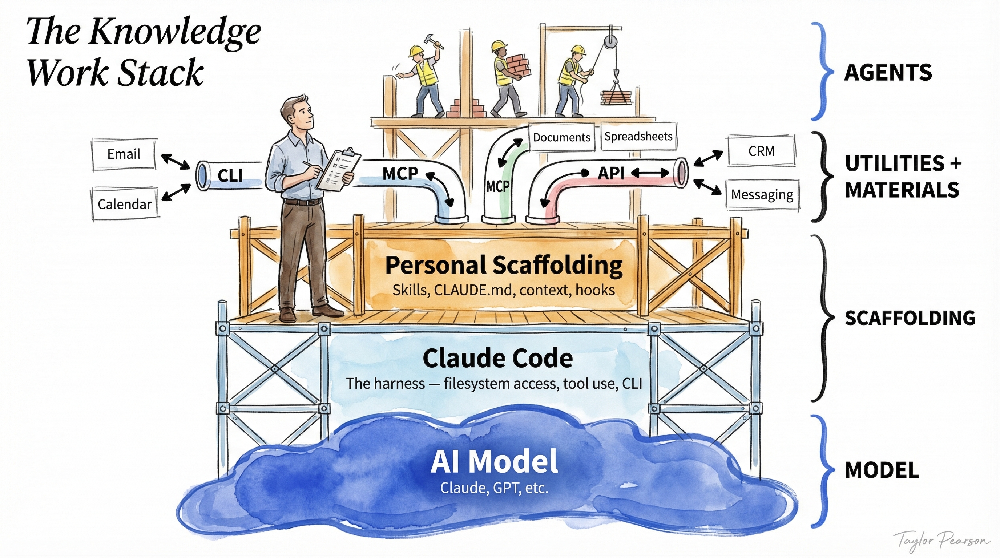

<!-- ABOUTME: AI Agents — progressive introduction: Tools, Skills, MCP, Anthropic patterns, memory, production, Context Engineering, agent products, AutoResearch. -->
<!-- ABOUTME: Session 3C for M2 IMT&E Paris 1 students: understand, build and deploy AI agents. -->

<!-- _class: title -->
<!-- _paginate: skip -->
<!-- _header: "" -->
<!-- _footer: "" -->

# AI Agents: from workflow to autonomy

## Session 3C — Understand, build and deploy AI agents

M2 IMT&E · Paris 1 Panthéon-Sorbonne · 2026

---

<!-- _class: section -->

# What is an Agent?

## From chatbot to autonomy

---

<!-- _class: img-right -->

# 01 — The analogy: Alfred, the AI assistant

You tell Alfred: **"Organize a business dinner for Thursday."**

Alfred asks you nothing further:
1. **Understands** the request and identifies the subtasks
2. **Reasons and plans** the order of actions
3. **Uses tools** (email, calendar, booking)
4. **Delivers the result** — confirmation sent

> An Agent = an LLM able to **reason**, **plan** and **interact with its environment** to achieve a goal [1].


<small>Sources: [1] [HuggingFace — Agents Course](https://huggingface.co/learn/agents-course/en/unit1/what-are-agents)</small>

---

<!-- _class: img-right -->

# 02 — The agency spectrum: 5 levels

Not all AI systems are agents. **Agency** is measured on a spectrum [1]:

- **☆☆☆** Simple processor — the output affects nothing
- **★☆☆** Router — the output determines the flow
- **★★☆** Tool Caller — the output triggers a function
- **★★★** Multi-step Agent — the output controls the iteration
- **★★★** Multi-Agent — an agent launches other agents

> **Most business cases = levels ★☆☆ and ★★☆.** Multi-step agents are the frontier of what works in production.


<small>Sources: [1] [HuggingFace — smolagents](https://huggingface.co/docs/smolagents/)</small>

---

<!-- _class: img-right -->

# 03 — The agent cycle: Think → Act → Observe

The fundamental loop of every agent [1][2]:

1. **Think** — the model reasons about the task
2. **Act** — it executes an action (search, API, calculation)
3. **Observe** — it analyzes the result
4. **"Have I reached my goal?"** → if not, back to Think

**Example**:
- *Think*: "I need to find Mistral AI's revenue"
- *Act*: Web search → "Mistral AI revenue"
- *Observe*: "Mistral has reached $300M ARR"
- *Think*: "I have the answer, I can synthesize"


<small>Sources: [1] [HuggingFace — Agents Course](https://huggingface.co/learn/agents-course/en/unit1/agent-steps-and-structure) · [2] [ReAct — Princeton/Google](https://arxiv.org/abs/2210.03629)</small>

---

<!-- _class: img-right -->

# 04 — The Augmented LLM: the 3 extensions

Every agentic system relies on an LLM **augmented** with 3 capabilities [1]:

- **Retrieval** — inject knowledge (RAG, seen in Deck B)
- **Tools** — act on the world (APIs, search, code)
- **Memory** — retain information between interactions

> Before building an agent, you need a well-augmented LLM. The 3 extensions are the foundations. Retrieval = what you already master from Deck B.


<small>Sources: [1] [Anthropic — Building Effective Agents](https://www.anthropic.com/research/building-effective-agents)</small>

---

# 05 — Discussion: agent or not an agent?

> You receive **200 résumés** for a Data Analyst position. You want to shortlist the 10 best candidates.

**Questions for the class**:

- At which level of the agency spectrum does this case sit? (Router? Tool Caller? Multi-step?)
- Would a simple Prompt Chain suffice? At what point would you switch to an agent?
- What would be the **cost of the error** if the agent eliminates a good candidate?
- How would you verify that the agent is doing a good job?

---

<!-- _class: section -->

# Tools & Skills

## The fundamental building blocks of the agent

---

# 06 — Tool Use: giving the LLM hands

**Function Calling** lets the LLM trigger actions in the real world:

| Limit of the LLM alone | Tool that solves it | Example |
|---|---|---|
| Cannot calculate | `calculator()` | "What is 15% of €847?" |
| No web access | `search_web()` | "Latest Mistral AI news" |
| No data access | `query_database()` | "Last month's orders" |
| Cannot act | `send_email()` | "Send a summary to the client" |

**How it works**: the LLM generates a **structured JSON** describing the action, the system executes it and returns the result.

> Tool Use transforms an LLM that "talks" into an LLM that "acts". It is the fundamental building block of agents.

---

<!-- _class: compact -->

# 07 — Skills: a concrete example

A **Tool** connects the agent to a service. A **Skill** teaches it a **complete process** [1].

**Example SKILL.md file** (open standard, 26+ platforms):

```yaml
---
name: translate-document
description: Translate a document while preserving formatting
---
# Steps
1. Read the source file with the Read tool
2. Detect the source language from the first 500 characters
3. Translate section by section, preserving all markdown
4. Write the output file with suffix _<lang>.md
5. Report: source language, target language, word count
```

> Tool = **"how to connect"** (a function). Skill = **"what to do"** (a complete process, testable, shareable) [1].

<small>Sources: [1] [Anthropic — Skills](https://www.anthropic.com/)</small>

---

<!-- _class: cols -->

# 08 — Skills vs Tools: the right abstraction

<div class="left">

- **Tool**: `search_web(query)` → a single atomic action
- **Skill**: "Competitive intelligence" = search + filtering + comparison + alert
- Skills are testable, versionable, shareable between agents

</div>
<div class="right">

- Skills invoke sub-agents that load other Skills (composition)
- **26+ platforms** adopt the SKILL.md standard
- Your proprietary Skills = your **competitive advantage** in AI

</div>

> The Skill is to the agent what **know-how** is to the craftsman: what differentiates a generic tool from an expert.

---

<!-- _class: section -->

# MCP: the universal standard

## A particular type of Tool — the protocol that connects any agent to any tool

---

<!-- _class: img-right -->

# 09 — The M×N problem of integrations

Without a standard, **every AI application** must write a dedicated connector for **every tool** [1]:

- 4 apps × 5 tools = **20 integrations** to maintain
- Each connector has its own format, its auth, its bugs
- A new tool? It must be connected to each app

This is the world **before USB-C**: each device had its own cable.

> The integration cost grows **multiplicatively** (M×N). Each new tool or app increases the technical debt [1].


<small>Sources: [1] [HuggingFace — MCP Course](https://huggingface.co/learn/mcp-course/unit1/key-concepts) · [2] [Anthropic — MCP](https://www.anthropic.com/news/model-context-protocol)</small>

---

<!-- _class: img-right -->

# 10 — The MCP solution: M+N

The **Model Context Protocol** (Anthropic, Nov. 2024) standardizes the LLM ↔ tools connection [1]:

- Each app implements the **client** only once
- Each tool implements the **server** only once
- Result: **M+N** integrations instead of M×N

**Adoption in 2026**:
- **~90M+ SDK downloads/month** [1]
- **10,000+ active** MCP servers [1]
- Given to the **AAIF** (Linux Foundation) — **146 members** [2]


<small>Sources: [1] [Anthropic — MCP](https://www.anthropic.com/news/model-context-protocol) · [2] [AAIF — Linux Foundation](https://www.linuxfoundation.org/press/agentic-ai-foundation-welcomes-97-new-members)</small>

---

<!-- _class: img-right -->

# 11 — MCP Architecture: Host, Client, Server

3 components with clear roles [1]:

- **Host** = the user application (Claude Desktop, Cursor, your app)
- **Client** = the component in the app that communicates (1:1 relationship with a Server)
- **Server** = the external program that exposes capabilities

**Concrete example**:
- Host = **n8n** (your workflow)
- Client = n8n MCP connector
- Server = **Wikipedia Search MCP** → the agent can search Wikipedia


<small>Sources: [1] [HuggingFace — MCP Course](https://huggingface.co/learn/mcp-course/unit1/key-concepts)</small>

---

<!-- _class: img-right -->

# 12 — The 4 types of MCP capabilities

An MCP Server can expose 4 types of capabilities [1]:

- **Tools** — executable functions (`create_issue()`, `send_email()`)
- **Resources** — read-only data (files, docs, DB)
- **Prompts** — reusable templates ("Analyze this code")
- **Sampling** — the server asks the LLM to reason

> **Tools** = what the agent **does**. **Resources** = what the agent **knows**. **Prompts** = how the agent **approaches** a problem [1].


<small>Sources: [1] [HuggingFace — MCP Course](https://huggingface.co/learn/mcp-course/unit1/key-concepts)</small>

---

<!-- _class: cols -->

# 13 — The MCP ecosystem in 2026

<div class="left">

**Massive adoption**:
- Claude, ChatGPT, Gemini, Copilot, Cursor
- VS Code (via GitHub Copilot)
- AWS, Cloudflare, Google Cloud, Azure
- **AAIF** (Linux Foundation, 146 members) [1]

</div>
<div class="right">

**Business opportunity**:
- 1 MCP server = compatible with **all** agents
- Integration cost: **hours** instead of weeks
- Examples: Stripe MCP, GitHub MCP, Notion MCP, Slack MCP

</div>

> **Entrepreneurial opportunity**: creating an MCP server for an uncovered business tool = instant access to the entire ecosystem.

<small>Sources: [1] [AAIF — Linux Foundation](https://www.linuxfoundation.org/press/agentic-ai-foundation-welcomes-97-new-members)</small>

---

<!-- _class: cols -->

# 14 — MCP: the security risks

<div class="left">

**3 documented attacks** [1]:
- **Tool Poisoning** — malicious description in the tool that injects instructions
- **Rug Pull** — legitimate tool that changes behavior after approval
- **Cross-Server Shadowing** — a malicious server that intercepts another's calls

</div>
<div class="right">

**Protection measures**:
- Verify the tools' descriptions (not just the names)
- Use MCP servers from verified sources
- Audit the granted permissions
- Monitor the executed actions

</div>

> MCP security = a critical topic. Invariant Labs demonstrated these attacks as early as April 2025 [1].

<small>Sources: [1] [Invariant Labs — MCP Security](https://invariantlabs.ai/)</small>

---

<!-- _class: cols -->

# 15 — MCP: the debate

<div class="left">

**For MCP**:
- **Standardization** — a single protocol instead of N ad-hoc integrations
- **Network effect** — 10K+ servers, 146 AAIF members
- **Security** — built-in permissions model
- **Vendor-neutral** — given to the Linux Foundation

</div>
<div class="right">

**Against MCP**:
- **Extra abstraction layer** — complexity for simple cases
- **Native Function Calling** is improving rapidly (OpenAI, Google)
- **Premature standardization?** — the field evolves fast
- **Risk of a closed ecosystem** despite the formal openness

</div>

> The underlying debate: **is a universal abstraction necessary**, or will native Function Calling eventually make MCP obsolete?

---

# 16 — Discussion: MCP for your startup?

> You are developing an **AI assistant for project management**. It must connect to Slack, Jira, Google Calendar and the company's internal database.

**Questions for the class**:

- Do you implement MCP or direct native integrations? What is the trade-off?
- If you choose MCP, how do you handle security (a malicious server could read your Jira tickets)?
- What would be the advantage of publishing your Jira integration as an open source MCP server?

---

<!-- _class: section -->

# The complexity ladder

## 5 patterns, from the simplest to the most autonomous

---

<!-- _class: img-right -->

# 17 — The golden rule: start simple

Anthropic "Building Effective Agents" [1]:

| Level | Pattern |
|---|---|
| 1 | Prompt Chaining |
| 2 | Routing |
| 3 | Parallelization |
| 4 | Orchestrator-Workers |
| 5 | Evaluator-Optimizer |
| 6 | Autonomous agent |

> "The most successful implementations weren't using complex frameworks." — Most business problems are solved at levels 1–3.


<small>Sources: [1] [Anthropic — Building Effective Agents](https://www.anthropic.com/research/building-effective-agents)</small>

---

<!-- _class: img-right -->

# 18 — Prompt Chaining: the controlled sequence

Break a task into **sequential steps** — each LLM call processes the previous one's output [1].

**Business example** — Generating a marketing brief:
1. Analyze the product → 2. Identify the persona → 3. Write the brief → 4. Quality **gate check**

**Gate checks**: between each step, a check validates the output before continuing.

> Prompt Chaining covers **the majority of business use cases** without the complexity of an agent.


<small>Sources: [1] [Anthropic — Building Effective Agents](https://www.anthropic.com/research/building-effective-agents)</small>

---

<!-- _class: img-right -->

# 19 — Routing: directing to the right handler

Classify the input, then **direct it to a specialized handler**. The LLM acts as a switch operator [1].

**Business example** — Customer support:
- Simple questions → lightweight LLM ($)
- Complex questions → premium LLM ($$)
- Complaints → human escalation

> Routing allows optimizing **cost and quality simultaneously** — simple cases cost less, complex cases receive more attention.


<small>Sources: [1] [Anthropic — Building Effective Agents](https://www.anthropic.com/research/building-effective-agents)</small>

---

<!-- _class: img-right -->

# 20 — Parallelization: several LLMs simultaneously

Two complementary variants [1]:

**Sectioning** — independent subtasks in parallel:
- Analyze the legal, financial and technical aspects of a contract *simultaneously*

**Voting** — same task, several times:
- 3 LLMs do a code review, the majority wins

> **When to use it**: when speed or reliability matter more than cost (2–3x) [1].


<small>Sources: [1] [Anthropic — Building Effective Agents](https://www.anthropic.com/research/building-effective-agents)</small>

---

<!-- _class: img-right -->

# 21 — Orchestrator-Workers: the AI project manager

A central LLM **dynamically decomposes** the task, delegates to specialized workers, and synthesizes [1].

**Example** — "Analyze this market":
- The orchestrator decomposes: size, competitors, regulation, trends, risks
- Workers in parallel → coherent synthesis

**Key difference from Parallelization**: the subtasks are **not predefined** — the orchestrator decides them at runtime.


<small>Sources: [1] [Anthropic — Building Effective Agents](https://www.anthropic.com/research/building-effective-agents)</small>

---

<!-- _class: img-right -->

# 22 — Evaluator-Optimizer: the improvement loop

One LLM **generates**, another **evaluates** and gives feedback. You loop until the quality threshold [1].

**Example** — Writing a commercial proposal:
- The Generator writes the proposal
- The Evaluator checks: tone, figures, conformity to the brief
- Feedback → correction → loop again

**Caution**: each iteration = cost. Put in a **circuit breaker** (max 3–5 rounds).


<small>Sources: [1] [Anthropic — Building Effective Agents](https://www.anthropic.com/research/building-effective-agents)</small>

---

# 23 — Discussion: which pattern for your project?

> You are launching an **automated competitive intelligence** service for SMEs. Clients send a competitor's name and receive a weekly report.

**Questions for the class**:

- Which pattern(s) from the ladder would you use? Why?
- At which level would you start? What would be your criterion to step up a notch?
- Which circuit breaker would you put in place?

---

<!-- _class: section -->

# Agent memory

## How an agent retains and improves

---

# 24 — Why memory changes everything

Without memory, the agent is a **"goldfish"** — it starts from scratch at each session.

With memory, the agent knows your preferences, your past decisions, your business context.

**Connection with Deck B**: memory uses the same techniques as RAG (embeddings, vector DB, retrieval) — applied to the agent's history rather than to documents.

> Memory is what transforms a disposable tool into a **faithful assistant**. It is the bridge between RAG (Deck B) and Agents.

---

<!-- _class: compact-table -->

# 25 — The types of memory: LLM taxonomy

From the LLM's point of view, **4 mechanisms** to retain information:

| Type | Lifetime | Mechanism | Example |
|---|---|---|---|
| **System Prompt** | Per session | Injected on each request | CLAUDE.md, system message |
| **Conversation History** | Per session | Message buffer (context window) | Chat, previous exchanges |
| **Persistent Files** | Cross-session | Files read/written by the agent | memory.md, SOUL.md, config |
| **External Database** | Permanent | Vector DB, SQL, knowledge graph | RAG, client history |

> From the most ephemeral (prompt) to the most durable (database) — each type answers a different need. The agent combines all 4.

---

<!-- _class: cols -->

# 26 — Memory in practice: from short to long term

<div class="left">

**Short term (session)**:
- **Conversation History** — the last N messages in the context window
- When it overflows → **compaction** (automatic summary)
- E.g.: Claude summarizes the old messages to keep the context

</div>
<div class="right">

**Long term (cross-session)**:
- **Persistent Files** — CLAUDE.md, MEMORY.md, SOUL.md
- **External DB** — vector store (like Deck B's RAG) applied to past interactions
- E.g.: "last time, we had chosen strategy X"

</div>

> **Trade-off**: short term = exact recall but ephemeral. Long term = durable but requires a good retrieval system.

---

# 27 — The markdown-file pattern

The most pragmatic pattern: the agent **writes** its memory into readable files.

**Concrete examples**:
- **CLAUDE.md** — persistent project instructions, re-read at each session
- **MEMORY.md** — Claude Code writes its learned lessons automatically
- **SOUL.md / IDENTITY.md** — OpenClaw stores its personality and the user profile

**Key advantage**: human-readable memory, versionable (Git), debuggable — you can read and edit the agent's memory.

> The markdown file is the simplest and most powerful memory. You already use it in this course with CLAUDE.md.

---

# 28 — Discussion: which memory for your agent?

> You are building an **AI assistant for a real estate agency**. It must: (1) remember each client's preferences (budget, neighborhoods, criteria), (2) recall the properties already visited, (3) adapt its recommendations over time.

**Questions for the class**:

- Which types of memory would you use for each of these 3 needs?
- Where would you store this memory? (File, vector DB, relational database?)
- What is the risk if the agent "forgets" a client?

---

<!-- _class: section -->

# Agents in production

## Compounding errors, failure modes and guardrails

---

# 29 — The problem of compounding errors

Why do autonomous agents often fail? The **errors multiply** at each step:

- 10 steps × 95% reliability each = **60% overall success** (0.95^10)
- 20 steps × 95% = **36%** success
- 50 steps × 95% = **8%** success

**The solutions**:
- **Reduce the number of steps** — simplify the workflow as much as possible
- **Increase reliability per step** — better prompts, better tools, validation
- **Human-in-the-Loop** — human supervision at critical points

> Gartner forecasts **40%** of agent projects cancelled by 2027 [1]. Reliability, not sophistication, is the real challenge.

<small>Sources: [1] [Gartner](https://www.gartner.com/)</small>

---

<!-- _class: cols -->

# 30 — Failure Modes: when agents go off the rails

<div class="left">

**The failure modes**:
- **Context Drift** — forgets its goal
- **Infinite Loop** — endless loop
- **Wrong Tool** — wrong tool for the task
- **Hallucinated Success** — declares victory without verifying

</div>
<div class="right">

**The guardrails**:
- **Human-in-the-Loop** at critical steps
- **Retry + escalation** (3 attempts → human)
- **Observability** — log each ReAct step
- **Budget** tokens/steps = circuit breaker

</div>

> Most agent bugs are solved by improving the **prompt** or the **tools' descriptions** [1].

<small>Sources: [1] [Anthropic — Building Effective Agents](https://www.anthropic.com/research/building-effective-agents)</small>

---

<!-- _class: compact -->

# 31 — When NOT to use an agent

Anthropic says it clearly: agents add latency, cost and risk [1].

**Use an agent when**:
- The task requires flexible and unpredictable decisions
- The number of steps cannot be defined in advance
- The value of the task justifies the additional cost

**Do NOT use an agent when**:
- A simple Prompt Chain suffices (the majority of cases)
- The workflow is predictable and fixed
- The cost of the error is high and supervision is difficult

> **1 well-equipped agent > N poorly coordinated agents** — Cognition (Devin) and Cline both chose the Single-Agent: multi-agent creates a "telephone game" where the context gets lost [2][3].

<small>Sources: [1] [Anthropic — Building Effective Agents](https://www.anthropic.com/research/building-effective-agents) · [2] [Cognition — via jxnl.co](https://jxnl.co/writing/2025/09/11/why-cognition-does-not-use-multi-agent-systems/) · [3] [Cline — via jxnl.co](https://jxnl.co/writing/2025/09/11/why-i-stopped-using-rag-for-coding-agents-and-you-should-too/)</small>

---

<!-- _class: compact-table -->

# 32 — Investing in AI: Discovery-first

**Don't start by building — start by discovering** [1]. 3 levels of investment:

| Level | Form Factor | Objective | Investment |
|---|---|---|---|
| **1 — Discovery** | Chatbot + MCP | Discover use cases organically | Low (shared infra) |
| **2 — Automation** | Agent | Automate validated workflows | Medium (after data validation) |
| **3 — Specialization** | Dashboard/UI | Dedicated interface for proven workflows | High (after demonstrated ROI) |

**Prioritization formula**: `volume × success rate × value per interaction`

> "If you know the economic value, build directly. Discovery-first is for when you don't yet know where the value is." [1]

<small>Sources: [1] [Jason Liu — How to Invest in AI](https://jxnl.co/writing/2025/06/09/how-to-invest-in-ai-w-mcps-and-data-analytics/)</small>

---

# 33 — The compliance case: Discovery → Dashboard

**Real timeline** of a Discovery-first AI project [1]:

- **Day 1** — Schedule data exposed via MCP. Managers ask "Who is working today?"
- **Week 2** — Compliance verification requests → search MCP
- **Week 4** — Need to contact the non-compliant → messaging MCP
- **Month 2** — Log analysis: compliance = **40%** of interactions → automated agent
- **Month 4** — Dedicated compliance dashboard with a background agent

> **Conversation analysis** (Kura/Clio-type clustering) reveals the real needs. Without data, you build in a vacuum [1].

<small>Sources: [1] [Jason Liu — How to Invest in AI](https://jxnl.co/writing/2025/06/09/how-to-invest-in-ai-w-mcps-and-data-analytics/)</small>

---

<!-- _class: section -->

# Context Engineering

## Designing the agent's environment

---

<!-- _class: img-right -->

# 34 — Context Engineering: beyond the prompt

**Context Engineering** designs the agent's entire informational environment [1]:

- **Write** — persist (CLAUDE.md, databases)
- **Select** — retrieve the relevant (RAG)
- **Compress** — summarize and compact
- **Isolate** — partition between agents

**The dangers**: **Context Pollution** (91% noise [2]) and **Context Rot** (degradation over long sessions).

> **Context Engineering > Prompt Engineering** — design the environment, not just the prompt [1].


<small>Sources: [1] [Jason Liu — CE Index](https://jxnl.co/writing/2025/08/28/context-engineering-index/) · [2] [Jason Liu — Subagents](https://jxnl.co/writing/2025/08/29/context-engineering-slash-commands-subagents/)</small>

---

<!-- _class: cols -->

# 35 — Subagents: isolate the dirty work

<div class="left">

**Slash Commands** — everything in the thread:
- Logs, tests, git history → injected directly
- Thread: **169K tokens, 91% noise**
- The reasoning drowns

</div>
<div class="right">

**Subagents** — separate workers:
- Own context window
- Main thread: **21K tokens, 76% signal**
- Subagent burns 150K in isolation

</div>

> **Rule**: reads are parallelized, writes are centralized. Applications: due diligence, research synthesis [1].

<small>Sources: [1] [Jason Liu — Subagents](https://jxnl.co/writing/2025/08/29/context-engineering-slash-commands-subagents/)</small>

---

<!-- _class: img-right -->

# 36 — Compaction: the agent's momentum

**Compaction** = summarizing the history when the context window fills up [1].

**The momentum analogy**: compaction preserves the **learning trajectory**:
- "I tried X, it failed → Y worked because Z"
- Too early = lose the momentum. Too late = overflow

**Trajectory Observability**: infinite loops, linter conflicts, feedback ↔ performance correlation.

> Compaction is not a simple summary — it is an **observation lens** on the agent's behavior [1].


<small>Sources: [1] [Jason Liu — Compaction](https://jxnl.co/writing/2025/08/30/context-engineering-compaction/)</small>

---

<!-- _class: section -->

# Agent products

## From Claude Code to OpenClaw

---

<!-- _class: img-right -->

# 37 — Claude Code: the agent that codes

A terminal-native agent that reads, writes and executes code autonomously [1]:

- Reads/writes files, executes bash, manages git
- **CLAUDE.md** — persistent project instructions
- **MEMORY.md** — automatic memory between sessions
- **Skills** — reusable modular capabilities
- **Subagents** — parallelize the subtasks

**The Knowledge Work Stack** [2]:
1. Model → 2. Harness (Claude Code) → 3. Personal Scaffolding (CLAUDE.md) → 4. MCPs/APIs → 5. Agents



<small>Sources: [1] [Anthropic — Claude Code](https://www.anthropic.com/) · [2] [Taylor Pearson](https://x.com/TaylorPearsonMe/status/2029996204306866585)</small>

---

<!-- _class: compact -->

# 38 — OpenClaw: the viral autonomous agent

**OpenClaw** = a local, open source AI agent that acts on your machine and your services [1][2]:

- **315K+ GitHub stars** in 4 months — the fastest-growing OSS project in history [1]
- Created by Peter Steinberger (founder of PSPDFKit), launched in Nov. 2025

**Pulse Files** — the agent's identity memory:
- **SOUL.md** — personality, tone, values, communication preferences
- **IDENTITY.md** — user profile, habits, professional context
- Re-read at each session → the agent **remembers who it is and who you are**

**The risks**: Cisco found that **26% of the 31,000 Skills** contained vulnerabilities [3]. The MoltMatch incident: an agent created a dating profile without explicit consent [4].

<small>Sources: [1] [GitHub — OpenClaw](https://github.com/openclaw/openclaw) · [2] [DigitalOcean](https://www.digitalocean.com/resources/articles/what-is-openclaw) · [3] [Cisco](https://blogs.cisco.com/ai/personal-ai-agents-like-openclaw-are-a-security-nightmare) · [4] [AFP/Taipei Times](https://www.taipeitimes.com/News/world/archives/2026/02/14/2003852326)</small>

---

# 39 — Discussion: which agent product for your startup?

> You are launching an **automated legal analysis** startup. You must choose how to integrate AI into your product.

**Questions for the class**:

- Would you start with **Claude Code** to prototype, or directly a framework like LangGraph?
- What role would **Skills** play in your product? Which ones would you be willing to share, which ones to keep proprietary?
- How would you handle MoltMatch-type security risks — an agent that acts beyond what the client asked?

---

<!-- _class: section -->

# Agents in action

## Concrete cases and synthesis

---

<!-- _class: img-right -->

# 40 — Karpathy AutoResearch: autonomous research

**AutoResearch** (Karpathy, March 2026) = an autonomous ML research loop [1]:

- **~630 lines** of Python, 1 GPU (H100), MIT
- **~12 experiments/hour**, ~100 per night
- **First run**: 126 experiments in 10h [2]
- **Extended run**: ~700 modifications, **11% gain** on "Time to GPT-2" [3]

**"Programming the program"**: the human iterates on `program.md`, the agent iterates on the code [1].

> "You're not touching any of the Python files. You are programming the program.md files that provide context to the AI agents." — Karpathy [1]


<small>Sources: [1] [Karpathy — AutoResearch](https://github.com/karpathy/autoresearch) · [2] [Discussion #43](https://github.com/karpathy/autoresearch/discussions/43) · [3] [Karpathy — X](https://x.com/karpathy/status/2031135152349524125)</small>

---

# 41 — AutoResearch: the lessons

What this project teaches us about agents:

- **The agent is not creative — it is systematic.** 126 experiments = no human would run them in a single night. It is intelligent brute force.
- **"Programming the program"**: you describe the constraints and objectives in natural language. The agent explores the solution space.
- **The Evaluator-Optimizer pattern at scale**: it is exactly the pattern from slide 22, applied 100 times per night with a 5-minute circuit breaker.

**Applicable beyond ML**: automated A/B tests, marketing campaign optimization, literature monitoring, prompt fine-tuning.

> Tobi Lutke (Shopify CEO) applied the pattern: 37 experiments in one night, **19% improvement**, a 0.8B model that beats his previous 1.6B model [1].

<small>Sources: [1] [Tobi Lutke — X](https://x.com/tobi/status/2030771823151853938)</small>

---

<!-- _class: section -->

# Synthesis

## The essential building blocks of the AI agent

---

<!-- _class: compact-table -->

# 42 — The toolbox: overview

| Building block | What it is | What you can do |
|---|---|---|
| **Tools** | Atomic functions (Function Calling) | Connect an LLM to the real world |
| **Skills** | Complete know-how (SKILL.md) | Create reusable processes |
| **MCP** | Universal LLM ↔ tools standard | Evaluate MCP integrations |
| **Patterns** | 5 levels of complexity (Anthropic) | Choose the right pattern for your case |
| **Memory** | 4 LLM-centered types | Design the agent's persistence |
| **Production** | Compounding errors, guardrails | Anticipate the failure modes |
| **Context Eng.** | Write/Select/Compress/Isolate | Design the agent's environment |

> You now have all the building blocks. The art is to **choose the right ones** and to **start simple**.

---

<!-- _class: compact -->

# 43 — Key Takeaways

1. **The agency spectrum** — 5 levels, from simple processor to multi-agent. Most business cases = levels ★☆☆ and ★★☆
2. **Tools → Skills** — Tool = atomic connectivity. Skill = complete know-how. Your Skills = your competitive advantage
3. **MCP = USB-C for AI** — M+N instead of M×N. ~90M+ downloads/month, 10K+ servers. But the debate remains open
4. **The Anthropic ladder** — 5 patterns, start with Prompt Chaining. Most problems are solved at levels 1–3
5. **LLM-centered memory** — prompt, history, persistent files, external database. The markdown file is the most pragmatic pattern
6. **Discovery-first** — Chat → Agent → Dashboard. Analyze the conversations before building
7. **Caution in production** — compounding errors, 1 well-equipped agent > N poorly coordinated agents

---

# 44 — What's next

**To explore**:
- Test Claude Code with a customized CLAUDE.md for your classification project
- Identify which pattern from the Anthropic ladder fits your project
- Explore an existing MCP server (GitHub, Slack, Notion)
- Read the AutoResearch README: "programming the program" applies to your own agents

**Next session: The business of AI**
- The AI ecosystem (who does what, the value chain)
- Business Models & real cases (Klarna, Mistral AI, L'Oréal)

> "The LLM is the consultant. The RAG is the client file. The agent is the assistant who fetches the file, analyzes it, and plans the next steps."
